# Lab 1: Accelerate Purchase Order Review with Copilot in Dynamics 365 Business Central

## Overview

This lab helps you understand how Microsoft Copilot can be used within Dynamics 365 Business Central to improve efficiency in purchasing-related tasks. You will work in a Business Central trial environment and explore Copilot features such as data analysis, intelligent autofill, and conversational insights. The lab focuses on accelerating the review and analysis of purchase orders using Copilot capabilities.

By completing this lab, you will gain hands-on experience with Copilot in real business scenarios and understand how AI-driven assistance can support day-to-day purchasing operations.

## Objectives

- Activate a Dynamics 365 Business Central trial environment.
- Verify that Copilot and agent capabilities are enabled, and generate demo data.
- Analyze purchase order data using Copilot **Analyze list**.
- Autofill purchase order fields with Copilot.
- Use Copilot Chat to retrieve purchase order and vendor insights.

## Prerequisites

- Admin Tenant ID and administrator credentials provided for the lab.
- Microsoft Edge (or another supported browser).

## Estimated Time

**45 minutes**

> [!NOTE]
> Text shown as +++sample text+++ can be typed or copied directly into the lab environment. Copilot responses are AI-generated, so your results may differ slightly from the screenshots.

---

## Exercise 1: Activate a Business Central Trial

In this exercise, you will activate a free trial environment for Dynamics 365 Business Central. This environment will be used for all subsequent exercises in this lab.

1. Open Microsoft Edge and navigate to the Microsoft Dynamics 365 Business Central product page:

    +++https://www.microsoft.com/en-us/dynamics-365/products/business-central+++

2. On the page, locate and select **Try for free** to start the trial activation process.

    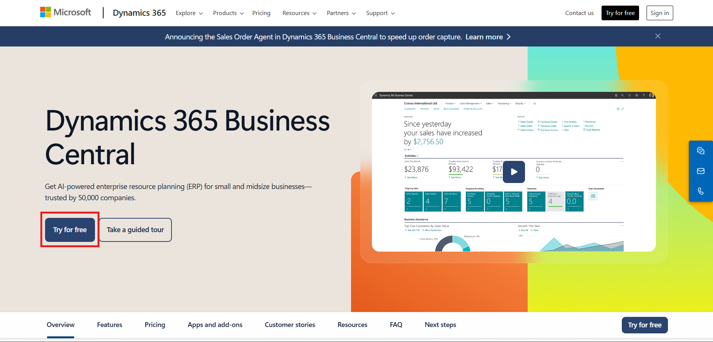

3. When prompted, enter your **Admin Tenant ID** and select **Next**.

    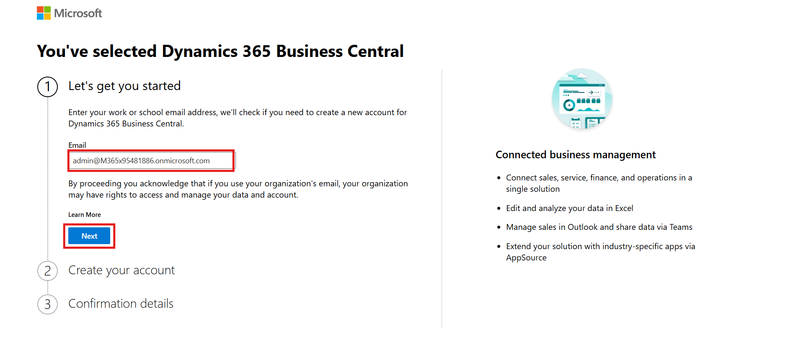

4. Select **Sign in** to proceed to authentication.

    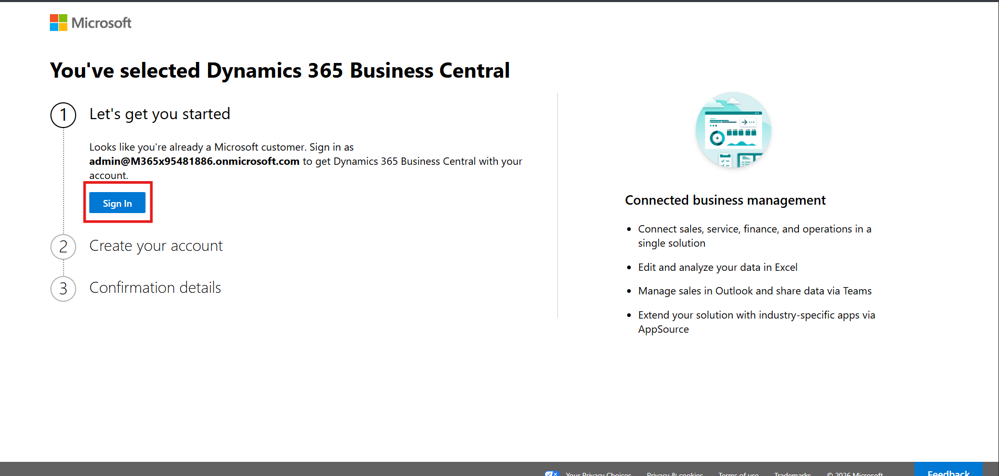

5. If required, enter the administrator password and select **Sign in** again to confirm your credentials.

    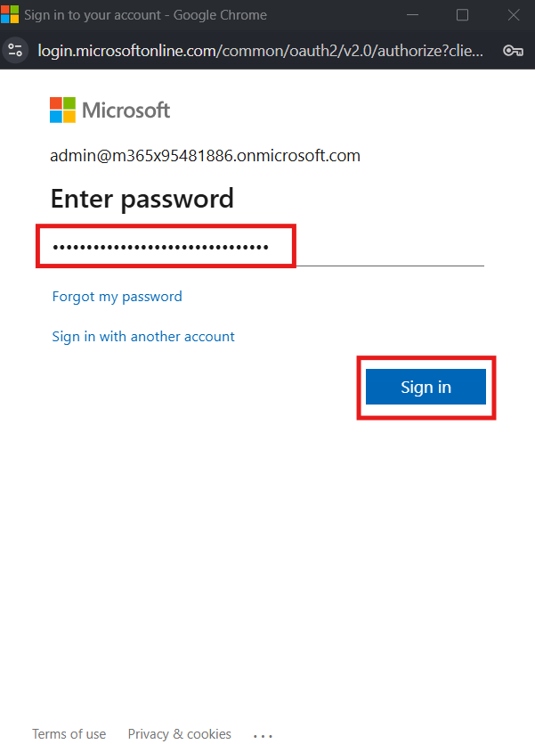

6. On the setup screen, provide the required information:

    - Select your **Country/Region** from the drop-down list.
    - Enter your **Job Title**.
    - Enter a valid **Business Phone Number**.

7. Select **Get started** to activate the Business Central trial.

    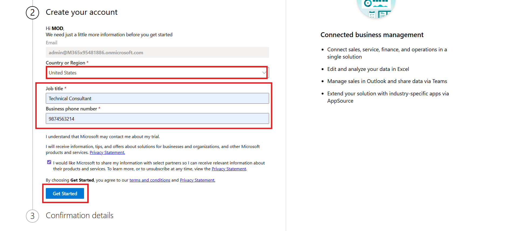

8. When prompted with optional setup steps, select **Skip and go to Business Central**.

9. Select **Get started** again to finalize the setup.

    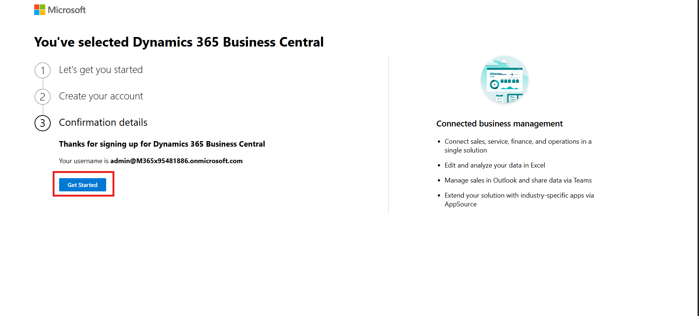

10. If a survey page appears, select **Skip survey**.

    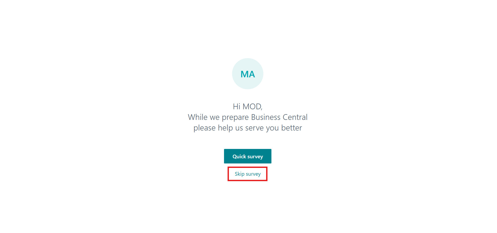

11. You are redirected to the **Business Central home page**, confirming that your trial environment is activated and ready for use.

    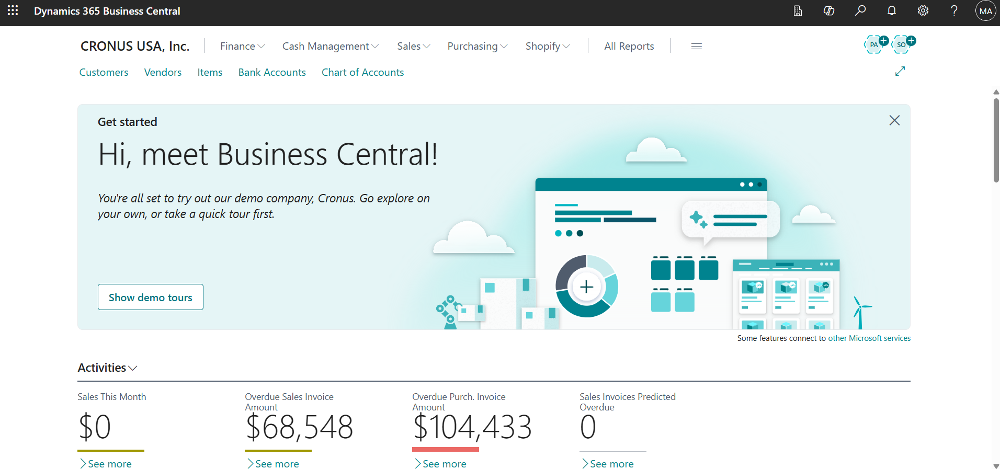

> **✅ Result:** Your Business Central trial environment is active and ready for the remaining exercises.

---

## Exercise 2: Verify Copilot and Agent Capabilities

In this exercise, you will verify that Copilot and agent capabilities are enabled in your Business Central environment, and then generate the demo data used in later exercises.

### Task 1: Review Copilot & Agent Capabilities

1. From the Business Central home page, press **Alt + Q** to open the **Tell me what you want to do** search.

2. In the search field, type:

    +++Copilot & agent capabilities+++

3. From the search results, select **Copilot & agent capabilities**.

    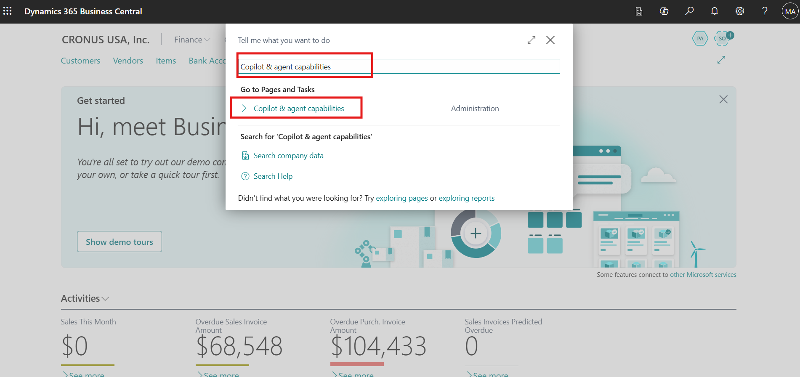

4. Review the settings displayed on the page.

> [!WARNING]
> In most trial environments, agent capabilities are enabled by default. For the purpose of this lab, do **not** activate or deactivate any options on this page.

5. Review the available options to understand the scope of Copilot features.

    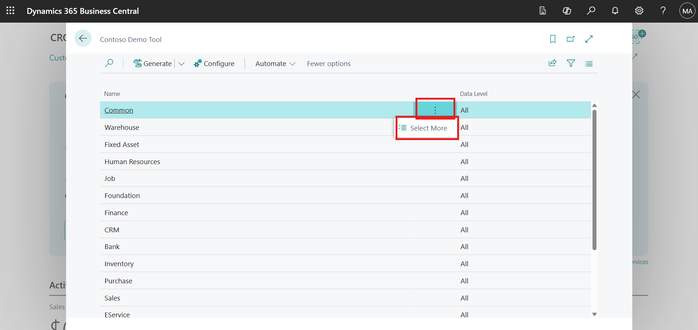

6. Confirm that Copilot and agent capabilities are active and available for use in subsequent exercises.

### Task 2: Generate Demo Data with the Contoso Demo Tool

1. Return to the Business Central home page, press **Alt + Q**, and type:

    +++Contoso Demo Tool+++

    Select **Contoso Demo Tool** from the results.

    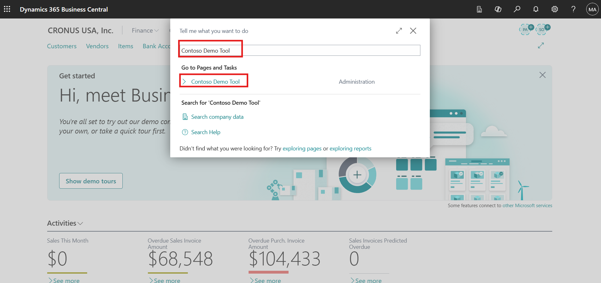

2. Select **Generate** at the top of the page, and then select **Yes** to confirm.

    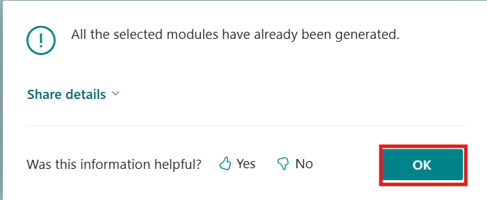

> [!NOTE]
> Demo data generation can take several minutes. Do not close the browser tab or navigate away until the process completes.

3. Select **OK** to complete the demo data setup.

    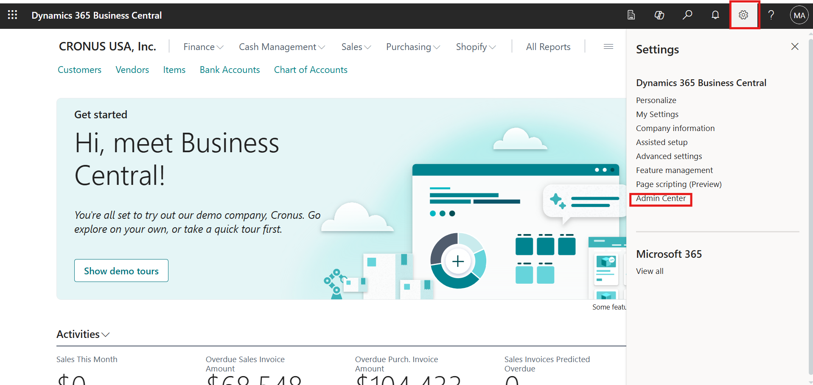

    

> **✅ Result:** Copilot and agent capabilities are verified, and demo data is available in your environment.

---

## Exercise 3: Analyze Purchase Order Data Using Copilot

In this exercise, you will use Copilot to analyze purchase order data directly from a list page. This demonstrates how Copilot can quickly generate insights without manual filtering or calculations.

### Task 1: Filter Purchase Orders by Status

1. Return to the **Business Central home page**.

2. From the top navigation menu, select **Purchasing**, and then select **Purchase Orders**.

    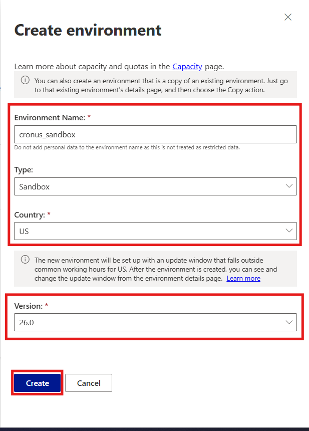

3. On the **Purchase Orders** list page, select the **Copilot** icon at the top of the list, and then select **Analyze list**.

    

4. In the Copilot analysis window, enter the following prompt and select **Generate**:

    +++Show released status entries+++

    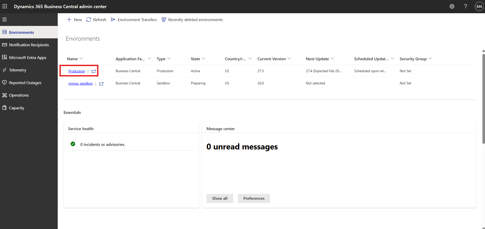

5. Observe the generated analysis, which displays purchase orders filtered by **Released** status.

    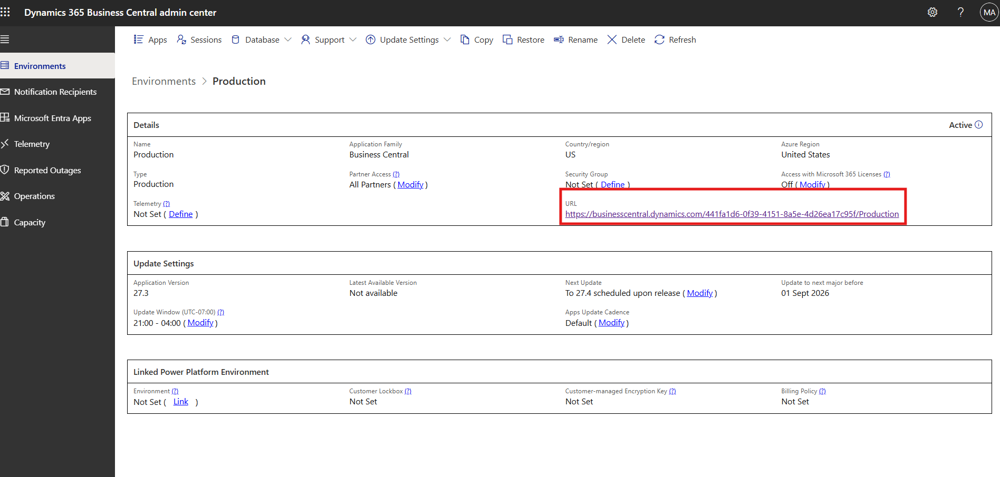

### Task 2: Refine the Analysis

1. At the bottom of the analysis window, locate the **Add more details** field and enter:

    +++Sort by amount+++

2. Press **Enter** or select **Execute**.

    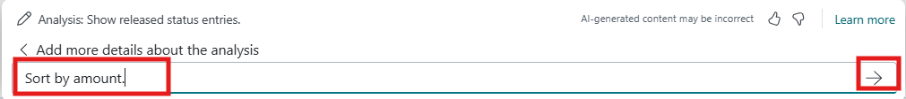

3. Copilot updates the analysis and sorts the purchase orders by amount. Select **Keep it** to save the changes.

    

### Task 3: Create a Grouped Analysis

1. Navigate to the **Analysis 1** sheet. Select the **Copilot** icon again, and then select **Create new analysis**.

    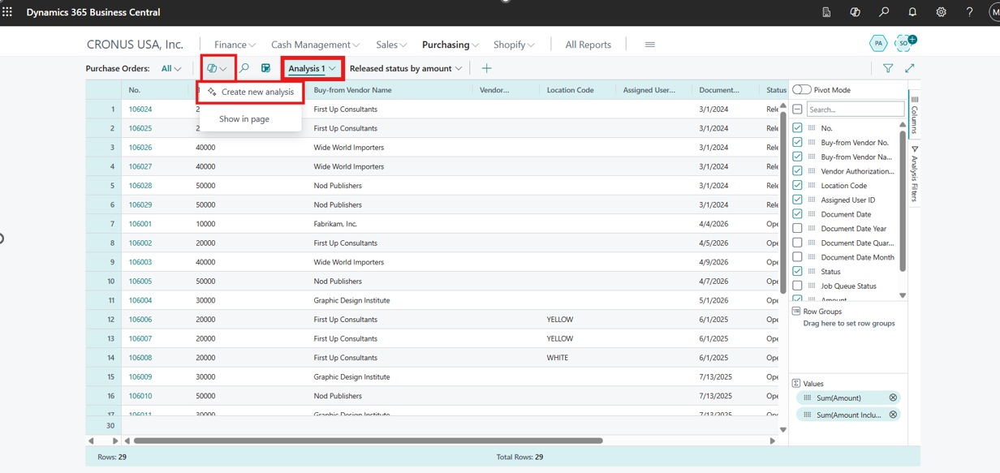

2. In the prompt area, select **Prompt options** > **Add structure** > **Group by**.

    

3. Replace the placeholder text after the **Group by** statement with the following, and then select **Generate**:

    +++average amount per vendor name+++

    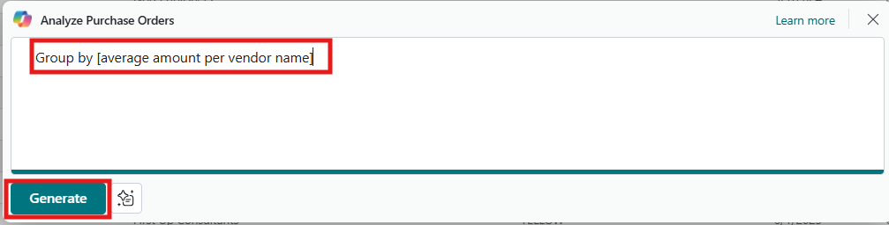

4. Review the grouped results showing average purchase order amounts per vendor, and then select **Keep it** to save the analysis.

    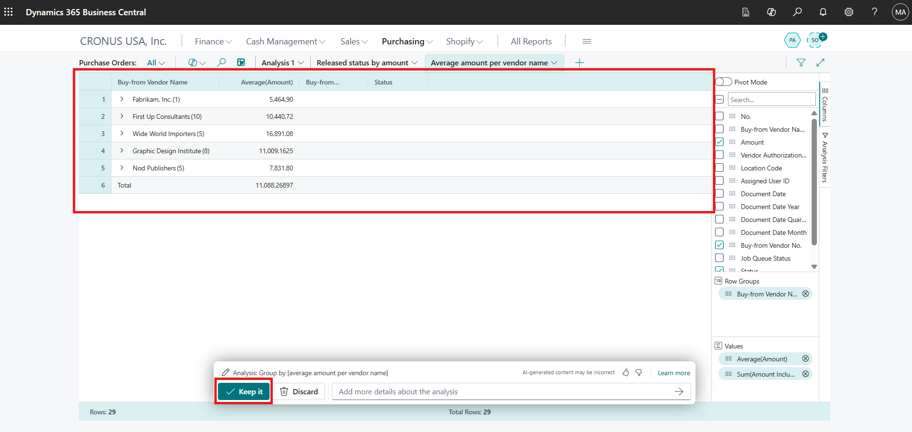

> [!TIP]
> Saved analysis tabs remain on the list page, so you can revisit them later without re-entering the prompt.

> **✅ Result:** You have created and saved Copilot-generated analyses, including one grouped by vendor showing average purchase order amounts.

---

## Exercise 4: Autofill Purchase Order Fields with Copilot (Preview)

In this exercise, you will see how Copilot automatically fills in fields while creating a purchase order, reducing manual data entry.

> [!NOTE]
> Autofill is a **preview** feature. Its availability and behavior can change between Business Central releases.

### Task 1: Create a New Purchase Order

1. Navigate back to the **Business Central home page**.

2. Select **Purchasing** from the top menu, and then select **Purchase Orders**.

    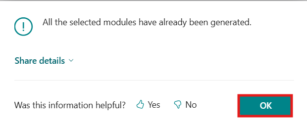

3. Turn off **analysis mode**, and then select **+ New** to create a new purchase order.

    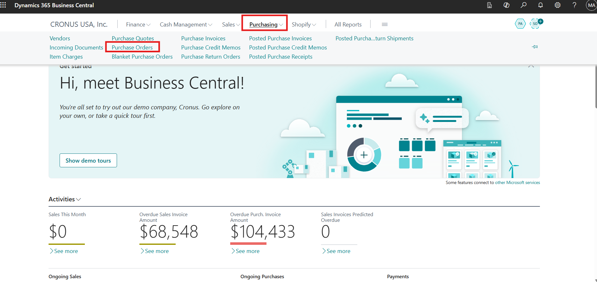

4. In the **Vendor Name** field, open the drop-down list and select **Graphic Design Institute**.

5. Business Central automatically fills in vendor-related information such as address, payment terms, and posting groups.

    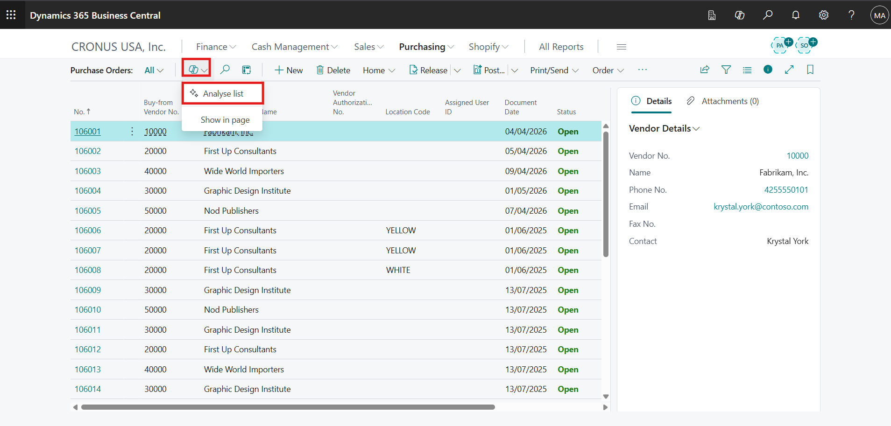

### Task 2: Use Copilot Autofill

1. Move your cursor to the **Your Reference** field, hover over it, and select the **Autofill** option.

    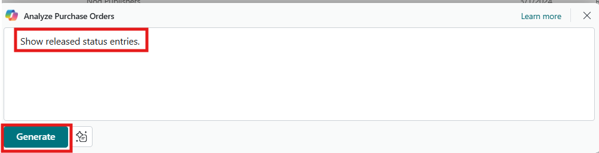

2. Review the content suggested by Copilot.

3. In the Copilot suggestion panel in the top-right corner, select **Got it**.

    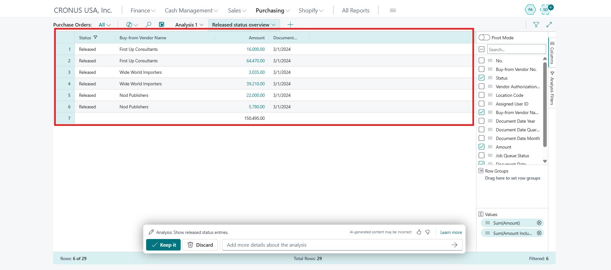

4. Select the **Details (information)** icon next to the **Your Reference** field, and review the explanation provided by Copilot.

5. Select **Keep** or **Change** depending on your business requirement.

    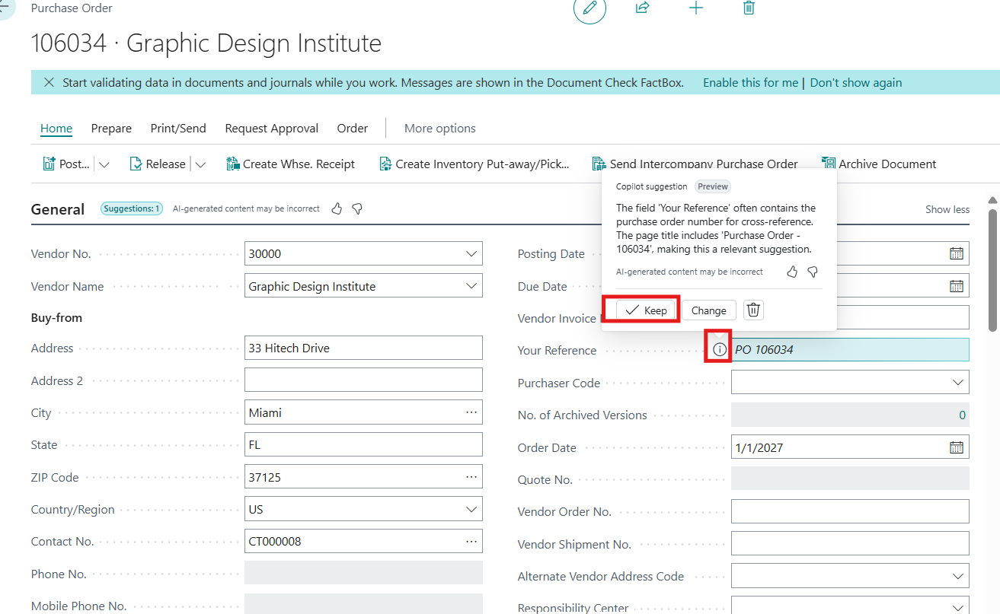

> [!IMPORTANT]
> Always verify autofilled values before posting a document. Copilot suggestions are based on existing data and may not match your specific business requirement.

> **✅ Result:** The purchase order fields are intelligently populated with Copilot assistance.

---

## Exercise 5: Chat with Copilot (Preview)

In this exercise, you will interact with Copilot using natural language to retrieve insights and navigate business data.

### Task 1: Find High-Value Purchase Orders

1. Return to the **Business Central home page**.

2. Select the **Copilot** icon at the top of the screen.

    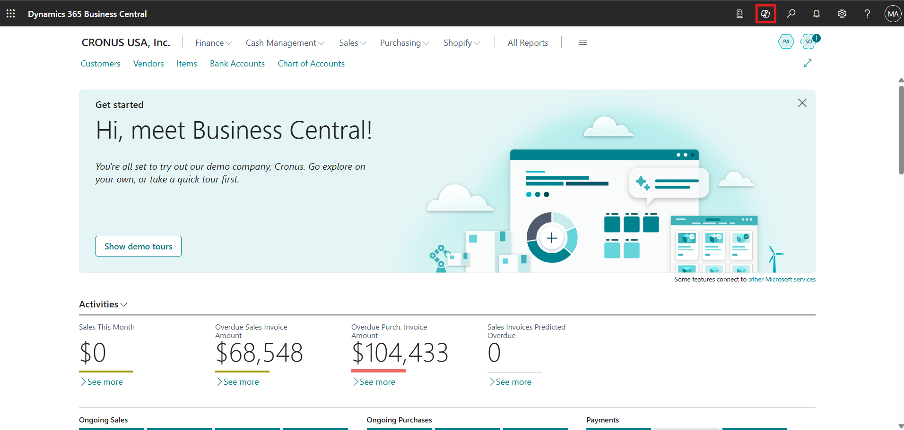

3. In the Copilot chat window, type the following query, and then press **Enter** or select **Execute**:

    +++Show me the top five high-value purchase orders+++

    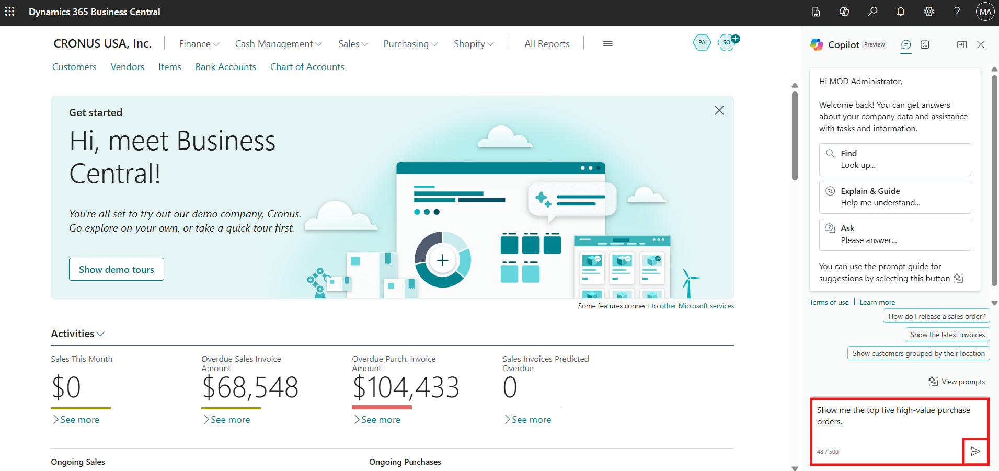

4. Review the list of purchase orders suggested by Copilot, and select the first purchase order in the list.

    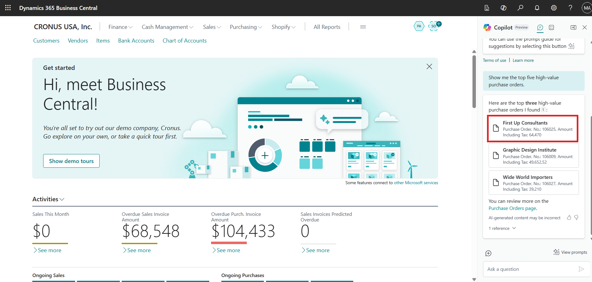

5. Verify the purchase order details displayed on the screen.

    

### Task 2: Use the Prompt Guide to Look Up a Vendor

1. At the bottom of the Copilot window, select **View prompts** and review the prompt guidance that helps structure effective queries.

2. Select **Find**, and then select **Look up**.

    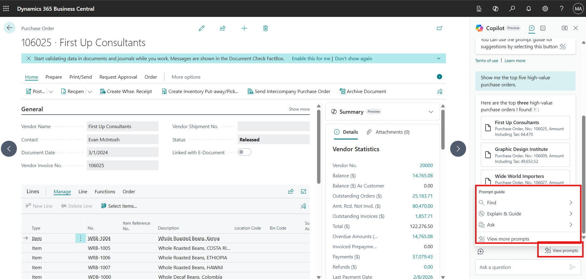

    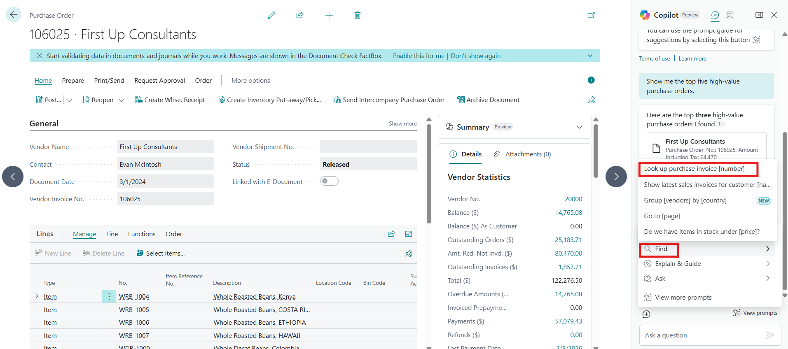

3. Enter the following text after **Look up**, and then press **Enter** or select **Execute**:

    +++Vendor number 30000+++

    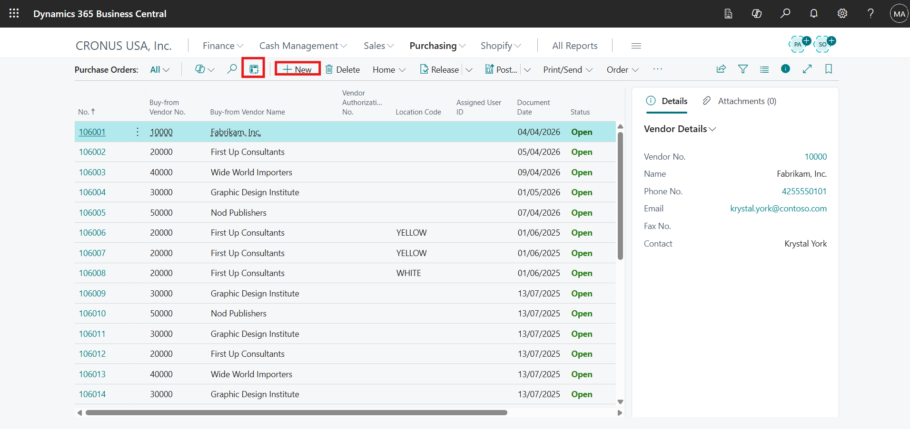

4. Copilot retrieves and displays information related to vendor number **30000**.

    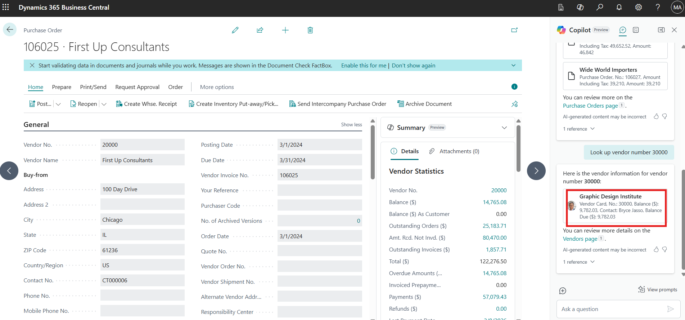

5. Select the vendor link to view the complete vendor details.

    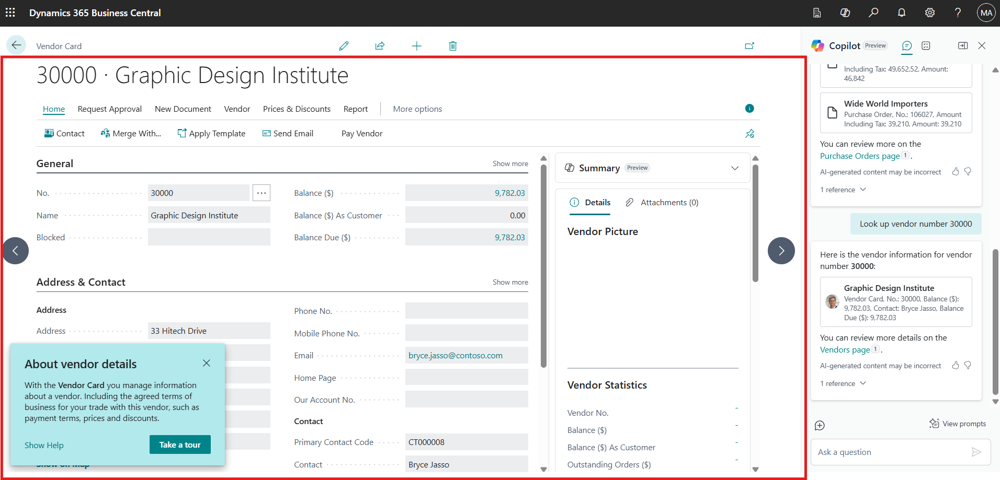

> **✅ Result:** You have used Copilot Chat and the prompt guide to find purchase orders and vendor records using natural language.

---

## Summary

You have successfully completed this lab. You activated a Business Central trial, verified Copilot capabilities, generated demo data, and used Copilot to analyze, autofill, and query purchase orders. You now understand how Copilot can accelerate purchase order review, analysis, and data entry in Dynamics 365 Business Central, enabling faster and more informed business decisions.

## Key Takeaways

- **Analyze list** turns plain-language prompts into filtered, sorted, and grouped views of list data.
- **Autofill** reduces manual data entry, but suggestions should always be verified.
- **Copilot Chat** and the prompt guide let you locate records and insights without navigating menus.
- Always review AI-generated content, as Copilot results may occasionally be incomplete or incorrect.
