# Lab 2: Improve Order Fulfillment and Customer Satisfaction using Suggest Substitute Items and Summarize Records with Copilot

## Overview

In this lab, you will learn how Copilot in Dynamics 365 Business Central helps improve order fulfillment and customer satisfaction by recommending suitable substitute items and providing intelligent summaries of purchasing records.

The lab is divided into two exercises. The first focuses on using Copilot to suggest and manage substitute items with confidence-based recommendations. The second demonstrates how Copilot summarizes purchase orders to support faster review and better decision-making. Together, these exercises highlight how Copilot enhances efficiency and accuracy across inventory and purchasing processes.

## Objectives

- Use **Suggest with Copilot** to generate substitute items for a product.
- Refine suggestions using matching and confidence options.
- Remove low-confidence suggestions and insert medium- and high-confidence items.
- View, copy, and explore the Copilot-generated summary of a purchase order.

## Prerequisites

- Access to the Business Central environment configured in **Lab 1**, with demo data generated.
- Admin tenant credentials.

## Estimated Time

**20 minutes**

> [!NOTE]
> Text shown as +++sample text+++ can be typed or copied directly into the lab environment. Copilot responses are AI-generated, so your results may differ slightly from the screenshots.

---

## Exercise 1: Suggest and Manage Substitute Items Using Copilot

In this exercise, you will open an item card and use Copilot to find, filter, and insert substitute items.

### Task 1: Navigate to Items in Business Central

1. Navigate to the Business Central sign-in page and sign in with the admin tenant:

    +++https://www.microsoft.com/en-us/dynamics-365/products/business-central/sign-in+++

    

2. Press **Alt + Q**, type +++Items+++, and select **Items** to open the item list.

    

### Task 2: Open the Item for Substitution

1. In the **Items** list, select **PARIS General chair, Black** to open the item card.

    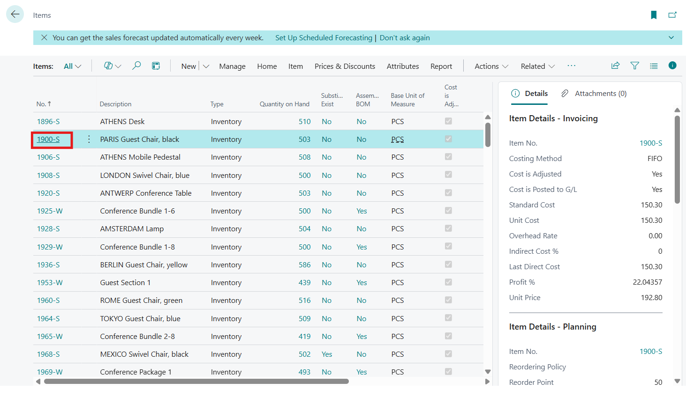

2. From the top menu, select **Item** > **Substitutions** to manage alternative items for the selected product.

    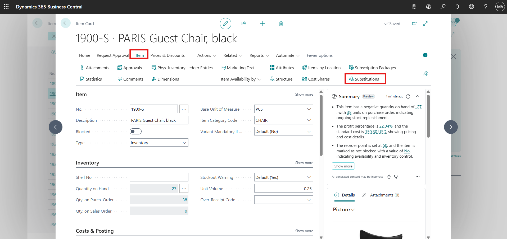

### Task 3: Suggest Substitute Items Using Copilot

1. On the **Item Substitutions** page, select **Suggest with Copilot** to generate a list of related substitute items.

    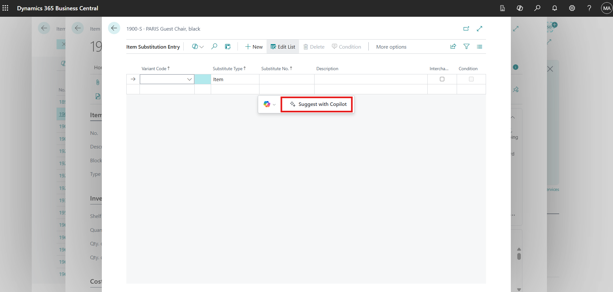

2. Review the items suggested by Copilot that are relevant to **PARIS General chair, Black**.

    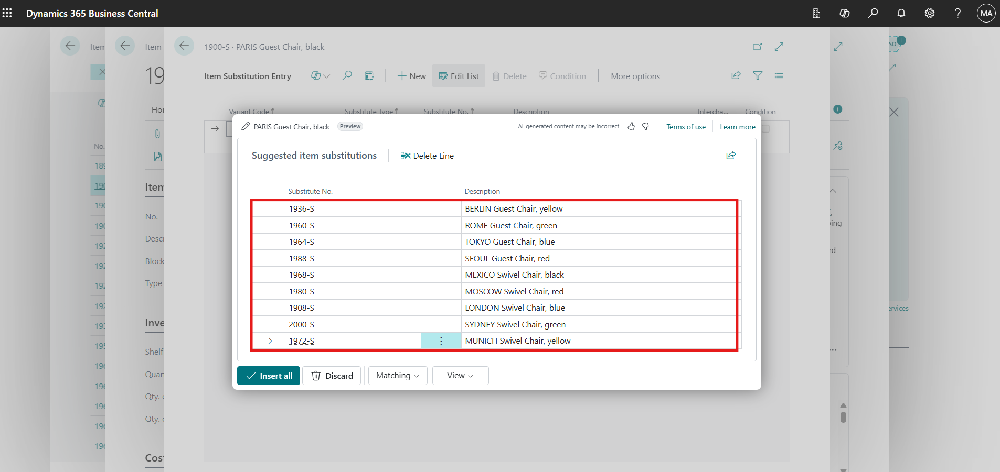

### Task 4: Refine Suggestions Using Matching and Confidence Options

1. Select **Matching** > **Permissive**, and then select **Generate** to broaden the list of suggested substitute items.

    

2. Select **View** > **Lines and Confidence**, and then select **Generate** to display confidence scores for each suggested item.

    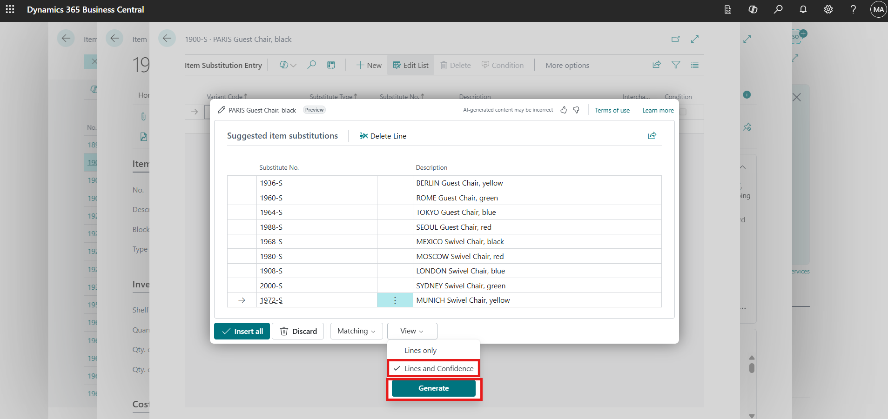

> [!TIP]
> **Permissive** matching returns a wider range of possible substitutes, while stricter matching returns fewer, closer matches. Use confidence scores to decide which suggestions to keep.

### Task 5: Remove Low-Confidence Substitute Items

1. Identify the items marked with **Low** confidence.

    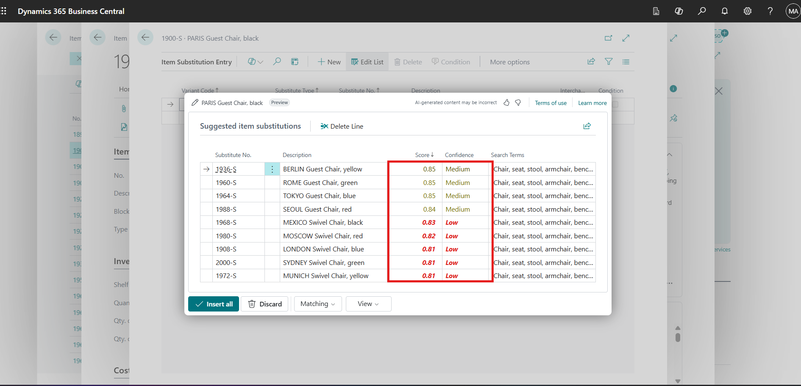

2. Select the **vertical ellipsis (⋮)**, and then select **Select more** to enable multiple selection.

    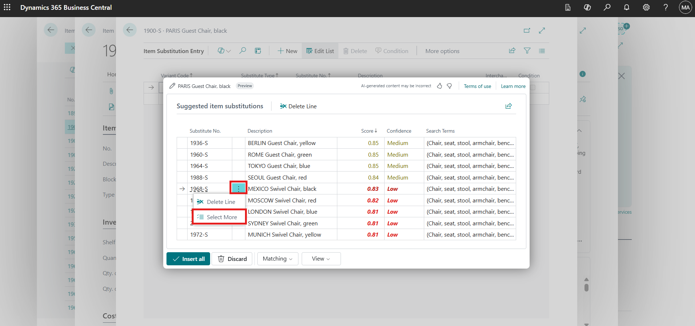

3. Select all low-confidence items, and then select **Delete**.

    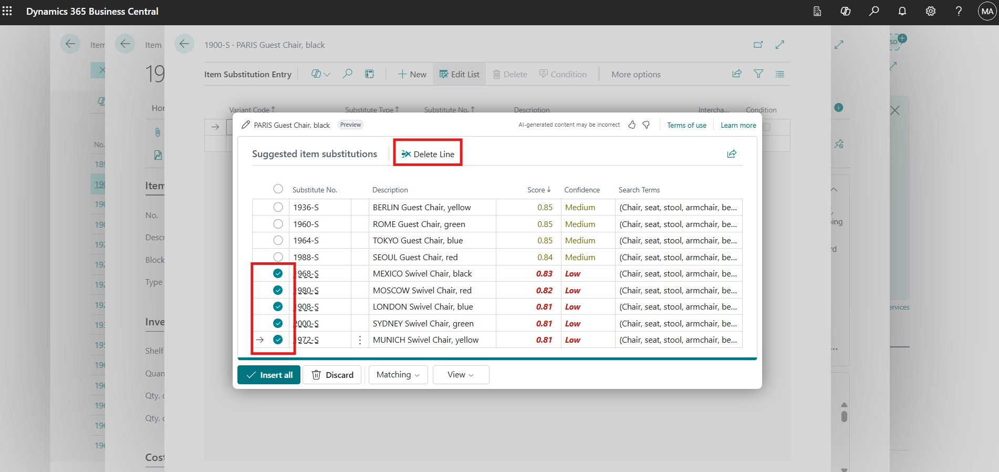

> [!WARNING]
> Make sure only **Low** confidence items are selected before deleting. Deleted suggestions are removed from the list and must be regenerated if needed.

4. Select **Yes** to confirm the deletion.

    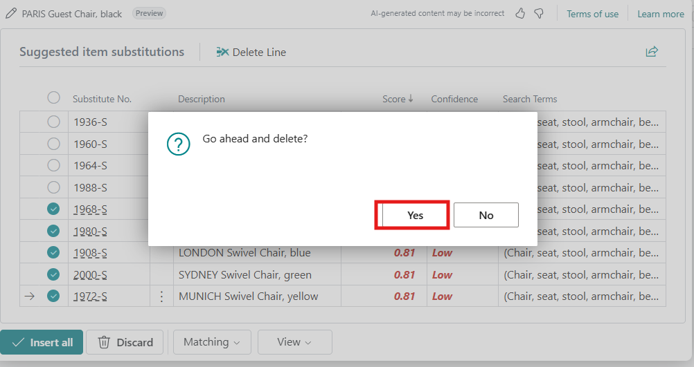

### Task 6: Insert Medium- and High-Confidence Substitute Items

1. Select **Insert all** to add all **Medium** and **High** confidence substitute items.

    

2. Verify that the substitute items are added successfully for the selected item.

    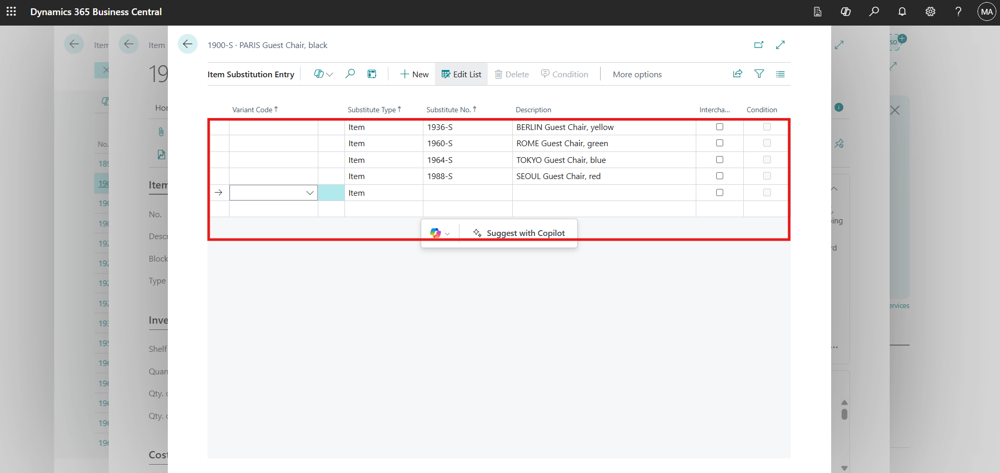

> **✅ Result:** You have used Copilot to generate, refine, and insert substitute items for **PARIS General chair, Black**.

---

## Exercise 2: Summarize Purchase Orders Using Copilot

In this exercise, you will open a purchase order and use the Copilot-generated summary to review its details quickly.

### Task 1: Open a Purchase Order

1. Navigate to the **Business Central home page**.

2. Select **Purchasing** from the top menu, and then select **Purchase Orders**.

    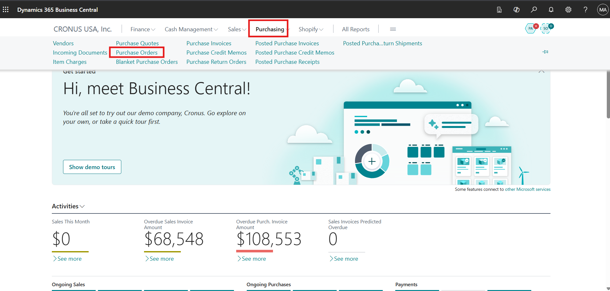

3. Open **Purchase Order No. 10601** to review its details.

    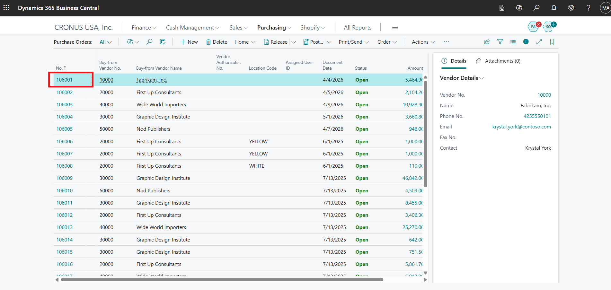

> [!NOTE]
> If purchase order **10601** is not available in your environment, open any existing purchase order to complete this exercise.

### Task 2: View the Purchase Order Summary with Copilot

1. On the right side of the purchase order page, locate the **Summary** section.

2. Select the **down arrow** to expand the Copilot-generated summary.

    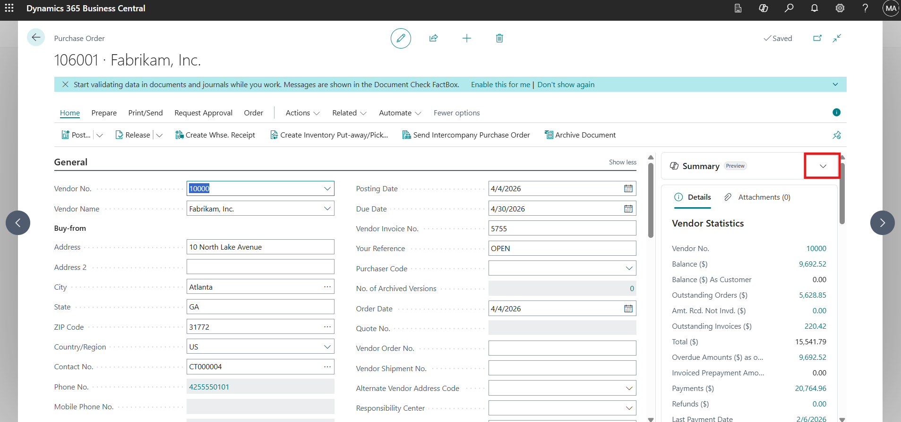

3. Select **Show more** to view additional details.

    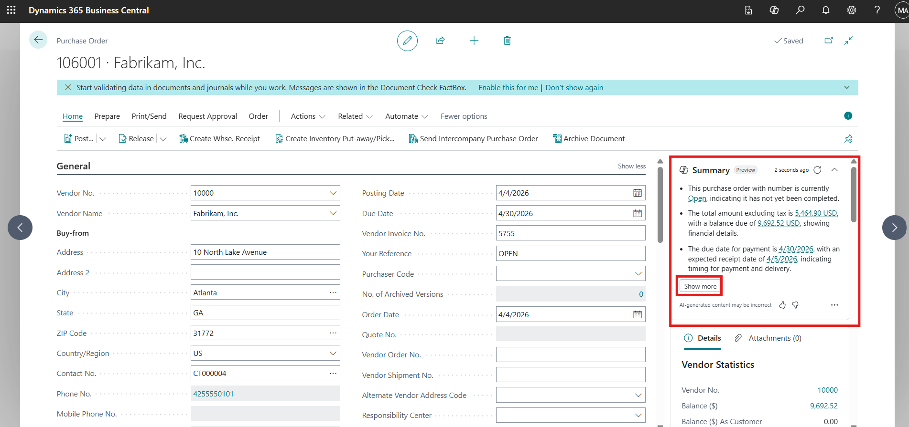

### Task 3: Review and Copy Copilot Summary Details

1. Review the detailed purchase order information displayed in the Copilot panel.

    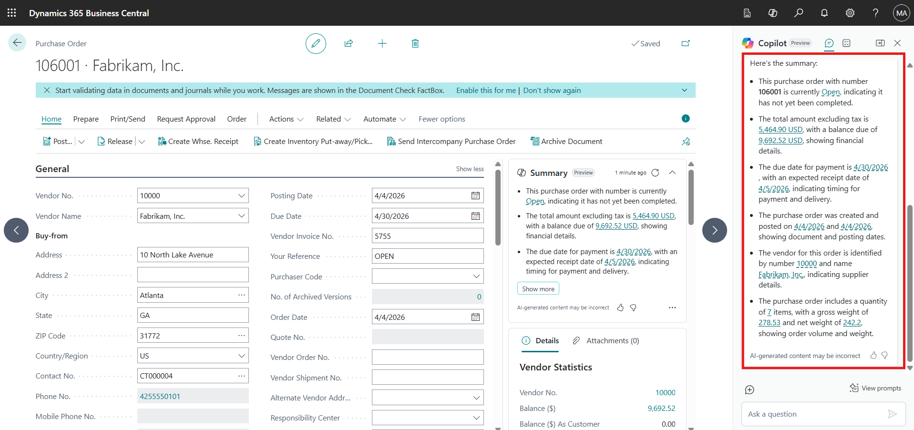

2. Hover over the summarized content and select **Copy** to copy the details for reuse or sharing.

    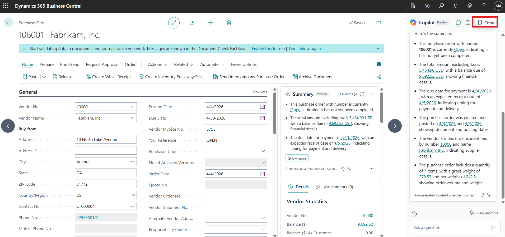

### Task 4: Explore Copilot Summary Options

1. In the Copilot summary section, select the **horizontal ellipsis (⋯)** to view additional options.

2. Review the available actions, including hiding the summary, copying the summary, viewing related items, and learning more about the summarized content.

    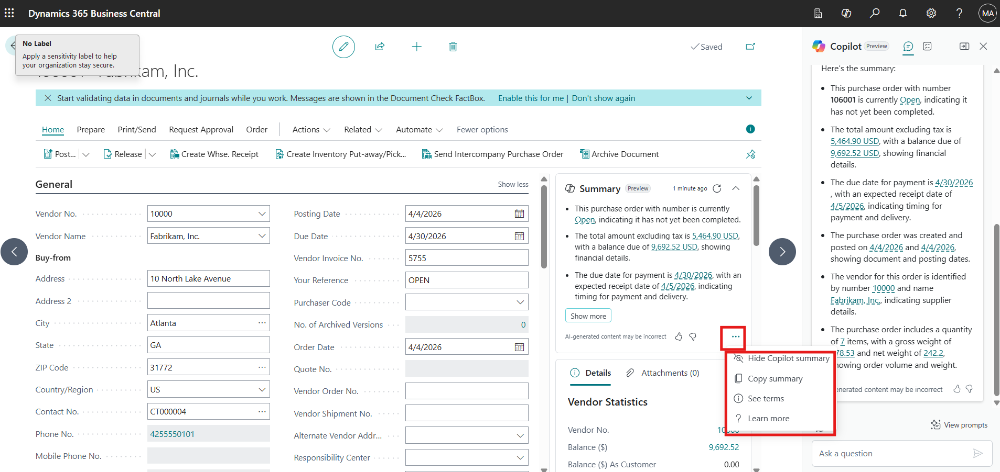

> [!IMPORTANT]
> Copilot summaries are generated from record data and may omit details. Always confirm key values such as quantities, amounts, and dates on the document itself before acting on them.

> **✅ Result:** You have reviewed, copied, and explored the Copilot-generated summary of a purchase order.

---

## Summary

By completing this lab, you have learned how to use Copilot to suggest and manage substitute items effectively, ensuring better product availability and improved order fulfillment. You also explored how Copilot summarizes purchase orders, enabling faster review and clearer insights into purchasing data. Together, these capabilities demonstrate how Copilot in Dynamics 365 Business Central helps teams enhance operational efficiency and deliver a better customer experience.

## Key Takeaways

- **Suggest with Copilot** finds relevant substitute items and rates each with a confidence score.
- Matching and confidence options let you control how broad or strict the suggestions are.
- Copilot summaries give a fast overview of a record, which you can copy and share.
- Always review AI-generated content, as Copilot results may occasionally be incomplete or incorrect.
