# Lab 3: Improve Order Fulfillment and Customer Satisfaction using Suggest Substitute Items and Summarize Records with Copilot

**Introduction**

In this lab, participants will learn how Copilot in Dynamics 365
Business Central helps improve order fulfillment and customer
satisfaction by recommending suitable substitute items and providing
intelligent summaries of purchasing records. The lab is divided into two
exercises: the first focuses on using Copilot to suggest and manage
substitute items with confidence-based recommendations, while the second
demonstrates how Copilot summarizes purchase orders to support faster
review and better decision-making. Together, these exercises highlight
how Copilot enhances efficiency and accuracy across inventory and
purchasing processes.

## Exercise 1: Suggest and Manage Substitute Items Using Copilot

### Task 1: Navigate to Items in Business Central

1.  Navigate to
    <https://www.microsoft.com/en-us/dynamics-365/products/business-central/sign-in>
    business central and sign in with the admin tenant.

> 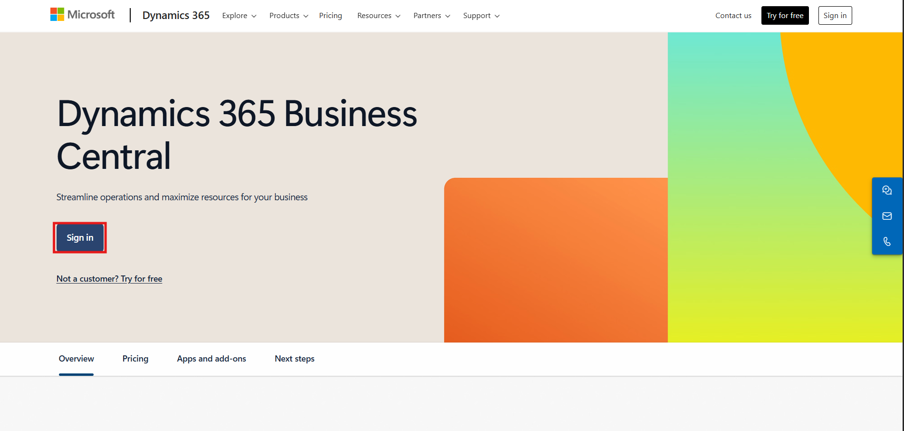

2.  Open the **Dynamics 365 Business Central** portal. From top click on
    the Setting icon and navigate to Admin center.

> 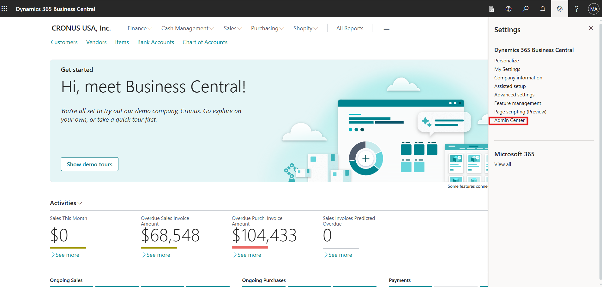

3.  Click on the Production environment.

> 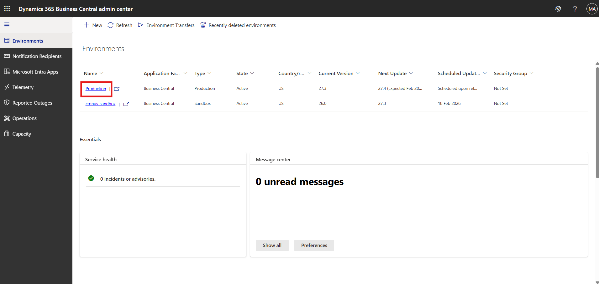

4.  Click on the environment to navigate to production environment of
    business central.

> 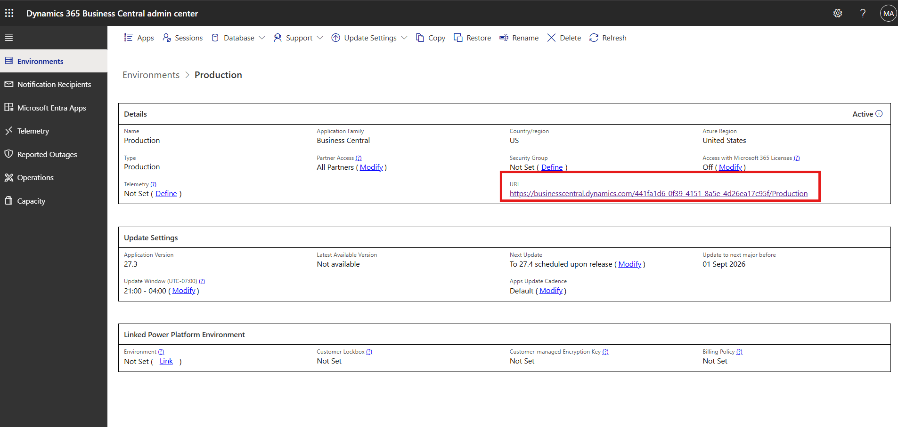

5.  Press **Alt + Q**, enter **Item**, and select **Items** to open the
    item list.

> 

### Task 2: Open the Item for Substitution

1.  In the **Items** list, select **PARIS General chair, Black** to open
    the item card.

> 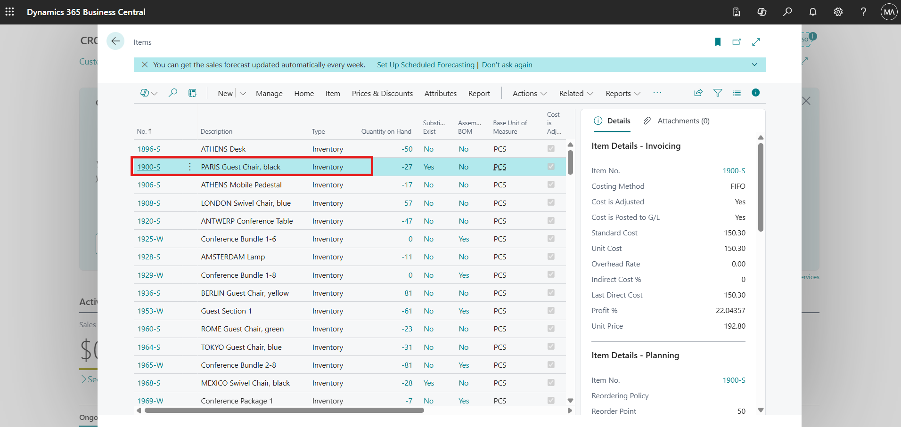

2.  From the top menu, click **Item** and select **Substitutions** to
    manage alternative items for the selected product.

> 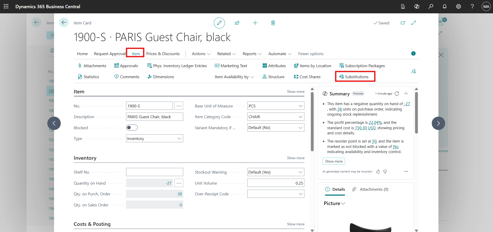

### Task 3: Suggest Substitute Items Using Copilot

1.  On the **Item Substitutions** page, click **Suggest with Copilot**
    to automatically generate a list of related substitute items.

> 

2.  Review the items suggested by Copilot that are relevant to **PARIS
    General chair, Black**.

> 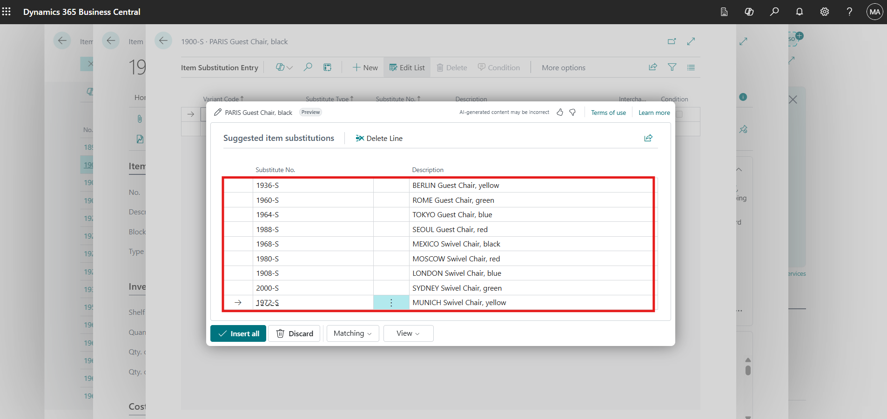

### Task 4: Refine Suggestions Using Matching and Confidence Options

1.  Click **Matching**, select **Permissive**, and then click
    **Generate** to broaden the list of suggested substitute items.

> 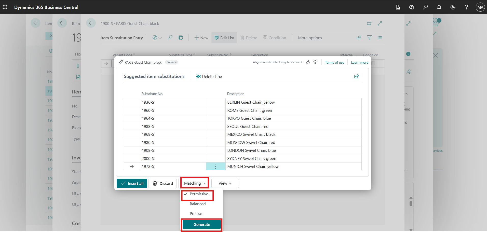

2.  Click **View**, select **Lines and Confidence**, and click
    **Generate** to display confidence scores for each suggested item.

> 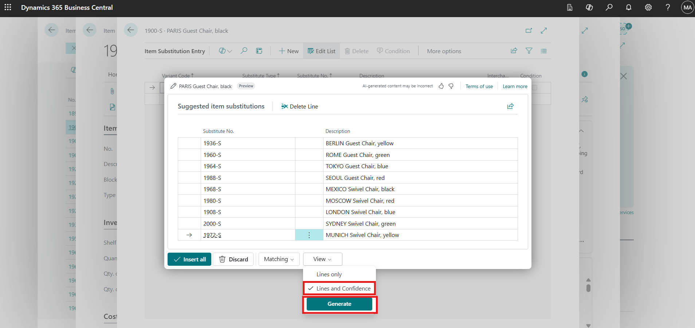

### Task 5: Remove Low-Confidence Substitute Items

1.  Identify items marked with **Low confidence**.

> 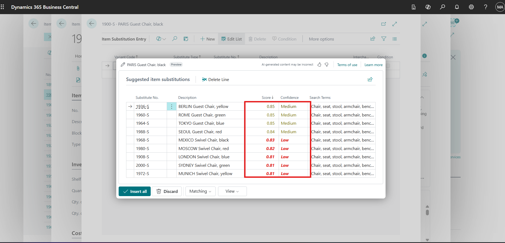

2.  Use the **vertical ellipsis (⋮)** and select **Select more** to
    enable multiple selection.

> 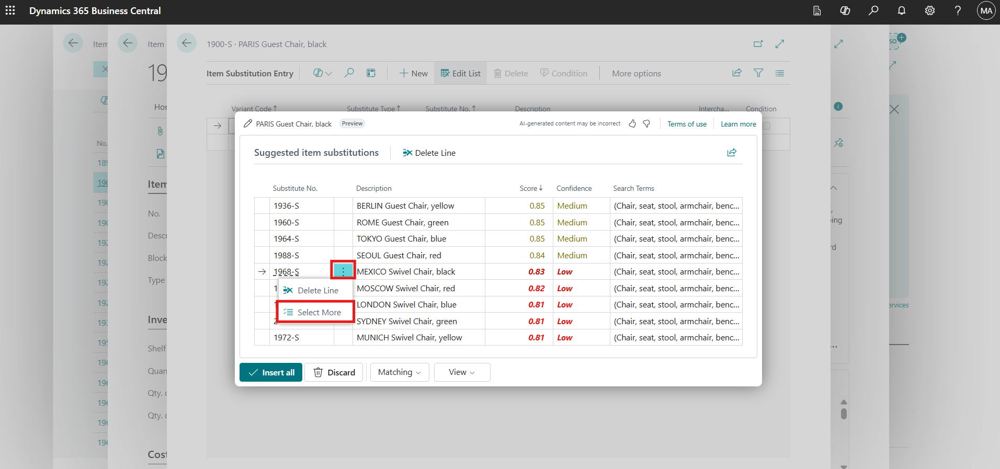

3.  Select all low-confidence items and click **Delete**.

> 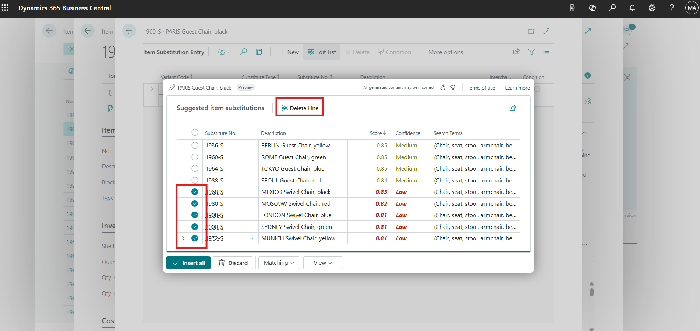

4.  Click **Yes** to confirm the deletion.

> 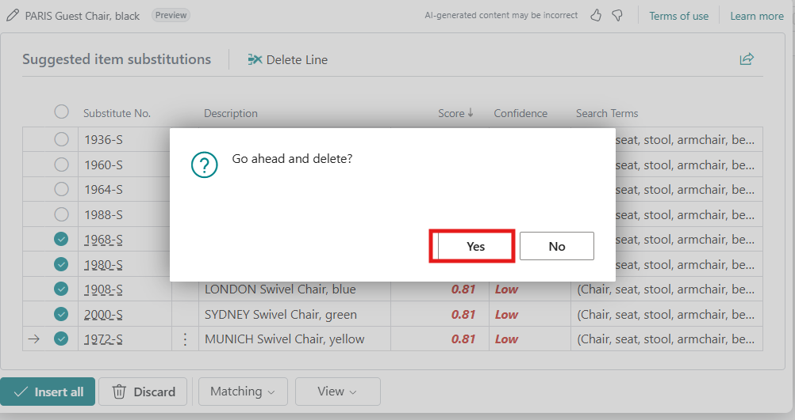

### Task 6: Insert Medium and High-Confidence Substitute Items

1.  Click **Insert all** to add all **Medium** and **High confidence**
    substitute items.

> 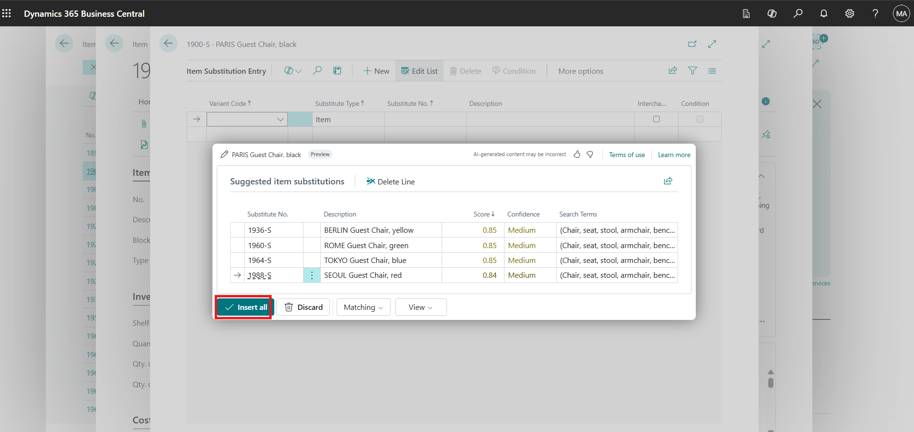

2.  Verify that the substitute items are added successfully for the
    selected item.

> 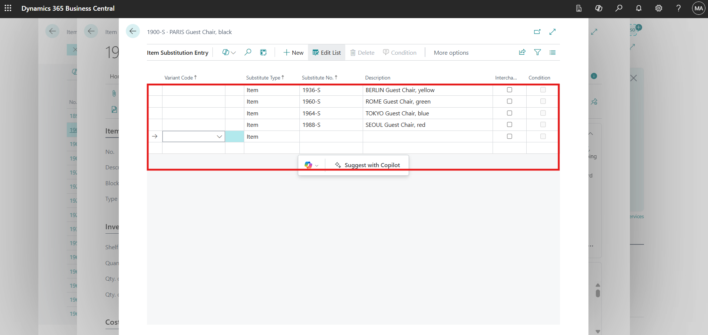

## Exercise 2: Summarize Purchase Orders Using Copilot

### Task 1: Open a Purchase Order

1.  Navigate to the **Business Central Home** page.

2.  Click **Purchasing** from the top menu and select **Purchase
    Orders**.

> 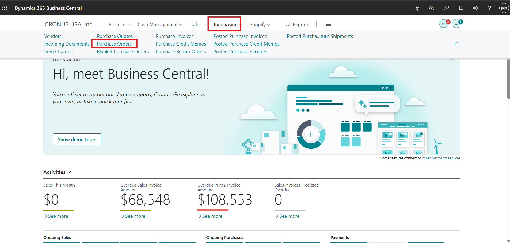

3.  Open **Purchase Order No. 10601** to review its details.

> 

### Task 2: View Purchase Order Summary with Copilot

1.  On the right side of the purchase order page, locate the **Summary**
    section.

2.  Click the **down arrow** to expand the Copilot-generated summary.

> 

3.  Click **Show more** to view additional details.

> 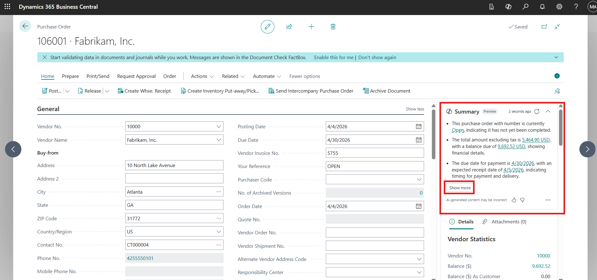

### Task 3: Review and Copy Copilot Summary Details

1.  Review the detailed purchase order information displayed in the
    Copilot panel.

> 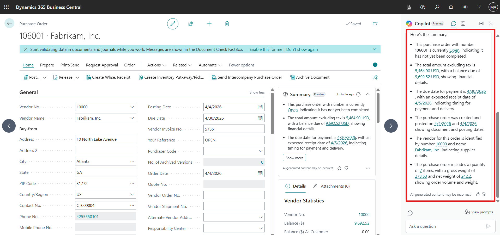

2.  Hover over the summarized content and click **Copy** to copy the
    details for reuse or sharing.

> 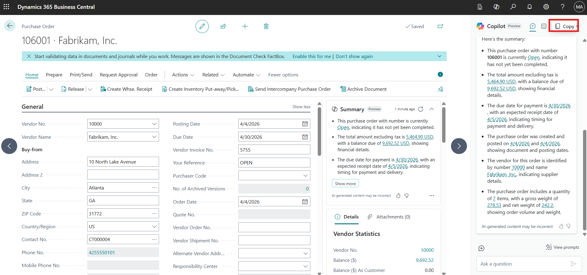

### Task 4: Explore Copilot Summary Options

1.  In the Copilot summary section, click the **horizontal ellipsis
    (⋯)** to view additional options.

2.  Review the available actions, including hiding the summary, copying
    the summary, viewing related items, and learning more about the
    summarized content.

> 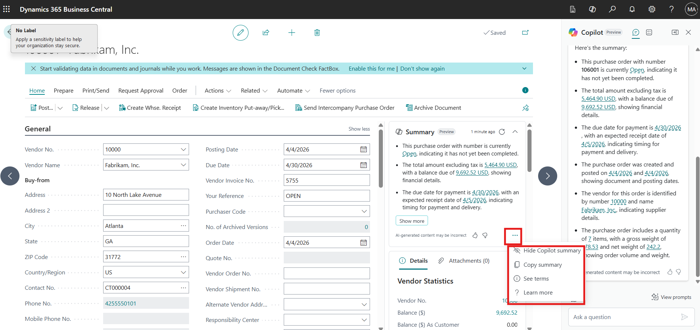

**Conclusion**

By completing this lab, participants have learned how to use Copilot to
suggest and manage substitute items effectively, ensuring better product
availability and improved order fulfillment. They also explored how
Copilot summarizes purchase orders, enabling faster review and clearer
insights into purchasing data. Together, these capabilities demonstrate
how Copilot in Dynamics 365 Business Central helps teams enhance
operational efficiency and deliver a better customer experience.
