# Lab 3: Map E-Documents to Purchase Order Lines with Copilot in Dynamics 365 Business Central

## Overview

In this lab, you will explore how e-documents are processed and mapped to purchase orders in Dynamics 365 Business Central using Copilot. The lab begins by accessing a sandbox environment and generating the required demo data using the Contoso Demo Tool. You will then work with linked purchase orders created from e-documents and learn how Copilot assists in matching e-document lines with purchase order lines.

Through hands-on exercises, you will gain practical experience in reviewing, validating, and saving Copilot-generated matches, while also understanding the different matching options available within the e-document mapping process.

## Objectives

- Open the Business Central admin center and access a sandbox environment.
- Generate demo data using the Contoso Demo Tool.
- Open linked purchase orders from **E-Document Activities**.
- Map e-document lines to purchase order lines using Copilot.
- Explore the available matching options (Copilot, manual, and automatic).

## Prerequisites

- Access to Dynamics 365 Business Central with administrator permissions.
- A sandbox environment named **cronus_sandbox** available in the admin center.

## Estimated Time

**25 minutes**

> [!NOTE]
> Text shown as +++sample text+++ can be typed or copied directly into the lab environment. Copilot responses are AI-generated, so your results may differ slightly from the screenshots.

---

## Exercise 1: Prepare the Sandbox Environment

In this exercise, you will open the sandbox environment and generate the demo data required for e-document mapping.

### Task 1: Open the Business Central Admin Center and Access the Sandbox Environment

1. Navigate to the Business Central home page.

2. From the top bar, select **Settings**, and then select **Admin Center**.

    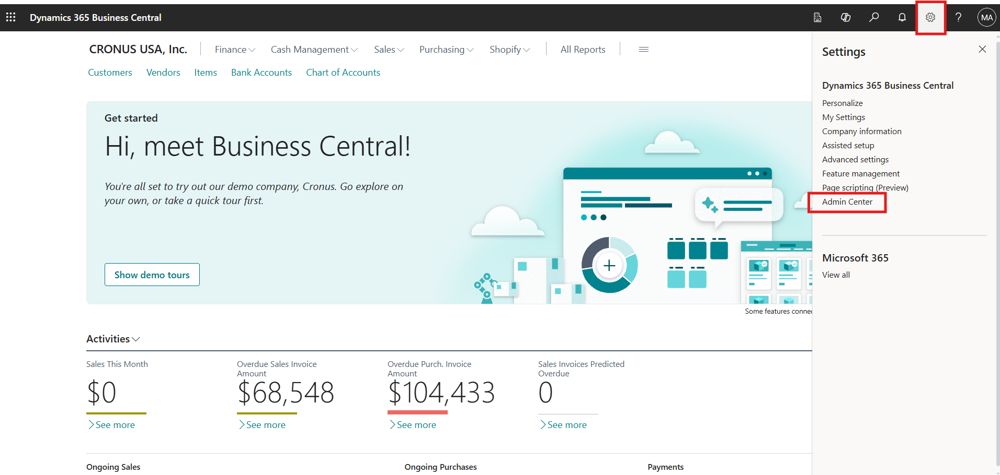

3. In the admin center, locate and select the **cronus_sandbox** environment.

    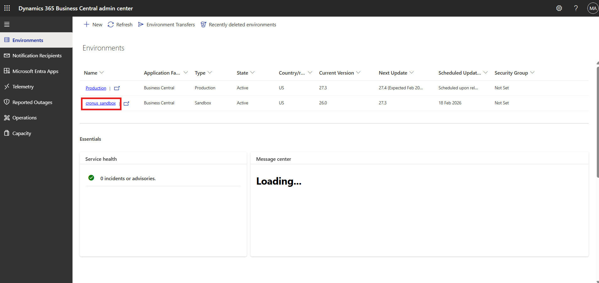

4. Select the **Environment URL** to open the sandbox environment.

    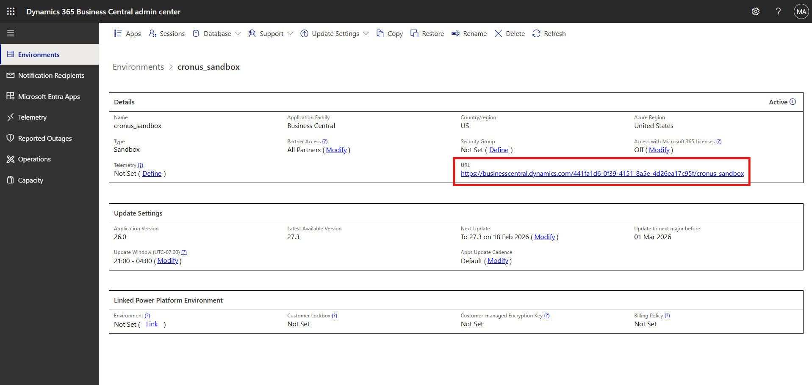

> [!IMPORTANT]
> Complete all remaining tasks in the **cronus_sandbox** environment, not in your production environment.

### Task 2: Generate Demo Data Using the Contoso Demo Tool

1. In the sandbox environment, press **Alt + Q** to open the search.

2. Type +++Contoso Demo Tool+++ and select it from the results.

    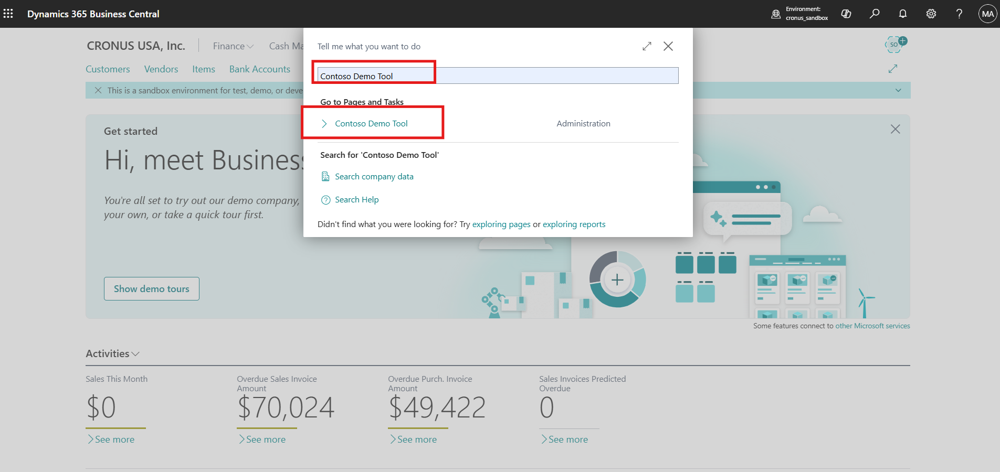

3. On the **Contoso Demo Tool** page, locate the **Data Name** field.

4. Select the vertical ellipsis (**⋮**) for the **Name** field, and then select **Select more**.

    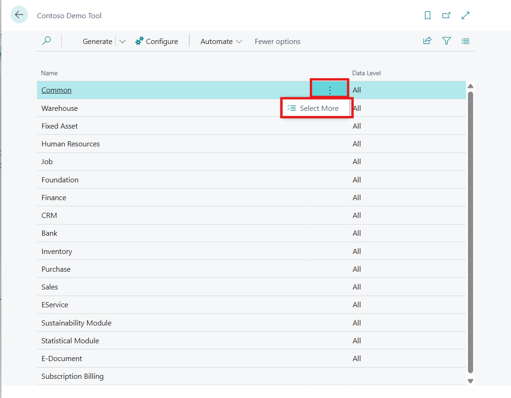

5. Select all data options **except** **Subscription and Billing**.

> [!WARNING]
> Do **not** select **Subscription and Billing**. This module is not required for this lab.

6. Select **Generate** at the top of the page.

    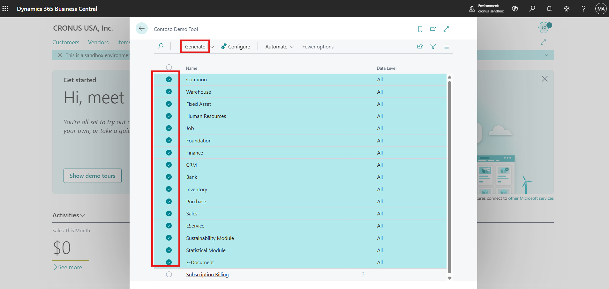

7. When prompted, select **Yes** to confirm the generation process.

    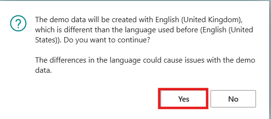

> [!NOTE]
> Generating multiple demo data modules can take several minutes. Wait for the process to finish before continuing.

8. Select **OK** once the process completes successfully.

    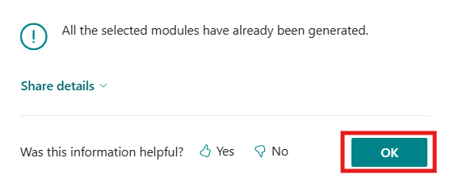

> **✅ Result:** The sandbox environment is ready, with demo data that includes e-documents linked to purchase orders.

---

## Exercise 2: Map E-Document Lines to Purchase Orders with Copilot

In this exercise, you will open linked purchase orders and use Copilot to match e-document lines with purchase order lines.

### Task 1: Open Linked Purchase Orders from E-Document Activities

1. Navigate back to the Business Central home page.

    

2. Scroll down to the **E-Document Activities** section, and then select **Linked Purchase Orders**.

    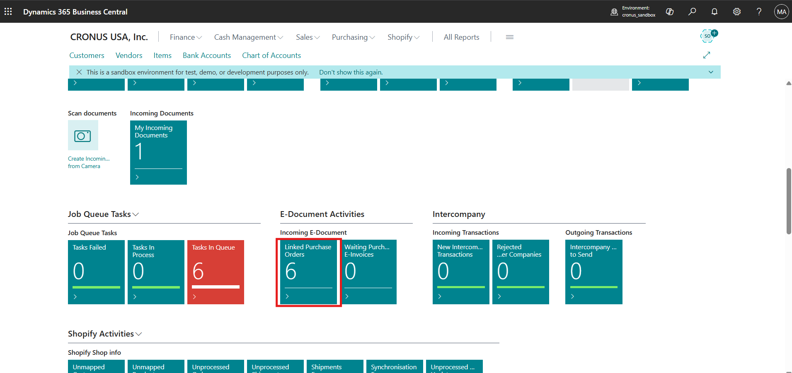

3. Review the list of available purchase orders created from the demo data.

### Task 2: Map E-Document Lines for the First Purchase Order

1. Select the **first purchase order** in the list.

2. On the purchase order page, select **Map E-Document Lines**.

    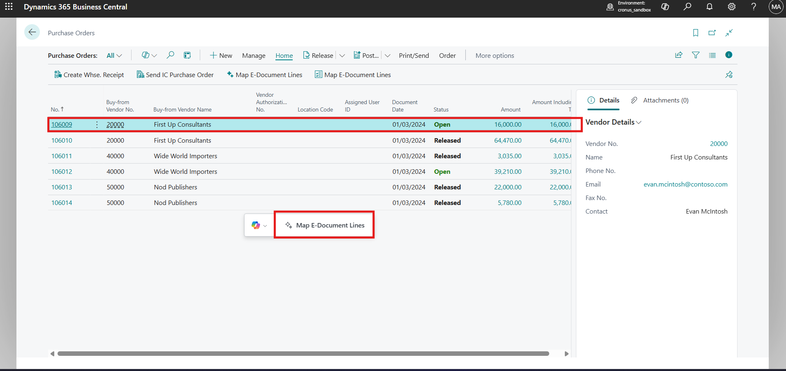

3. Copilot automatically matches the e-document lines with the purchase order lines. Review the suggested matches.

> [!IMPORTANT]
> Check each suggested match (item, quantity, and amount) before saving. Copilot matches are suggestions and should be validated by a person.

4. Select **Keep it** to save the matched purchase order.

    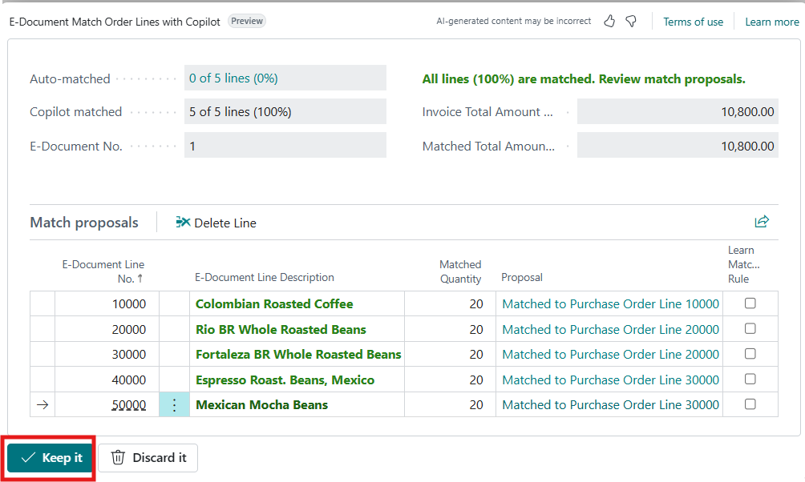

5. Select **Back** to return to the purchase order list.

    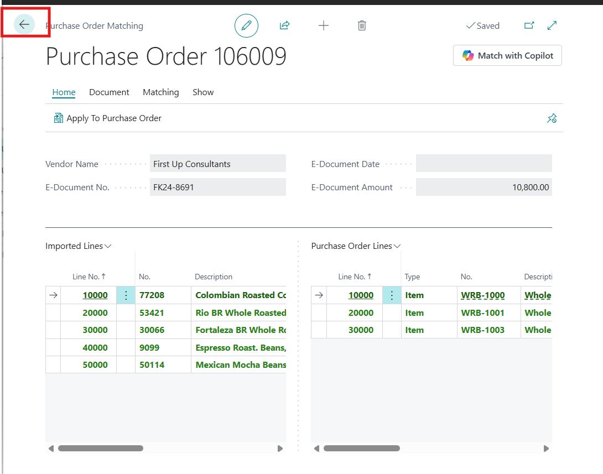

### Task 3: Explore E-Document Mapping Options with Another Purchase Order

1. Open the **next purchase order** in the list.

    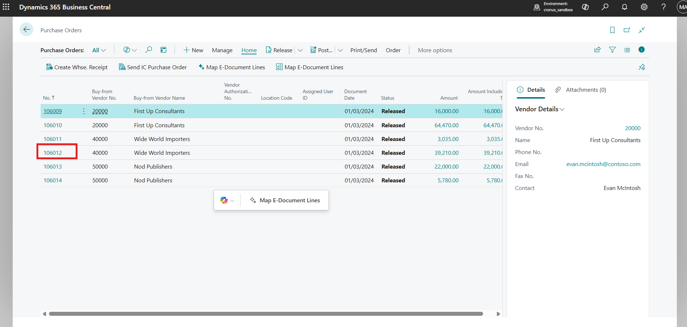

2. On the purchase order page, select **Map E-Document Lines** from the top bar.

    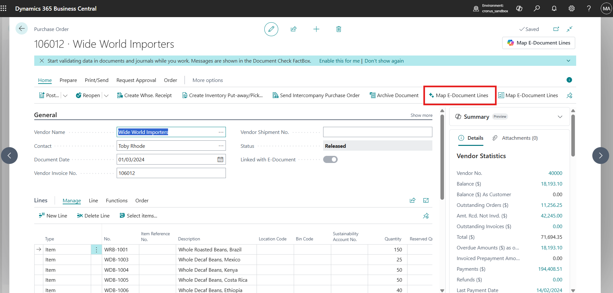

3. Review the matching results, including:

    - Auto-matched lines
    - Copilot-matched lines

4. Select **Discard it** to explore alternative matching options.

    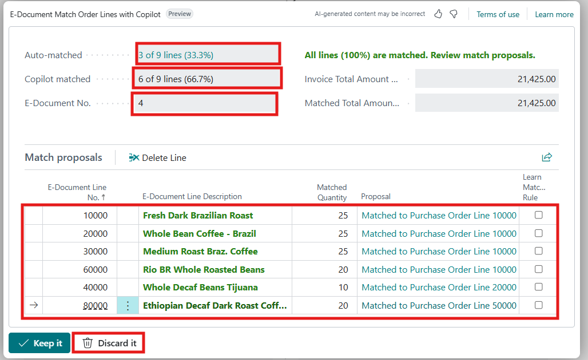

### Task 4: Match E-Document Lines Using Copilot

1. On the purchase order matching page, review the available options:

    - **Match with Copilot**
    - **Match manually**
    - **Match automatically**

    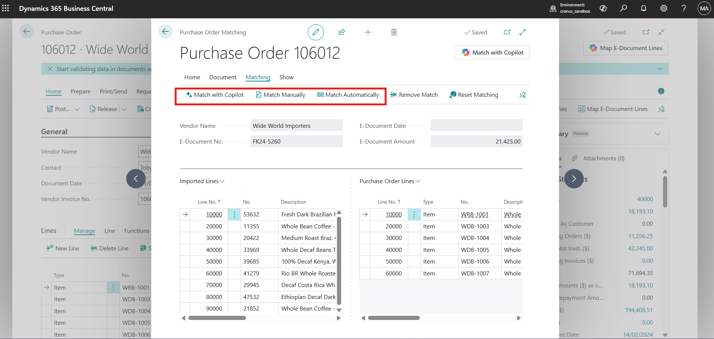

2. Select **Match with Copilot**.

    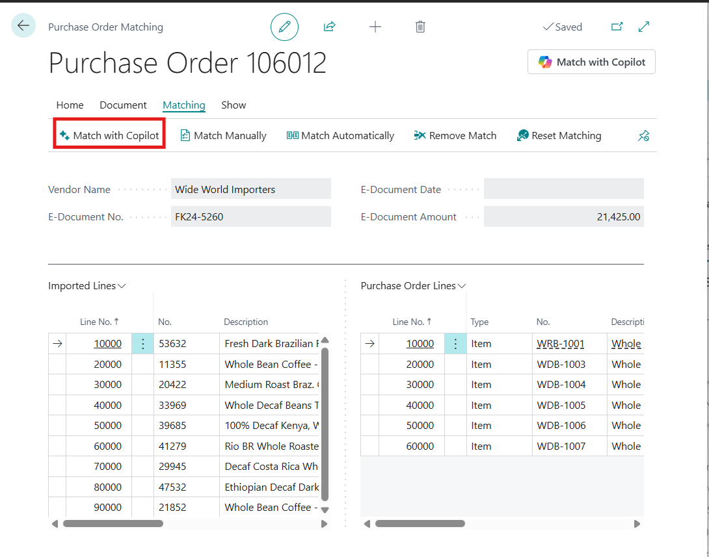

3. Copilot matches all e-document lines with the purchase order lines. Review the matching suggestions carefully.

4. Select **Keep it** to save the final mapping.

    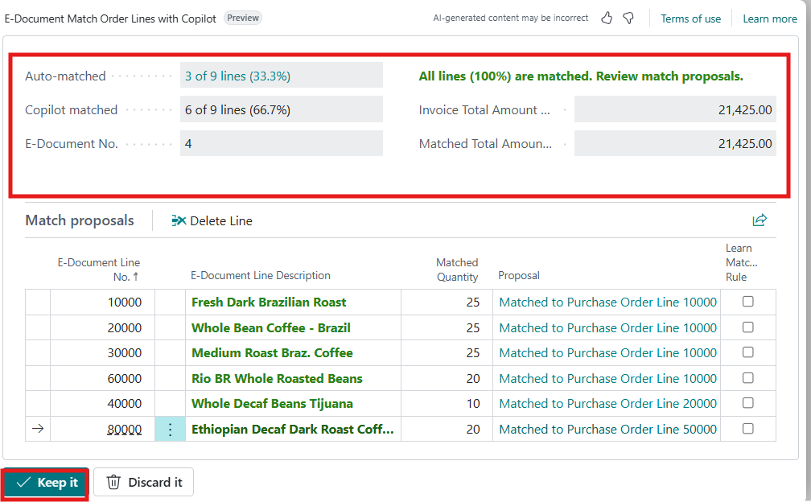

> [!TIP]
> Use **Match manually** when you want full control over which e-document line maps to which purchase order line.

> **✅ Result:** You have mapped e-document lines to purchase order lines using Copilot and explored the alternative matching options.

---

## Summary

By completing this lab, you gained a practical understanding of how Copilot enhances the e-document mapping experience in Dynamics 365 Business Central. You generated demo data, reviewed linked purchase orders, and used Copilot to match e-document lines with purchase order lines. You also explored different matching scenarios, including reviewing and discarding matches, to understand the available options. This lab demonstrates how Copilot can reduce manual effort, improve accuracy, and streamline procurement workflows by simplifying the mapping of vendor e-documents to purchase orders.

## Key Takeaways

- E-documents received from vendors can be linked to existing purchase orders in Business Central.
- **Map E-Document Lines** uses Copilot to match document lines to purchase order lines.
- You can keep, discard, or re-run matches with Copilot, manual, or automatic matching.
- Always review AI-generated matches, as Copilot results may occasionally be incomplete or incorrect.
