# Lab 4: Automating Sales Order Capture for Faster Order Processing with the Sales Order Agent.

**Introduction**

In this lab, participants will learn how the Copilot-powered **Sales
Agent** in Dynamics 365 Business Central helps automate customer
inquiries and generate sales quotations directly from email requests.
The lab demonstrates how to activate and configure the Sales Agent,
receive customer inquiries via email, review Copilot-driven decisions,
and send quotation responses automatically. This hands-on experience
shows how sales teams can respond faster to customer requests while
reducing manual effort and improving accuracy.

## Task 1: Activate the Sales Agent

1.  Navigate to
    <https://www.microsoft.com/en-us/dynamics-365/products/business-central/sign-in>
    business central and sign in with the admin tenant.

> **Note:** Ensure all participants are working in the Production
> environment before starting the exercise.
>
> 

2.  From the top navigation bar, click the **Sales Agent** icon to begin
    configuration.

3.  Click **Activate** to start setting up the Sales Agent.

> 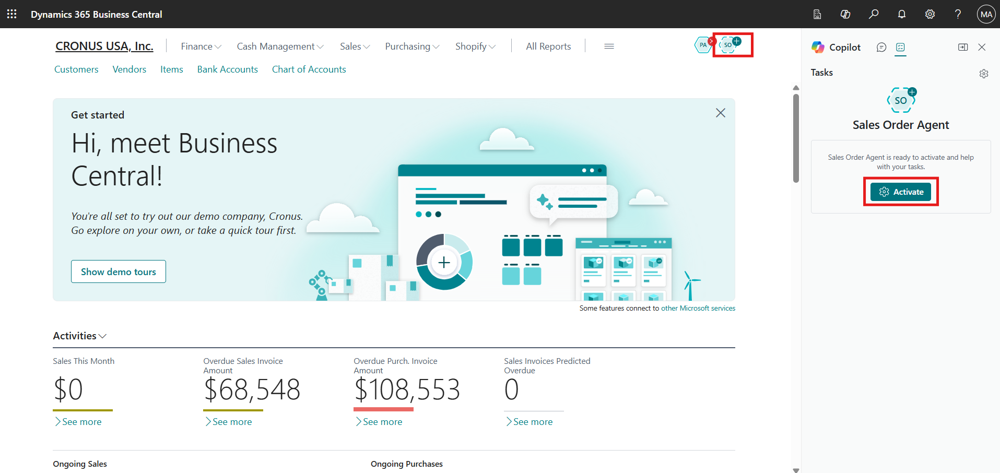

4.  Turn **On** the **Activate** toggle so the Sales Agent can start
    handling incoming sales inquiries.

> 

## Task 2: Configure the Mailbox for Sales Inquiries

1.  In the **Mailbox** section, click the **horizontal ellipsis (⋯)** to
    configure how sales inquiries will be received.

> 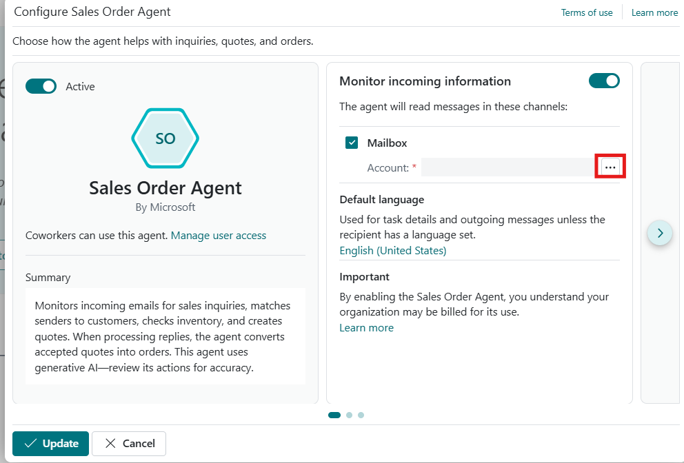

2.  Select **Current user**, allowing the agent to use the signed-in
    user’s mailbox for receiving customer emails.

3.  Click **OK** to proceed and complete the mailbox configuration.

> 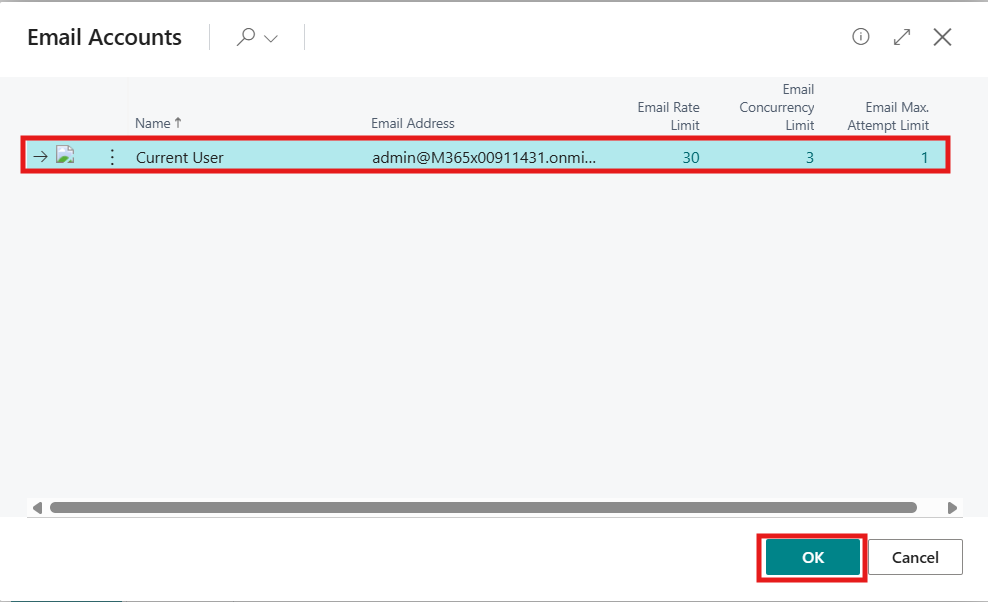

## Task 3: Configure Sales Agent Behavior

1.  Click the **right-arrow (\>)** icon to access additional Sales Agent
    configuration options.

> 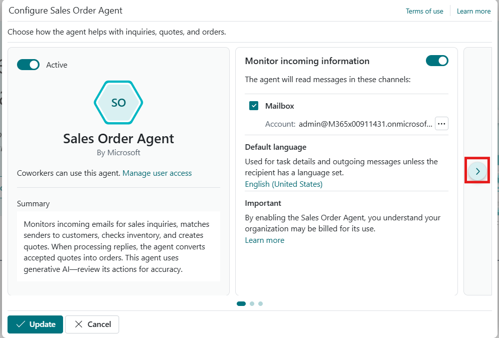

2.  Review the available configuration sections:

    - **Respond to inquiries**, which controls how the agent reviews and
      responds to messages from registered and unregistered senders.

    - **Create sales documents**, which determines whether the agent
      sends quotations for confirmation and creates orders from quotes.

3.  Leave the default settings unchanged for this lab.

4.  Click **Update** to apply the configuration.

> 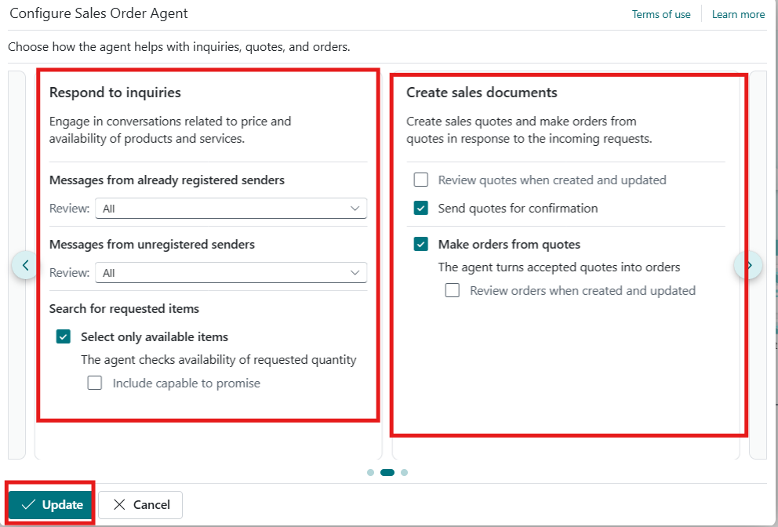

5.  Verify that the Sales Agent status shows it is configured
    successfully.

> 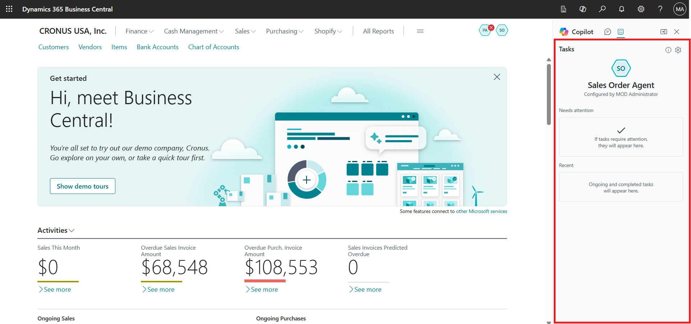

## Task 4: Send a Customer Inquiry Email

1.  Open a new browser tab and navigate to
    <https://outlook.live.com/mail/0/> **Outlook**.

2.  Sign in using your personal email account.  
    *If Outlook is not available, any email provider can be used.
    Outlook is used here for demonstration.*

> 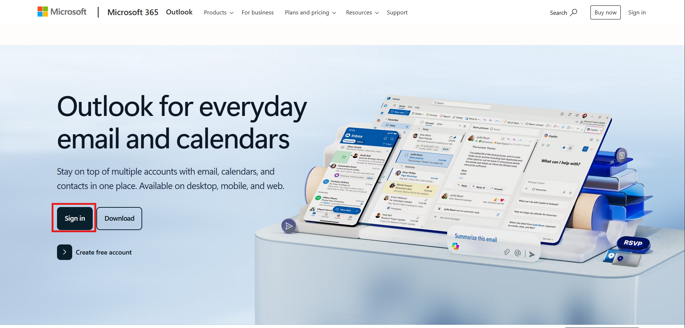

3.  Create a new email and send it to the same admin tenant email
    address configured for the Sales Agent.

4.  Use the following email details:

> **Subject:** Inquiry About Chairs
>
> **Email Body:**
>
> Hi,
>
> My name is Meagan Bond from the School of Fine Art. We are in the
> process of purchasing chairs and would like to know what options you
> have available.
>
> Please share the available models, pricing, and lead times at your
> earliest convenience.
>
> Thank you

5.  Send the email to initiate the sales inquiry process.

> 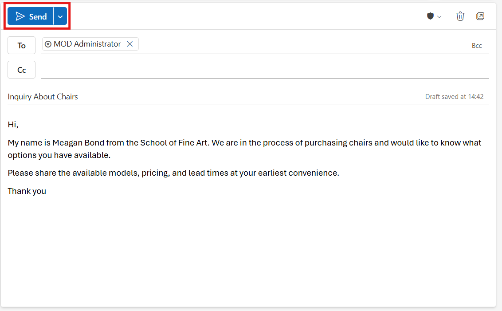

## Task 5: Review the Sales Inquiry in Business Central

1.  Navigate back to the **Sales Agent** in the Business Central portal.

2.  Notice the notification indicating a **new sales inquiry** has been
    received.

3.  Click the new sales order notification to open the request.

> 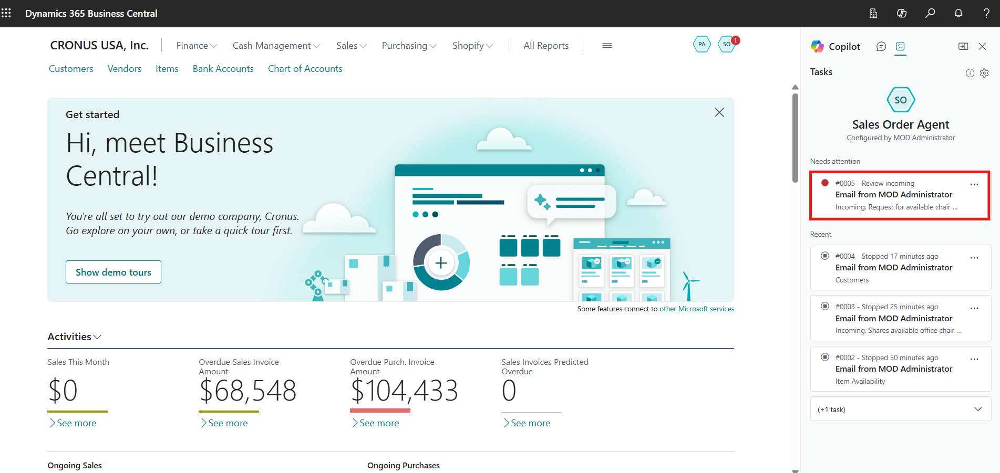

4.  Click **Review** to examine the incoming email.

> 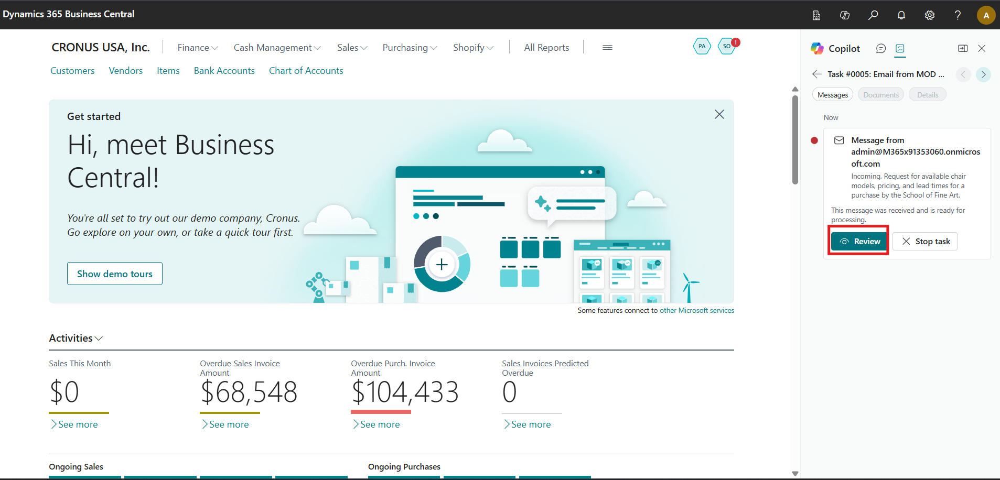

5.  Review the inquiry details and allow the agent to determine the next
    step for generating a quotation.

6.  Click **Continue** to proceed.

> 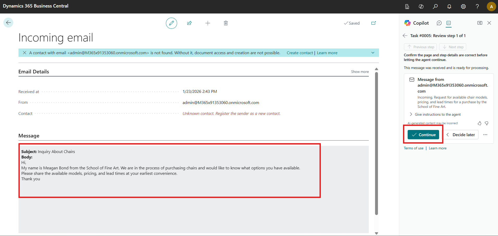

## Task 6: Review and Send the Quotation Response

1.  After processing the inquiry, the Sales Agent prepares a response
    email based on the received request.

2.  Click **Review** to review the drafted response.

> 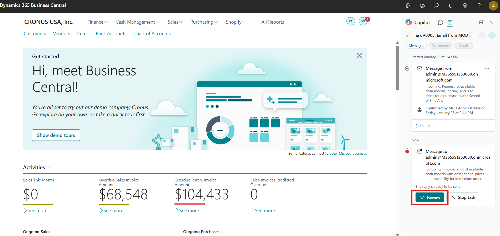

3.  Review the quotation details created from Business Central item
    data.

4.  Click **Continue** to allow the agent to send the quotation email.

> 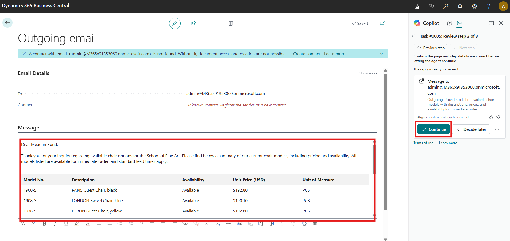

5.  Navigate back to your personal email inbox and review the quotation
    response received, which includes the furniture details requested in
    the original inquiry.

> 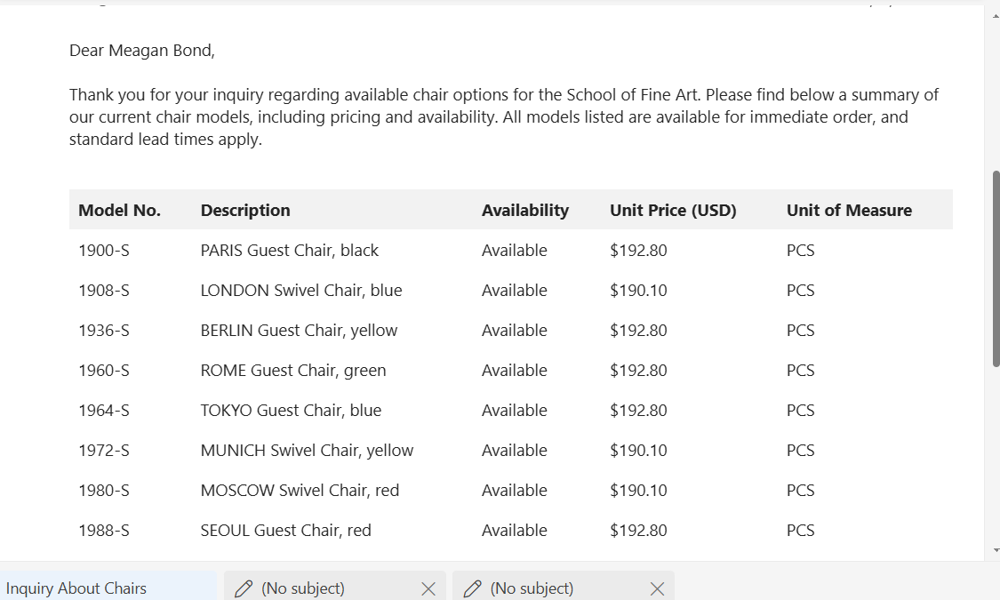

**Conclusion**

By completing this lab, participants have successfully configured the
Sales Agent and used Copilot to automate customer inquiry handling and
quotation creation. They experienced how incoming emails are reviewed,
interpreted, and transformed into structured sales responses without
manual intervention. This lab highlights how Copilot helps sales teams
respond faster to customer needs, improve accuracy, and enhance customer
satisfaction using Dynamics 365 Business Central.
