# Lab 4: Creating and Enhancing Item Marketing Text with Copilot in Business Central

## Overview

In this lab, you will learn how to use Copilot in Microsoft Dynamics 365 Business Central to generate, review, and refine marketing text for an existing item. You will open an item card, generate an AI-powered first draft using Copilot, customize the content by selecting relevant attributes, and then review, edit, and save the final version.

This lab demonstrates how AI can accelerate content creation while still requiring human validation to ensure quality, accuracy, and brand alignment.

## Objectives

- Open an item card and start a marketing text draft with Copilot using two different methods.
- Select item attributes to improve the quality of the generated text.
- Edit, format, and regenerate marketing text suggestions.
- Adjust tone, format, and emphasis to match brand guidelines.
- Review and save the final marketing text.

## Prerequisites

- Access to the Business Central environment configured in **Lab 1**, with demo data generated.
- Copilot enabled in Business Central.

## Estimated Time

**20 minutes**

> [!NOTE]
> Text shown as +++sample text+++ can be typed or copied directly into the lab environment. Copilot responses are AI-generated, so your results may differ slightly from the screenshots.

---

## Exercise 1: Generate the First Draft with Copilot

In this exercise, you will open an existing item and use Copilot to generate a marketing text draft. You will explore two different methods to start draft generation and learn how to select relevant product attributes to improve the quality of the AI-generated content.

### Task 1: Open the Item Card

1. In Business Central, press **Alt + Q**. In the search field, type +++Items+++, and then select **Items** from the results.

    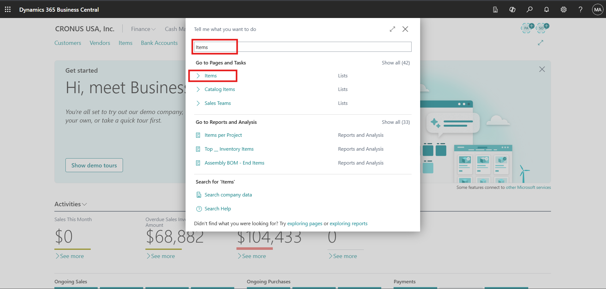

2. Locate the item **ATHENS Desk**, and select the value in the **No.** column to open the **Item Card**.

    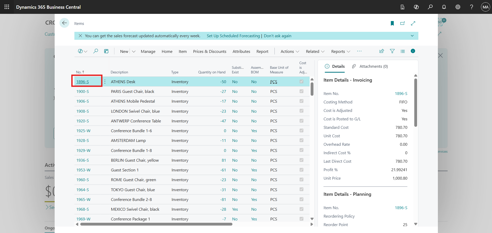

### Task 2: Start a Draft Using the Marketing Text FactBox (Method 1)

1. Locate the **Marketing Text** pane in the FactBox area on the right side of the Item Card.

2. Select **Draft with Copilot**.

    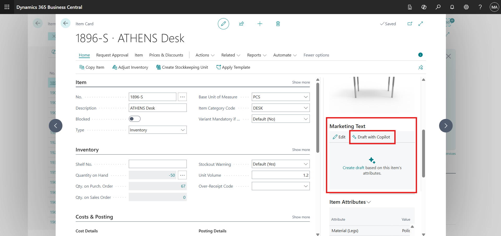

3. Copilot begins preparing a draft based on the item's existing information. Select **Cancel** to close the window.

    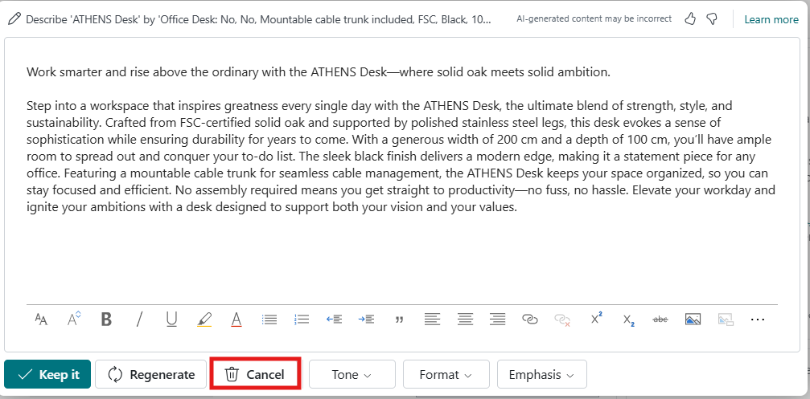

> [!NOTE]
> In this task you only explore where the FactBox option is located. Selecting **Cancel** closes the window without saving any text. You will generate the draft in the next task.

### Task 3: Start a Draft Using the Marketing Text Action (Method 2)

1. At the top of the Item Card page, select the **Marketing Text** action.

    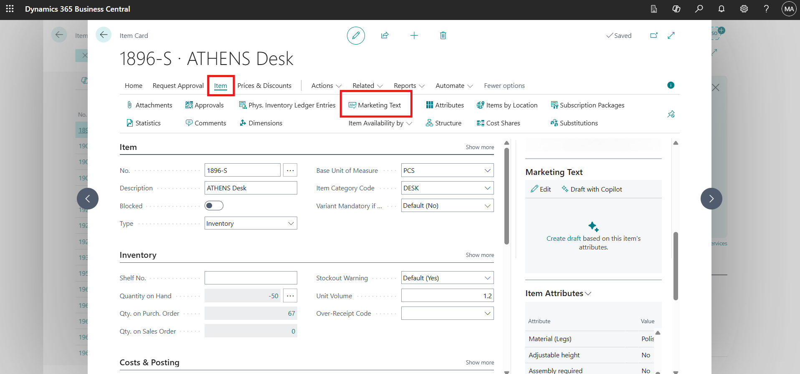

2. In the **Edit Marketing Text** window, select **Suggest marketing text**.

    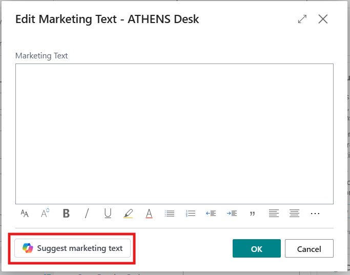

3. The **Suggest marketing text** window opens and displays the available item attributes.

    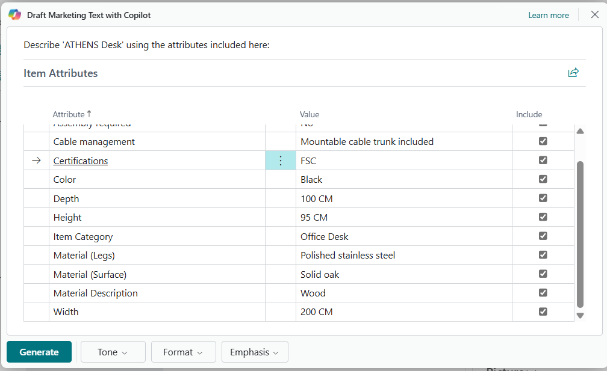

### Task 4: Select Attributes and Generate the Draft

1. In the **Draft Marketing Text** window, review the list of available item attributes.

2. Select the vertical ellipsis (**⋮**) next to an item attribute, and then select **Select more**.

3. Select multiple attributes, such as:

    - Color
    - Height
    - Material (legs)
    - Material (Surface)

4. Select **Generate**.

    

5. The generated text appears in the Copilot editor window. Read the draft carefully to evaluate its clarity, accuracy, tone, and completeness.

    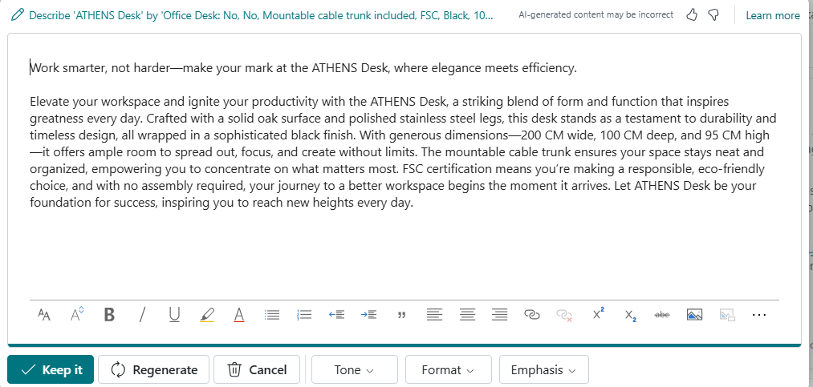

> [!IMPORTANT]
> AI-generated content is a suggestion only. It may contain inaccuracies or language that does not fully align with your organization's standards. Always review and edit the content before saving or publishing.

> **✅ Result:** You have generated a first draft of marketing text for **ATHENS Desk** using selected item attributes.

---

## Exercise 2: Review, Edit, and Save Marketing Text

In this exercise, you will refine the AI-generated marketing text. You will edit and format the content, generate alternative suggestions, customize tone and structure, and perform a final validation before saving.

### Task 1: Edit and Format the Draft

1. In the Copilot editor window, place the cursor inside the text box.

2. Make direct edits to improve clarity, accuracy, and brand alignment.

3. Use the formatting toolbar at the bottom of the editor to apply text styling, structure the content for readability, and insert hyperlinks if needed.

    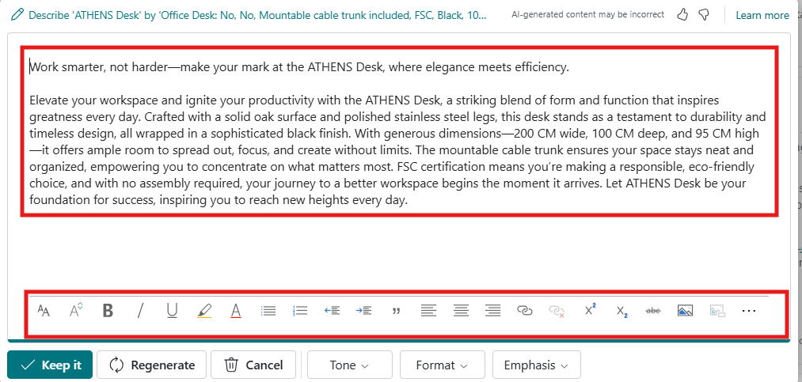

### Task 2: Regenerate and Compare Suggestions

1. Select **Regenerate** to create a new suggestion.

    

2. Use the navigation controls at the top of the page (for example, *1 of 2*) to move between the available suggestions.

    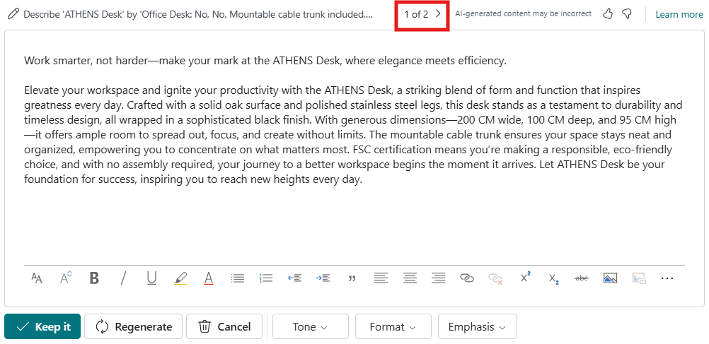

3. Compare the variations and determine which draft best aligns with your requirements.

### Task 3: Customize Tone, Format, and Emphasis

1. Choose a **tone** that aligns with your brand voice:

    - **Formal** – For professional and corporate communication.
    - **Creative** – For engaging and conversational messaging.

    

2. Select the **format** of the marketing text:

    - **Tagline** – A short, catchy phrase.
    - **Paragraph** – A detailed descriptive block of text.
    - **Tagline + Paragraph** – A combination of both.
    - **Brief** – An introductory statement followed by bullet points.

    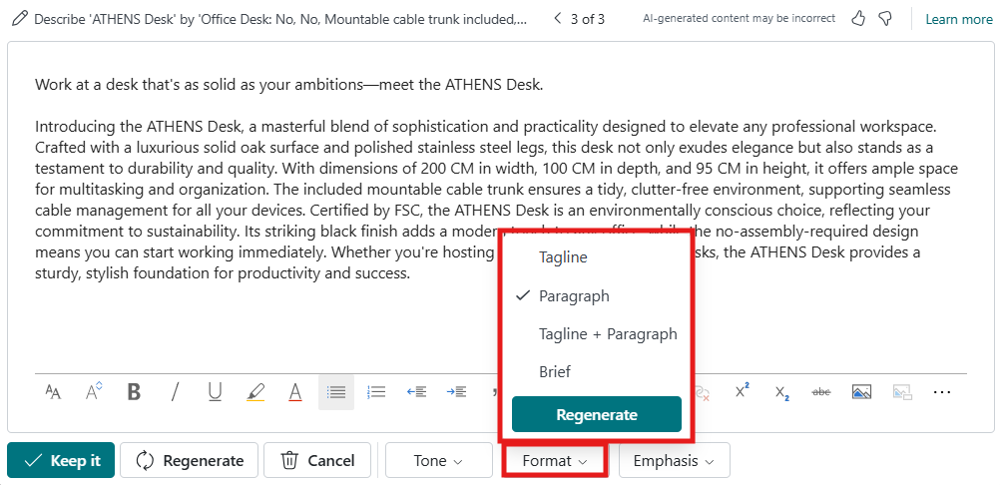

3. Select predefined **qualities** to emphasize, such as Quality, Durability, Performance, or Innovation.

    

4. Choose attributes that logically align with the item type. After adjusting your preferences, select **Regenerate** if needed to apply the new settings.

    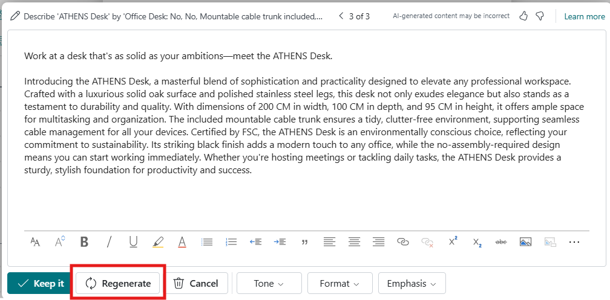

> [!TIP]
> Change one setting at a time and regenerate, so you can clearly see how each option affects the output.

### Task 4: Review and Save the Marketing Text

1. Conduct a thorough review of the text and confirm that:

    - Product details are accurate.
    - Content complies with company standards.
    - The tone aligns with brand guidelines.

2. If satisfied, select **Keep it** to save the marketing text.

    

3. Select **OK** to confirm the update.

    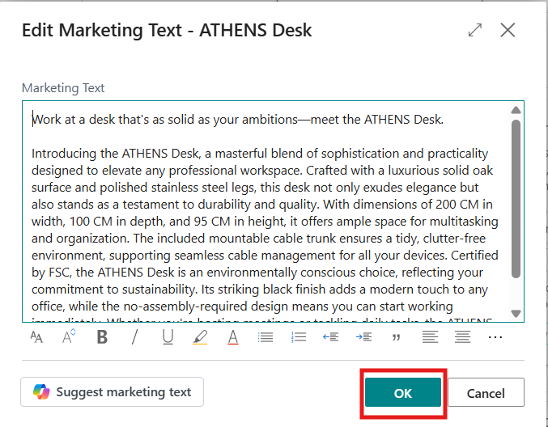

> **✅ Result:** You have refined, validated, and saved the marketing text for the item.

---

## Summary

In this lab, you explored how to use Copilot in Microsoft Dynamics 365 Business Central to efficiently create and refine marketing text for an existing item. You learned how to generate an initial AI-powered draft, enhance content quality by selecting relevant item attributes, and customize tone, structure, and emphasis to align with brand guidelines. You also reviewed multiple suggestions, edited the content for clarity and accuracy, and finalized the text before saving it. Overall, this lab demonstrated how AI can accelerate content creation while reinforcing the importance of human review to ensure accuracy, consistency, and compliance with organizational standards.

## Key Takeaways

- Marketing text can be drafted from the **Marketing Text** FactBox or the **Marketing Text** action on the Item Card.
- Selecting relevant item attributes improves the accuracy of the generated text.
- Tone, format, and emphasis settings let you tailor the output to your brand.
- Always review AI-generated content, as Copilot results may occasionally be incomplete or incorrect.
