# Lab 5: Analyze Open Sales Invoices Using Copilot Chat and Analysis Assist in Dynamics 365 Business Central

## Overview

Keeping track of unpaid customer invoices is one of the most important routine tasks for any finance or accounts receivable team. Open invoices tie up cash, and knowing which customers owe money, how much, and when payments are due helps a business plan collections and manage cash flow.

Microsoft Dynamics 365 Business Central includes Copilot capabilities that make this work faster. **Copilot Chat** lets you ask questions about your business data in plain language and returns clickable results that open the underlying records. **Analysis Assist** works inside list pages, turning a short natural-language description into a grouped, totalled, and sorted analysis view without building it manually.

In this lab, you will work in the **CRONUS USA, Inc.** demo company. You will use Copilot Chat to find posted sales invoices that still carry a remaining amount, use the prompt guide to look up purchase invoices, build and save an analysis of open invoices by due month with Analysis Assist, and finally ask Copilot which customer has the highest outstanding balance.

## Objectives

- Open Copilot Chat and query posted sales invoices using natural language.
- Navigate from a Copilot result card directly to the underlying document.
- Use the Copilot prompt guide to build queries from ready-made templates.
- Use Analysis Assist to group, total, and sort the Posted Sales Invoices list.
- Refine, keep, and rename an analysis view for later reuse.
- Ask Copilot Chat analytical questions about customer balances.

## Prerequisites

- Access to a Dynamics 365 Business Central environment with the **CRONUS USA, Inc.** demo company.
- Copilot enabled in Business Central, including Copilot Chat and Analysis Assist.
- A user account with permission to view sales and purchase documents.

## Estimated Time

**30 minutes**

> [!NOTE]
> Text shown as +++sample text+++ can be typed or copied directly into the lab environment. Copilot responses are AI-generated, so your results may differ slightly from the screenshots.

---

## Exercise 1: Find Open Sales Invoices Using Copilot Chat

In this exercise, you will open Copilot Chat from the Business Central home page and ask it to list posted sales invoices that still have a remaining amount. You will then open one of the invoices directly from the Copilot response.

### Task 1: Query Open Sales Invoices

1. Sign in to Dynamics 365 Business Central. The Role Center for **CRONUS USA, Inc.** opens, showing activity tiles such as **Overdue Sales Invoice Amount**.

    

2. Select the **Copilot** icon at the top of the screen to open the Copilot chat pane.

    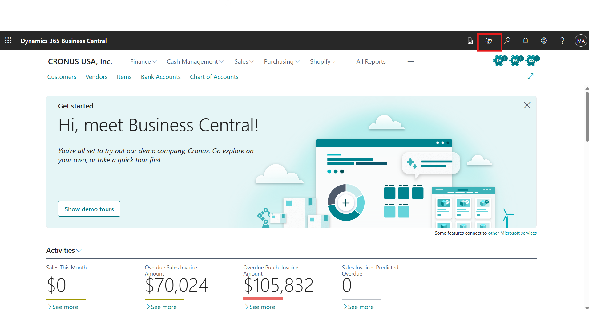

3. In the Copilot chat window, type the following query, and then press **Enter** or select the **Send** icon:

    +++Show me all posted sales invoices that have a remaining amount+++

    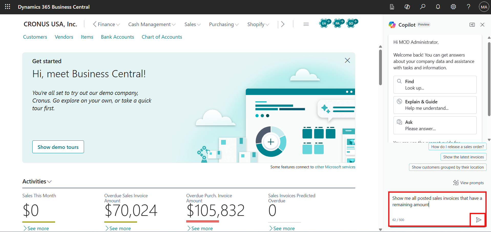

4. Review the response. Copilot returns a list of posted sales invoices with a remaining amount, such as **Trey Research**, **School of Fine Art**, and **Relecloud**. Each card shows the invoice number, amount, due date, amount including tax, and remaining amount.

    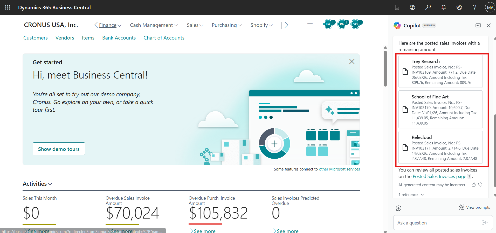

### Task 2: Open an Invoice from the Copilot Results

1. Select the **Trey Research** invoice card (**PS-INV103169**) to open the document.

    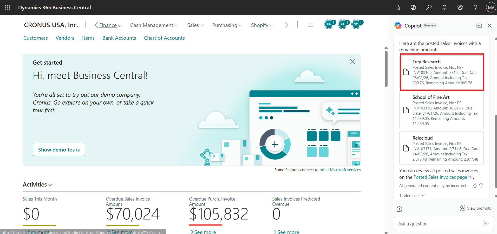

2. The **Posted Sales Invoice** page opens for **PS-INV103169 · Trey Research**. Scroll through the page to review the invoice totals and the **Invoice Details** section, including the payment terms and the total including tax.

    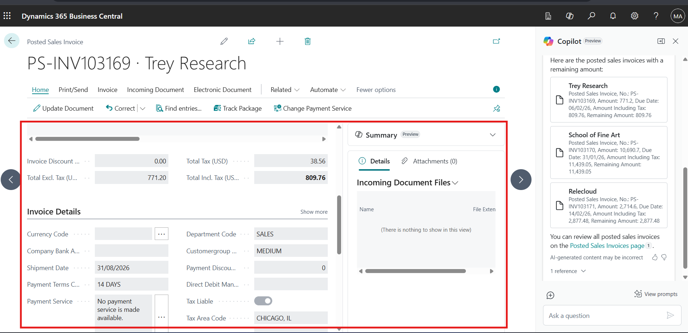

> [!NOTE]
> Invoice numbers and customer names in your results may differ depending on the demo data in your environment. If **PS-INV103169** does not appear, open any invoice card returned by Copilot.

> **✅ Result:** You have used Copilot Chat to find open sales invoices and navigated directly from a Copilot result to the source document.

---

## Exercise 2: Use the Copilot Prompt Guide to Look Up Purchase Invoices

The prompt guide offers ready-made prompt templates grouped into **Find**, **Explain & Guide**, and **Ask** categories. In this exercise, you will use a Find template to look up posted purchase invoices for a specific vendor.

### Task 1: Open the Prompt Guide

1. With the Copilot pane still open, select **View prompts** at the bottom of the chat pane.

    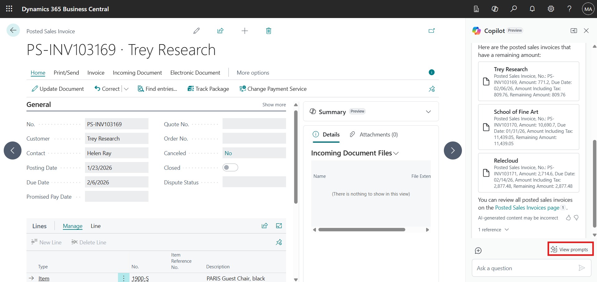

2. The **Prompt guide** menu opens, showing the categories **Find**, **Explain & Guide**, and **Ask**, along with **View more prompts**.

    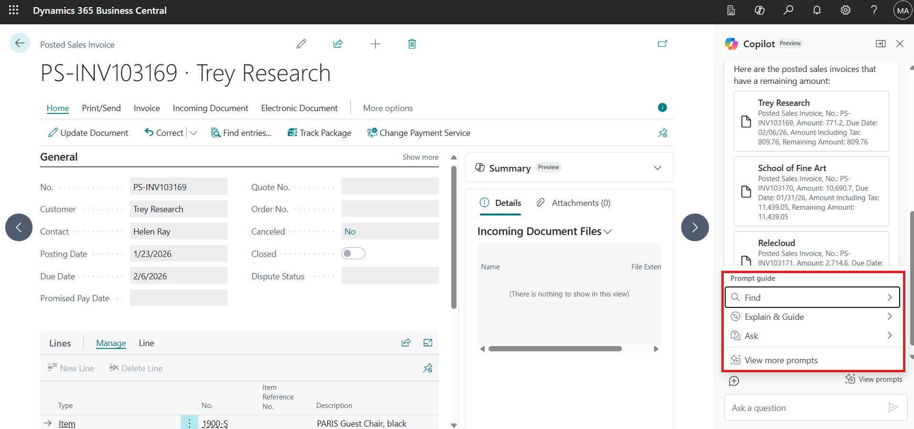

3. Select **Find**.

    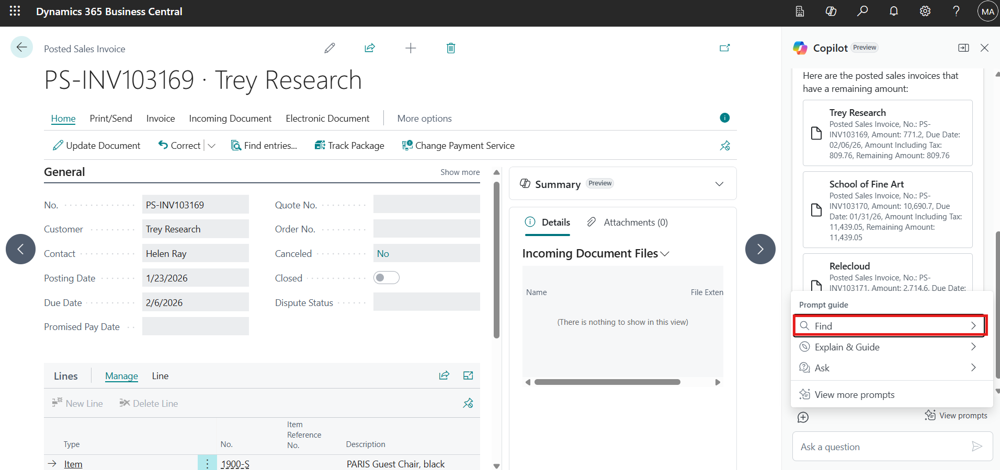

### Task 2: Build and Run a Query from a Template

1. From the list of templates, select **Look up purchase invoice [number]**. The template text is inserted into the chat input box.

    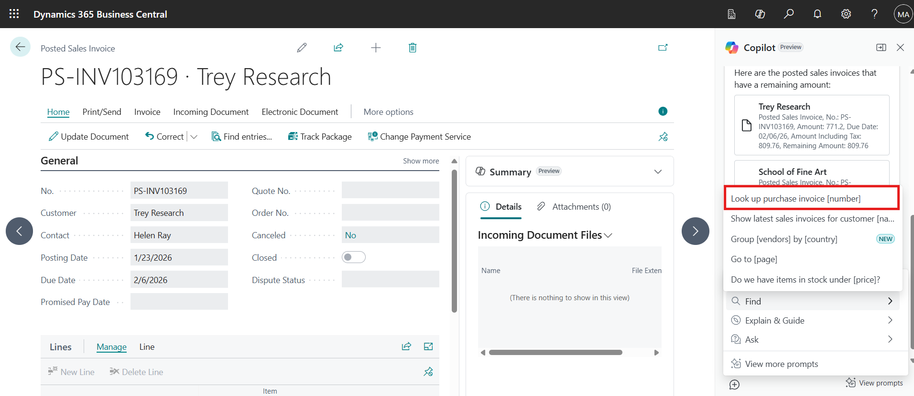

2. Edit the prompt so that it reads as follows, and then select the **Send** icon:

    +++Look up fabrikam purchase invoice whose amount should be greater than 1000+++

    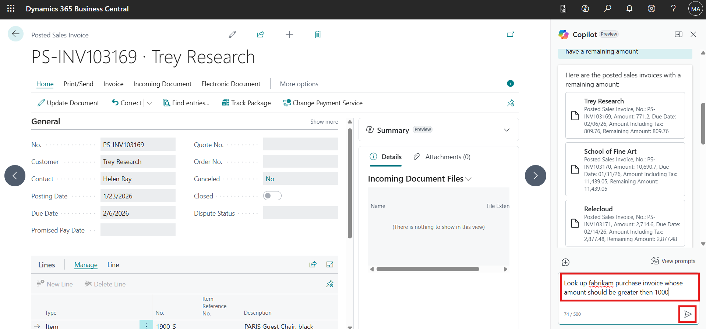

3. Review the results. Copilot lists the posted purchase invoices for **Fabrikam, Inc.** with amounts greater than $1,000. Select the invoice card **108034** to open it.

    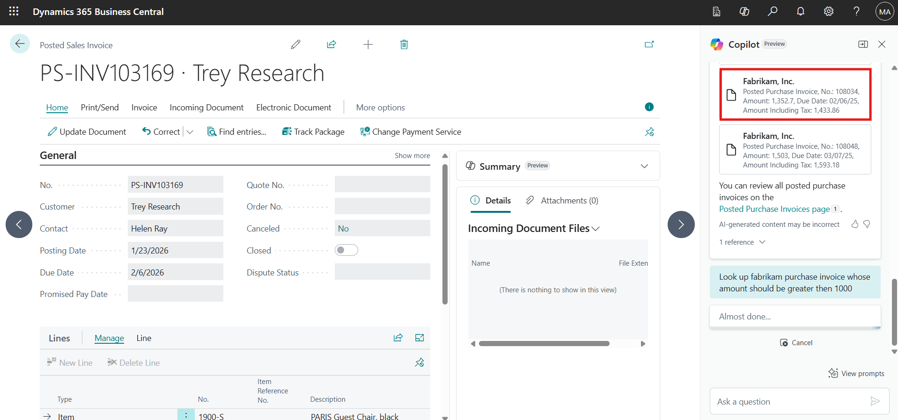

4. The **Posted Purchase Invoice** page opens for **108034 · Fabrikam, Inc.** Review the invoice line and totals, such as **Total Excl. Tax** and **Total Incl. Tax**.

    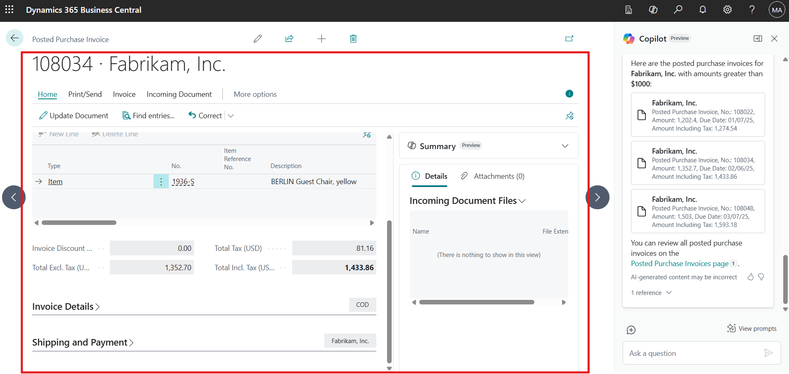

> [!TIP]
> Templates in the prompt guide are starting points. Replace the text in square brackets with your own values, or rewrite the prompt entirely to fit your question.

> **✅ Result:** You have used the prompt guide to build a Copilot query from a template and opened the matching purchase invoice.

---

## Exercise 3: Analyze Open Sales Invoices Using Analysis Assist

Analysis Assist lets you describe the layout you want in plain language, and Copilot builds the analysis view for you. In this exercise, you will group posted sales invoices by due month and customer, total the remaining amount, sort the results, and save the analysis with a meaningful name.

### Task 1: Generate a Grouped Analysis

1. On the Role Center, select **Sales** from the navigation menu, and then select **Posted Sales Invoices**.

    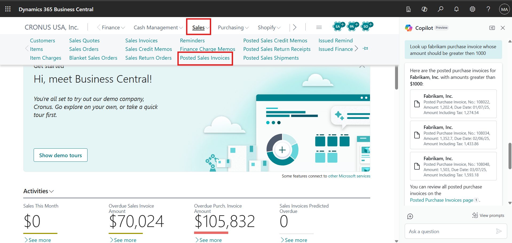

2. On the **Posted Sales Invoices** list page, select the **Copilot** drop-down icon in the action bar, and then select **Analyze list**.

    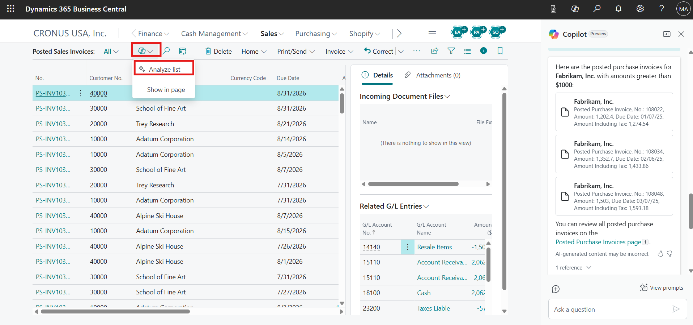

3. The **Analyze Posted Sales Invoices** window opens. Select the **Prompt guide** icon next to **Generate**, point to **Add structure**, and then select **Group by [salesperson then country]**.

    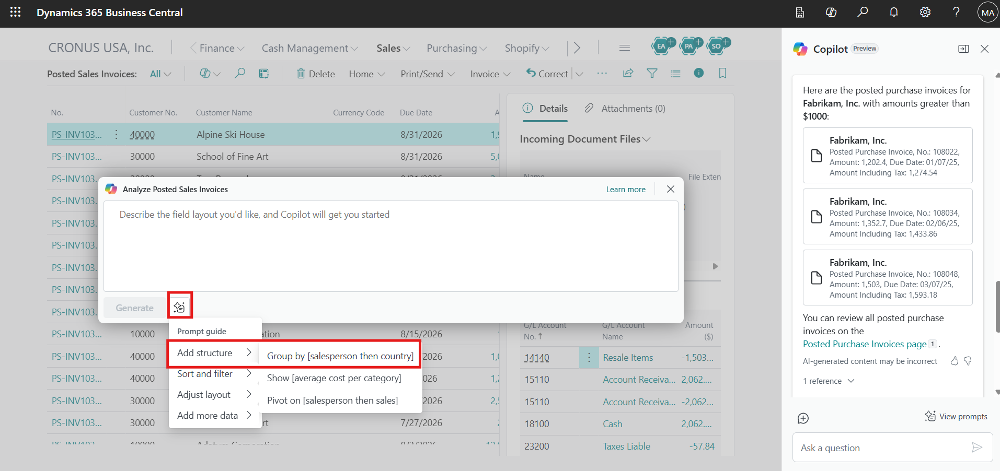

4. Replace the prompt text so that it reads as follows, and then select **Generate**:

    +++Group by due date month and customer name, and total the remaining amount+++

    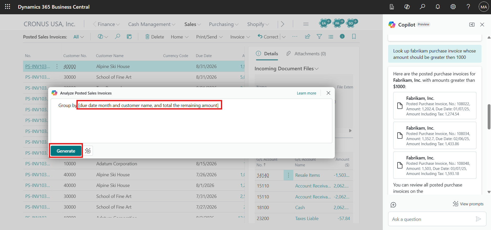

5. Review the generated analysis. The invoices are grouped by **Due Date Month** and **Customer Name**, with **Sum(Remaining Amount)** and **Sum(Amount)** columns and a total row at the bottom. The **Row Groups** pane on the right reflects the grouping Copilot applied.

    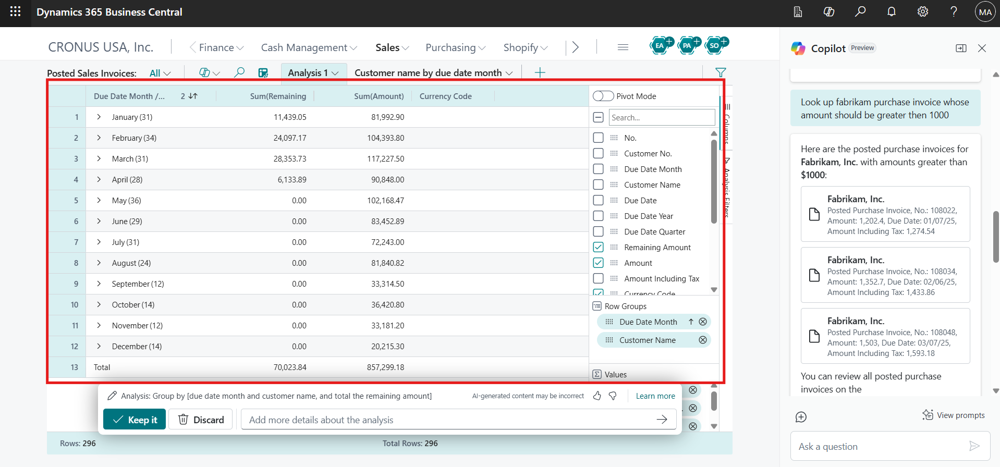

### Task 2: Refine and Keep the Analysis

1. Select the **Add more details about the analysis** box.

    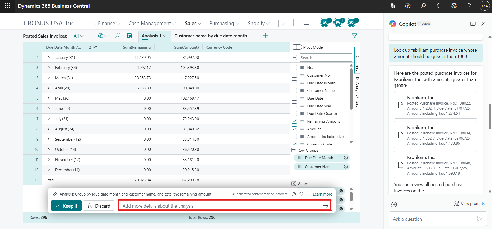

2. Type the following instruction, and then select the **arrow** icon:

    +++Sort by remaining amount, highest first+++

    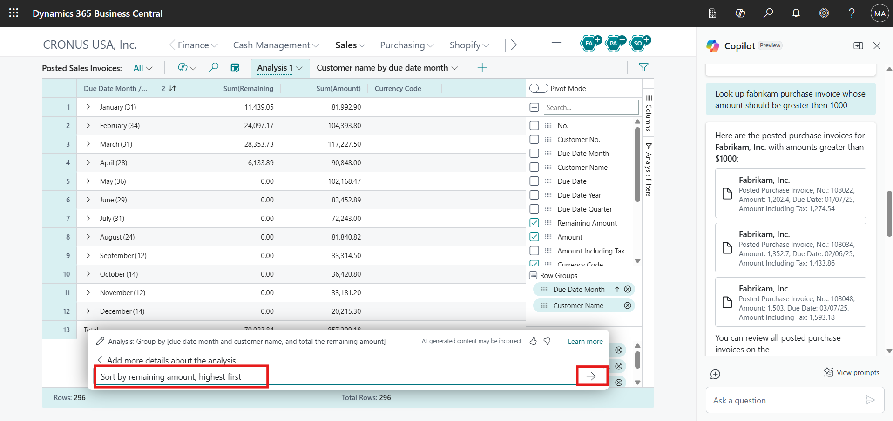

3. Verify that the months are now sorted by remaining amount in descending order, with **March** at the top. Select **Keep it** to save the analysis.

    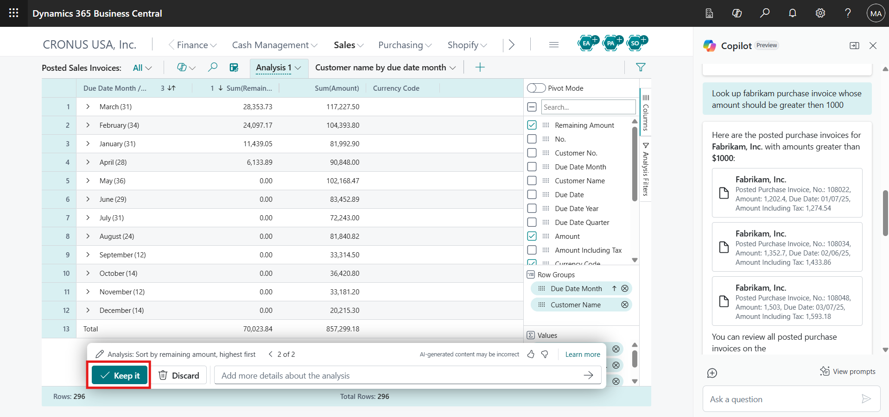

> [!WARNING]
> If you close the analysis window without selecting **Keep it**, the generated analysis is discarded and you must run the prompt again.

### Task 3: Rename the Analysis Tab

1. Select the drop-down arrow next to **Analysis 1**, and then select **Rename**.

    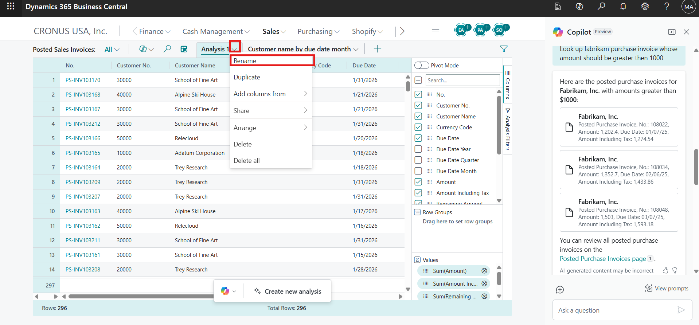

2. In the **Rename** dialog, enter the following name in the **Name** field, and then select **Rename**:

    +++Open Invoices by Due Month+++

    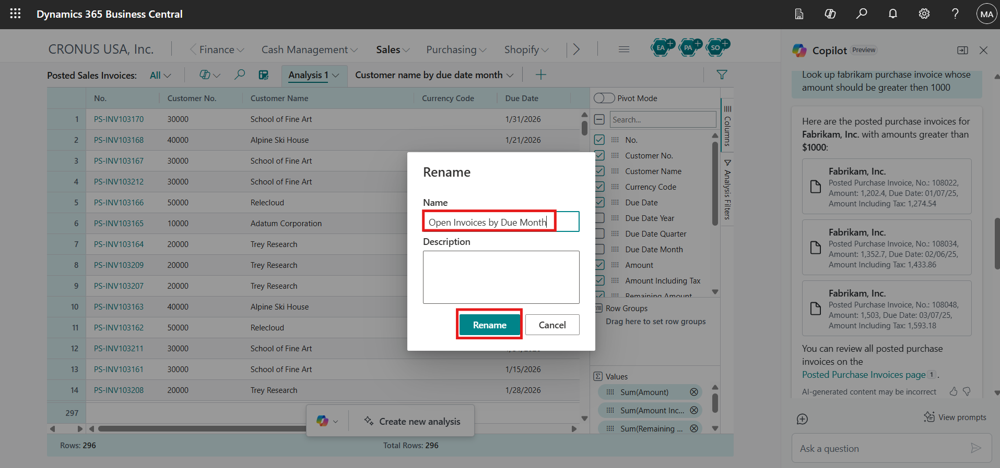

> **✅ Result:** You have created, refined, and saved an analysis of open sales invoices by due month using Analysis Assist.

---

## Exercise 4: Identify the Customer with the Highest Outstanding Balance

With the analysis saved, you will return to Copilot Chat to ask a direct analytical question about customer balances.

1. Confirm that the analysis tab now shows **Open Invoices by Due Month**. In the Copilot chat pane, type the following question, and then select the **Send** icon:

    +++Which customer has the highest outstanding balance+++

    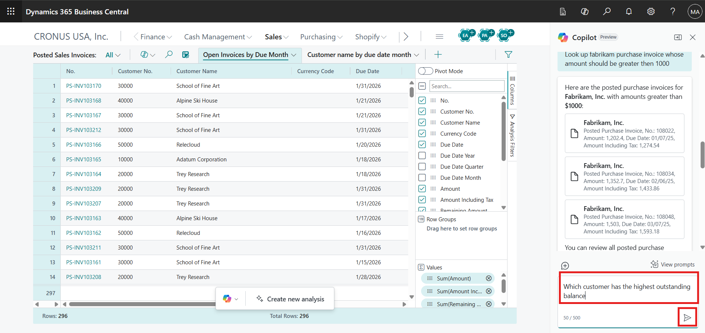

2. Review the response. Copilot identifies **School of Fine Art** as the customer with the highest outstanding balance of **$53,833.52**, which is also fully overdue. The customer card shows the customer number, balance, contact name, and overdue balance, and you can select it to open the customer record.

    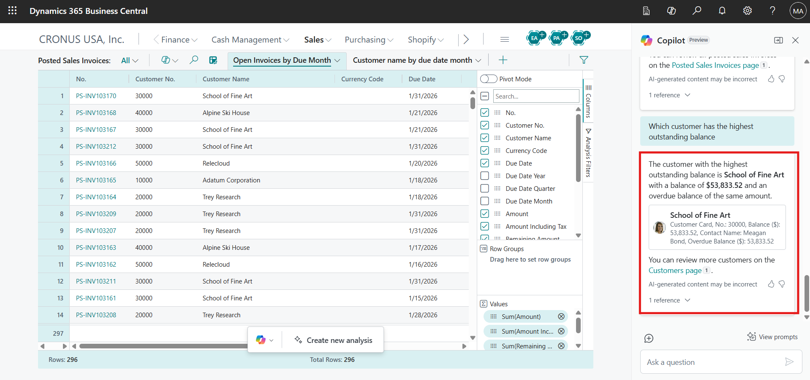

> [!IMPORTANT]
> Before using Copilot's answer for collections decisions, confirm the balance on the customer card or in customer ledger entries.

> **✅ Result:** You have used Copilot Chat to quickly identify the customer with the highest outstanding balance.

---

## Summary

In this lab, you used Copilot in Dynamics 365 Business Central to analyze open sales invoices from several angles. You asked Copilot Chat in plain language for posted sales invoices with a remaining amount and opened an invoice directly from the results. You used the prompt guide to build a query from a template and looked up Fabrikam purchase invoices above a set amount.

You then used Analysis Assist on the Posted Sales Invoices list to group invoices by due month and customer, total the remaining amount, sort the results from highest to lowest, and save the view as **Open Invoices by Due Month**. Finally, you asked Copilot Chat which customer had the highest outstanding balance and identified **School of Fine Art**.

Together, these capabilities let finance and sales teams move from question to insight in minutes, without building filters, reports, or pivot layouts by hand. Saved analysis views can be revisited at any time to support regular collections reviews and cash flow planning.

## Key Takeaways

- Copilot Chat answers questions about Business Central data in natural language and links results to the source records.
- The prompt guide provides reusable templates that speed up common Find, Explain & Guide, and Ask queries.
- Analysis Assist turns a short description into a grouped, totalled, and sorted analysis view that you can refine, keep, and rename.
- Always review AI-generated content, as Copilot results may occasionally be incomplete or incorrect.
