# Lab 5 - Map e-documents to purchase order lines with Copilot in Dynamics 365 Business Central

**Introduction**

In this lab, participants explore how e-documents are processed and
mapped to purchase orders in Dynamics 365 Business Central using
Copilot. The lab begins by accessing a sandbox environment and
generating the required demo data using the Contoso Demo Tool.
Participants then work with linked purchase orders created from
e-documents and learn how Copilot assists in matching e-document lines
with purchase order lines. Through hands-on exercises, participants gain
practical experience in reviewing, validating, and saving
Copilot-generated matches, while also understanding the different
matching options available within the e-document mapping process.

## Task 1: Open Business Central Admin Center and Access Sandbox Environment

1.  Navigate to the Business Central home page.

2.  From the top bar, select **Settings**, and then choose **Admin
    Center**.

> 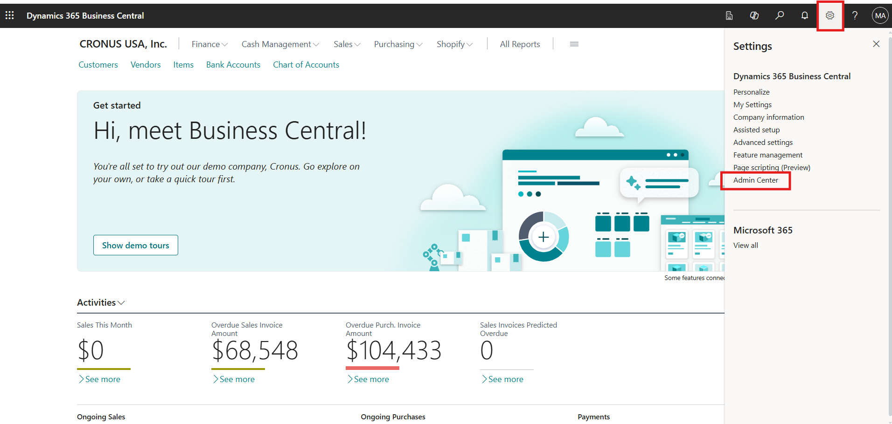

3.  In the Admin Center, locate and select the **cronus_sandbox**
    environment.

> 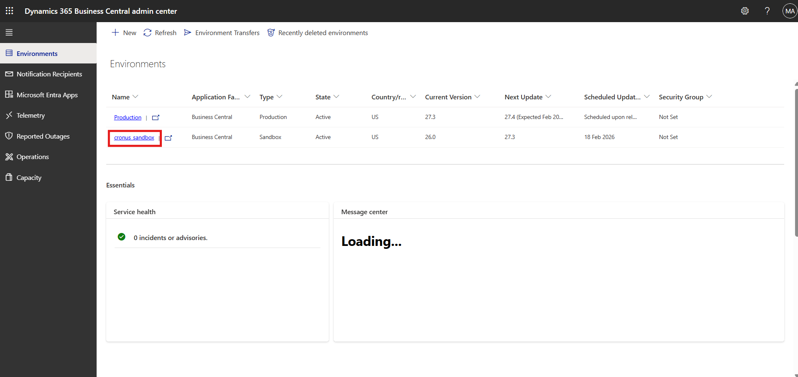

4.  Click on the **Environment URL** to open the selected sandbox
    environment.

> 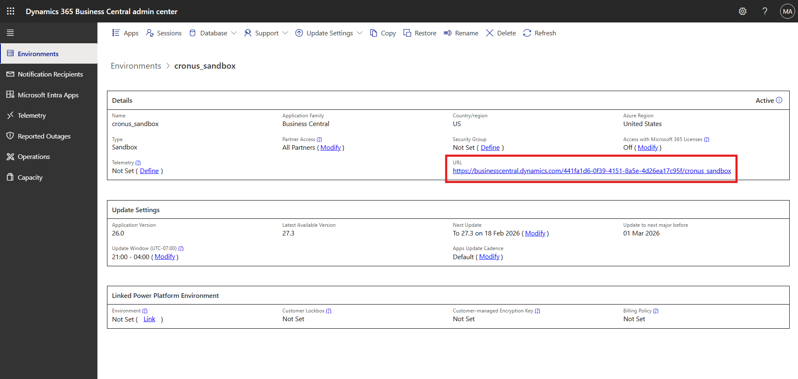

## Task 2: Generate Demo Data Using Contoso Demo Tool

1.  Once inside the sandbox environment, press **Alt + Q** on the
    keyboard to open the search.

2.  In the search field, enter **Contoso Demo Tool** and select it from
    the results.

> 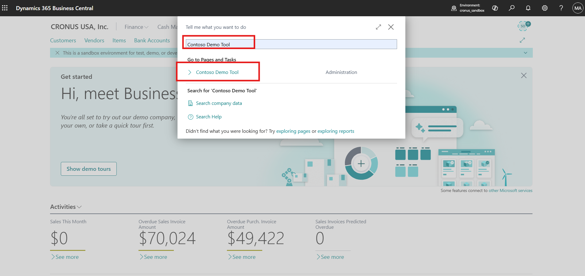

3.  In the Contoso Demo Tool page, locate the **Data Name** field.

4.  Select the vertical menu option for the Name field and choose
    **Select More**.

> 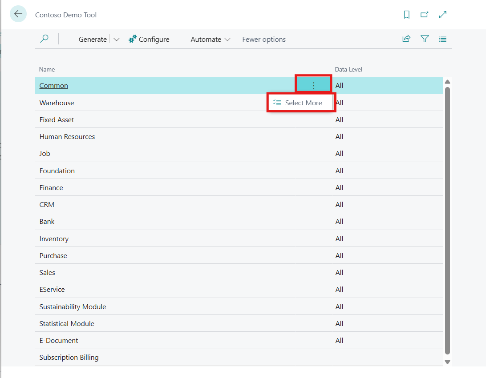

5.  From the list of available demo data:

    - Select all data options

    - **Do not select**: Subscription and Billing

6.  After selecting the required demo data, click **Generate** from the
    top of the page.

> 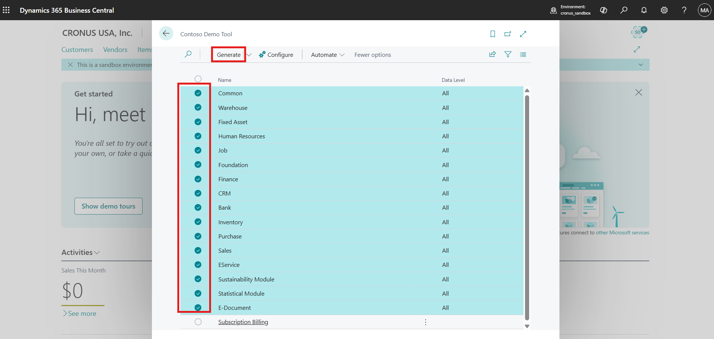

7.  When prompted, click **Yes** to confirm the generation process.

> 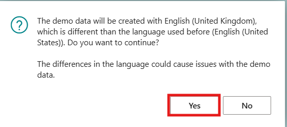

8.  Click **OK** once the process is completed successfully.

> 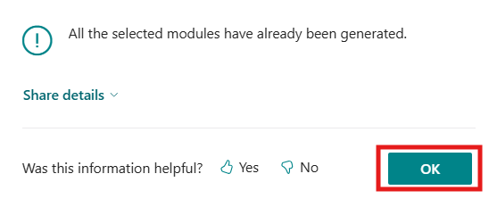

## Task 3: Open Linked Purchase Orders from E-Document Activities

1.  Navigate back to the Business Central home page.

> 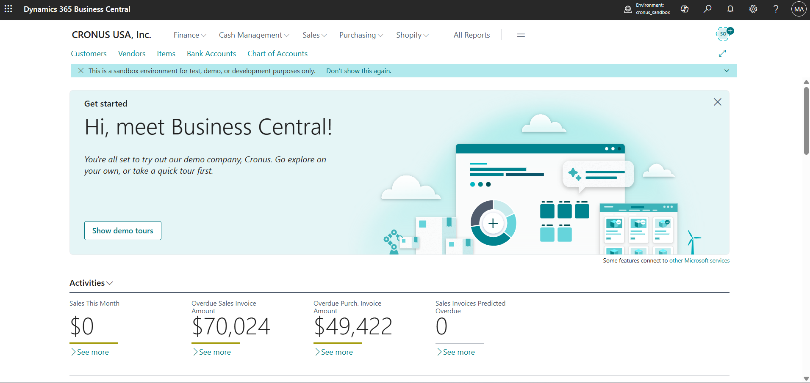

2.  Scroll down to locate the **E-Document Activities** section.

3.  Select **Linked Purchase Orders**.

> 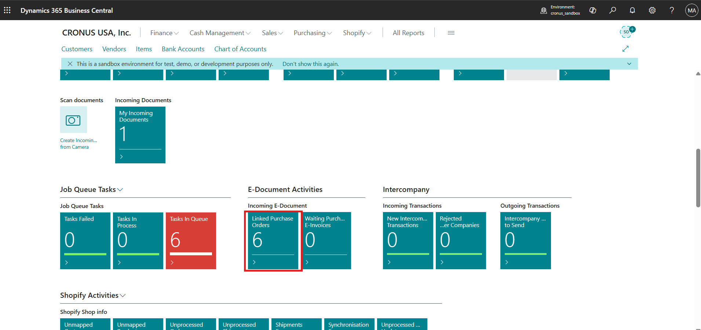

4.  Review the list of available purchase orders created from demo data.

## Task 4: Map E-Document Lines for the First Purchase Order

1.  Select the **first purchase order** from the list.

2.  On the purchase order page, choose **Map E-Document Lines**.

> 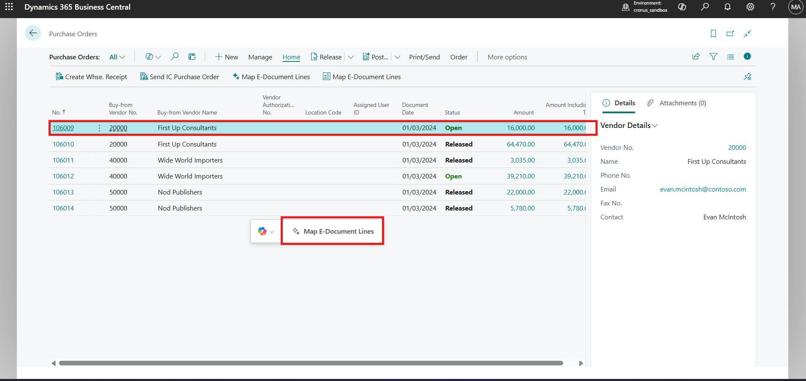

3.  Copilot automatically matches the e-document lines with the purchase
    order lines.

4.  Review the suggested matches.

5.  Select **Keep it** to save the matched purchase order.

> 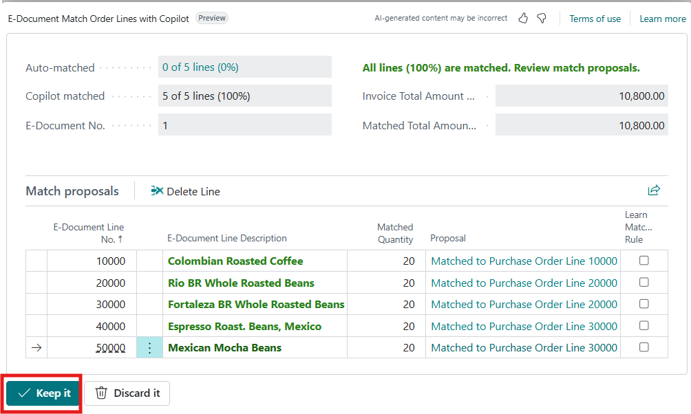

6.  Select **Back** to return to the purchase order list.

> 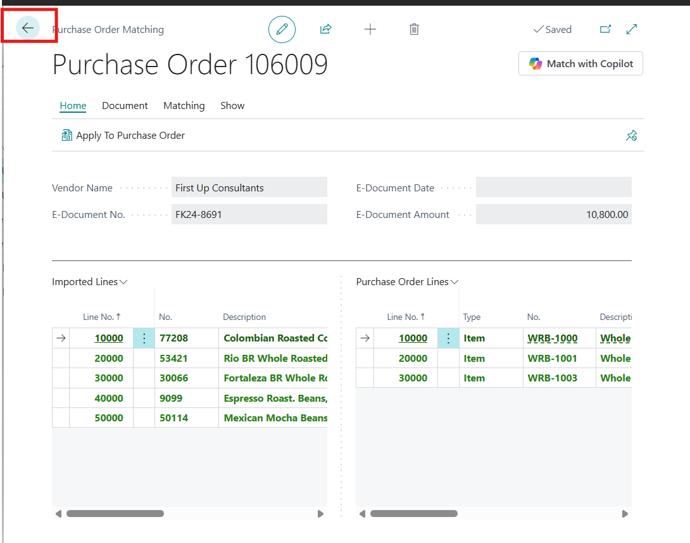

## Task 5: Explore E-Document Mapping Options with Another Purchase Order

1.  Open the **next purchase order** from the list to further explore
    e-document mapping.

> 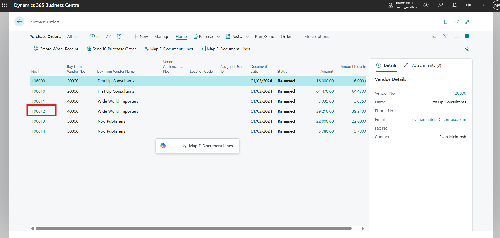

2.  On the purchase order page, select **Map E-Document Lines** from the
    top bar.

> 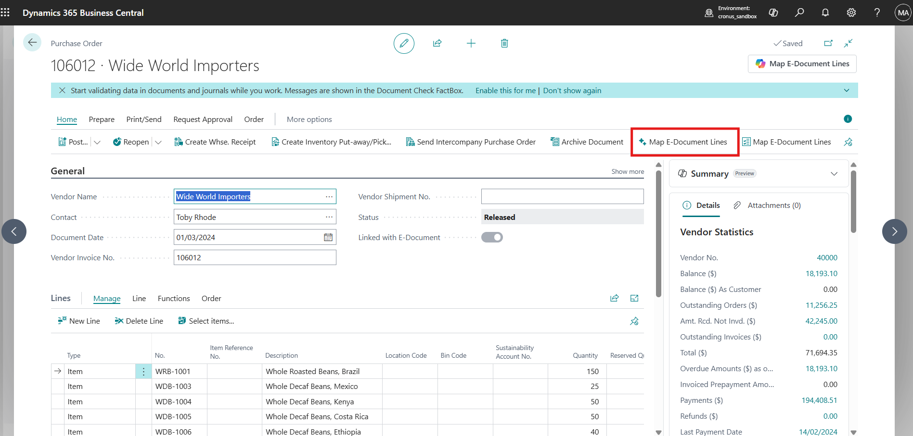

3.  Review the matching results:

    - Auto-matched lines

    - Copilot-matched lines

4.  Select **Discard it** to explore alternative matching options.

> 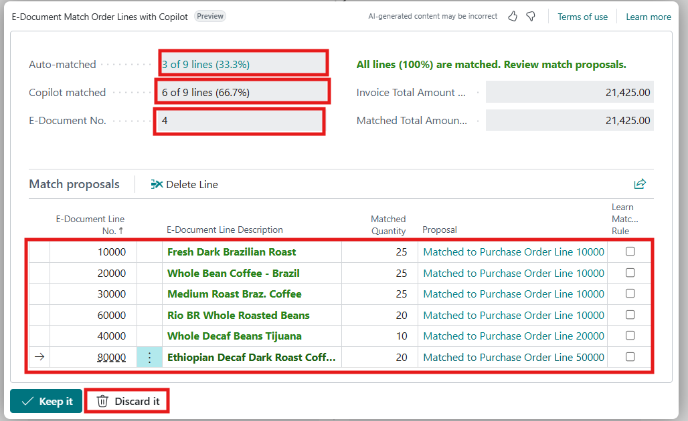

## Task 6: Match E-Document Lines Using Copilot

1.  On the purchase order matching page, review the available options:

    - Match with Copilot

    - Match manually

    - Match automatically

> 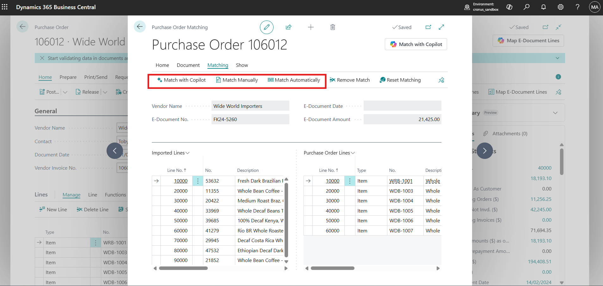

2.  For this lab, select **Match with Copilot**.

> 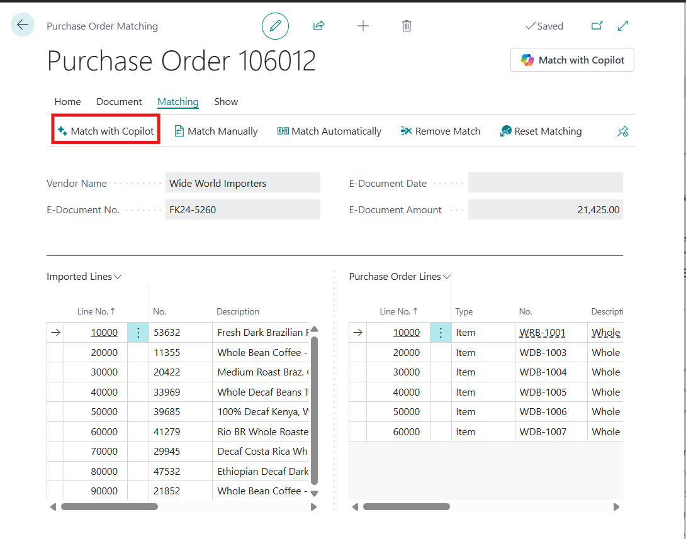

3.  Copilot matches all e-document lines with the purchase order lines.

4.  Review the matching suggestions carefully.

5.  Select **Keep it** to save the final mapping.

> 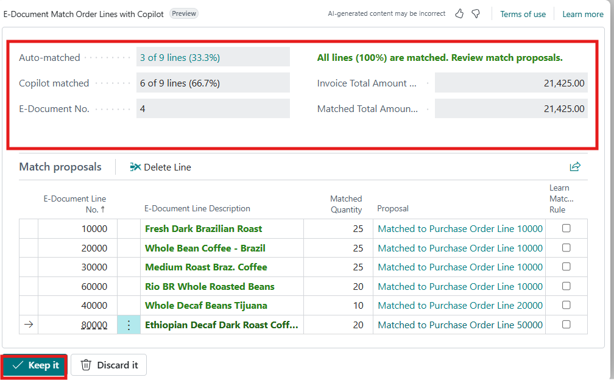

**Conclusion**

By completing this lab, participants gain a practical understanding of
how Copilot enhances the e-document mapping experience in Dynamics 365
Business Central. Participants successfully generated demo data,
reviewed linked purchase orders, and used Copilot to automatically match
e-document lines with purchase order lines. They also explored different
matching scenarios, including reviewing and discarding matches to better
understand the available options. This lab demonstrates how Copilot can
reduce manual effort, improve accuracy, and streamline procurement
workflows by simplifying the process of mapping vendor e-documents to
purchase orders.
