# Lab 6 - Creating and Enhancing Item Marketing Text with Copilot in Business Central​

**Lab Objective**

In this lab, you will learn how to use Copilot in Microsoft Dynamics 365
Business Central to generate, review, and refine marketing text for an
existing item. You will start by opening an item card, generate an
AI-powered first draft using Copilot, customize the content by selecting
relevant attributes, and then review, edit, and save the final version.

This lab demonstrates how AI can accelerate content creation while still
requiring human validation to ensure quality, accuracy, and brand
alignment.

## Exercise 1: Generate the First Draft with Copilot

In this exercise, you will open an existing item and use Copilot to
generate a marketing text draft. You will explore two different methods
to initiate draft generation and learn how to select relevant product
attributes to improve the quality of the AI-generated content.

1.  In Business Central, press **Alt + Q**. In the search field, type
    **Items**. From the search results, select **Items** to open the
    list of available items.

> 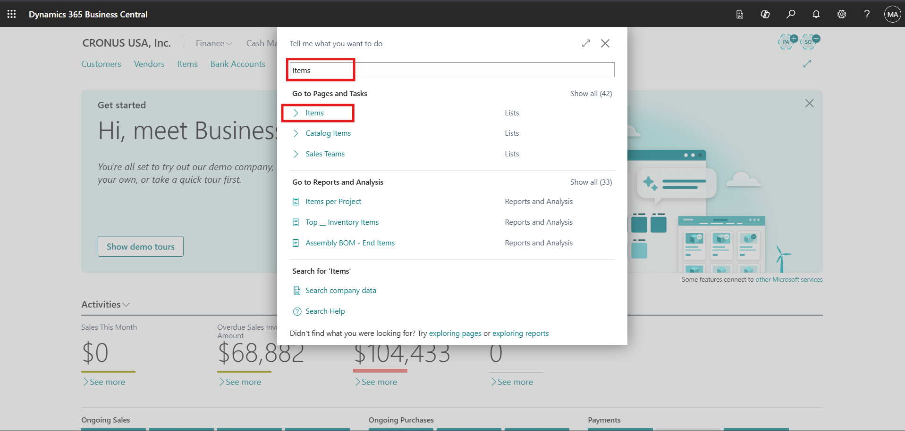

2.  Locate the item ATHENS Disk. Select the value in the No. column to
    open the Item Card. You are now ready to generate marketing text for
    this item.

> 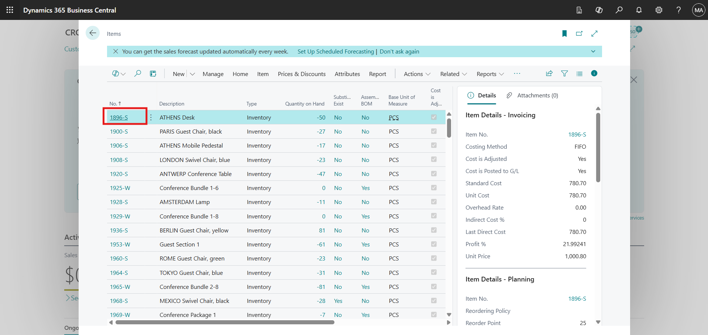
>
> **Method 1: Using the Marketing Text FactBox**

- Locate the Marketing Text pane in the FactBox area on the right side
  of the Item Card.

- Select Draft with Copilot.

> 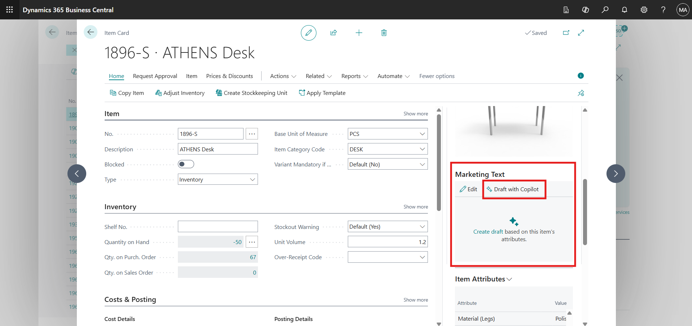

- Copilot begins preparing a draft based on the item’s existing
  information.

- Select Cancel to close the window.

> 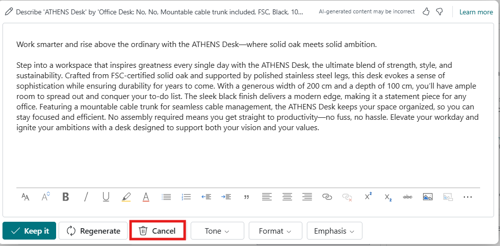
>
> **Method 2: Using the Marketing Text Action**

- At the top of the Item Card page, select the Marketing Text action.

> 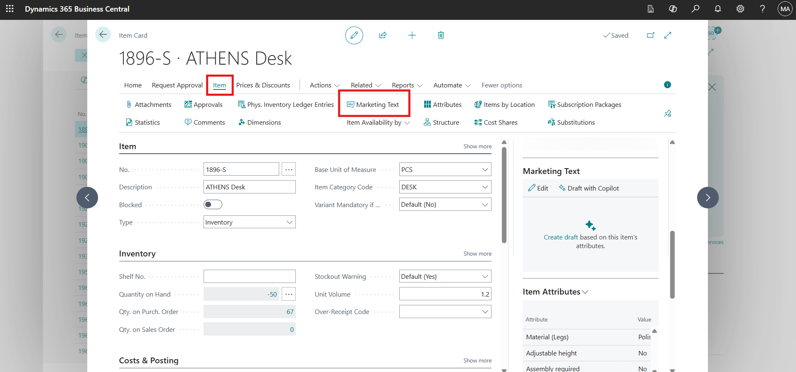

- In the Edit Marketing Text window, select Suggest marketing text.

> 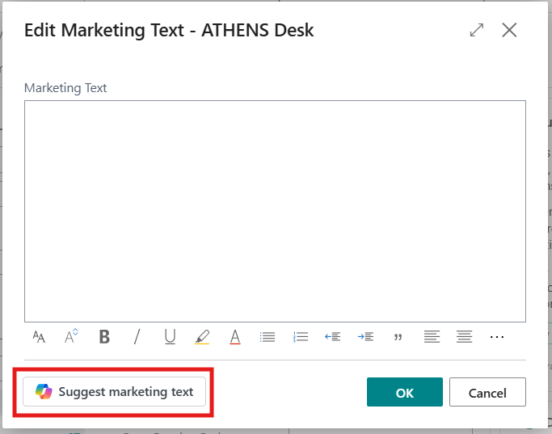

- The Suggest marketing text window opens and displays available item
  attributes.

> 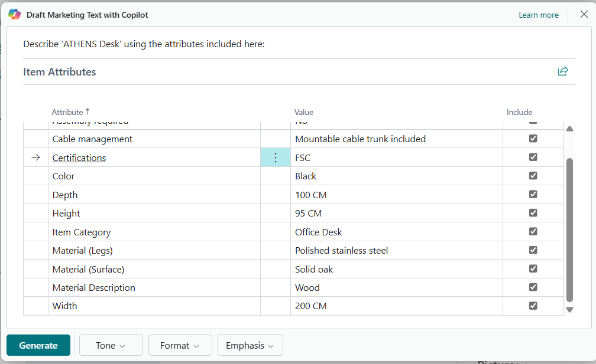

3.  In the Draft Marketing Text window, review the list of available
    item attributes.

4.  Select the vertical ellipsis (⋮) next to an item attribute. Choose
    Select more.

5.  Select multiple attributes such as:

    - Color

    - Height

    - Material (legs)

    - Material (Surface)

6.  After selecting the relevant attributes, choose Generate.

> 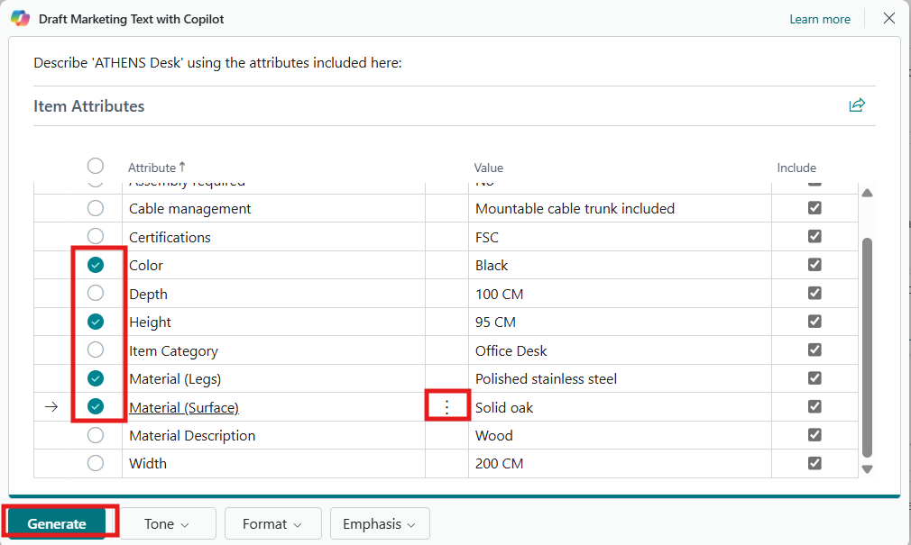

7.  The generated text appears in the Copilot editor window.

8.  Carefully read the draft to evaluate:

    - Clarity

    - Accuracy

    - Tone

    - Completeness

Important: AI-generated content is a suggestion only. It may contain
inaccuracies or language that does not fully align with your
organization’s standards. Always review and edit the content before
saving or publishing.

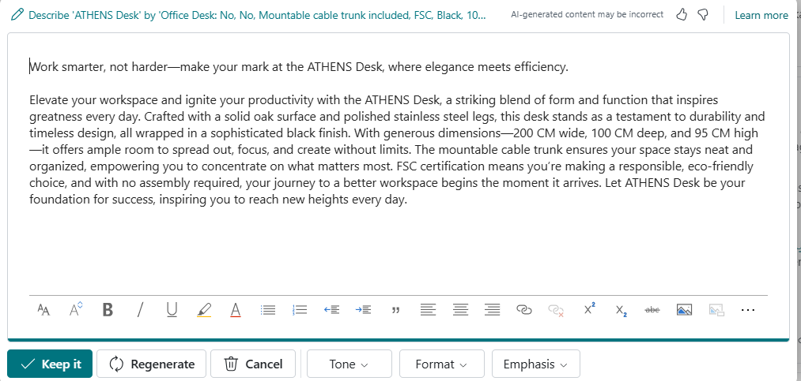

## Exercise 2: Review, Edit, and Save Marketing Text

In this exercise, you will refine the AI-generated marketing text. You
will edit and format the content, generate alternative suggestions,
customize tone and structure, and perform a final validation before
saving.

1.  In the Copilot editor window, place the cursor inside the text box.

2.  Make direct edits to improve:

    - Clarity

    - Accuracy

    - Brand alignment

3.  Use the formatting toolbar at the bottom of the editor to:

    - Apply text styling

    - Structure content for readability

    - Insert hyperlinks if needed

> 

4.  Select Regenerate to create a new suggestion.

> 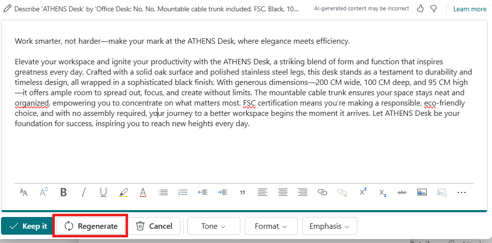

5.  Use the navigation controls at the top of the page (e.g., *1 of 2*)
    to move between available suggestions.

> 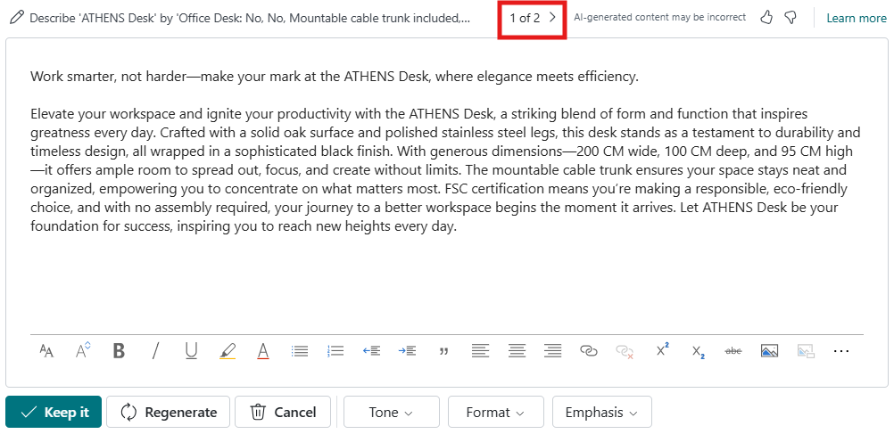

6.  Compare variations and determine which draft best aligns with your
    requirements.

7.  Choose a tone that aligns with your brand voice, such as:

- Formal – For professional and corporate communication.

- Creative – For engaging and conversational messaging.

> 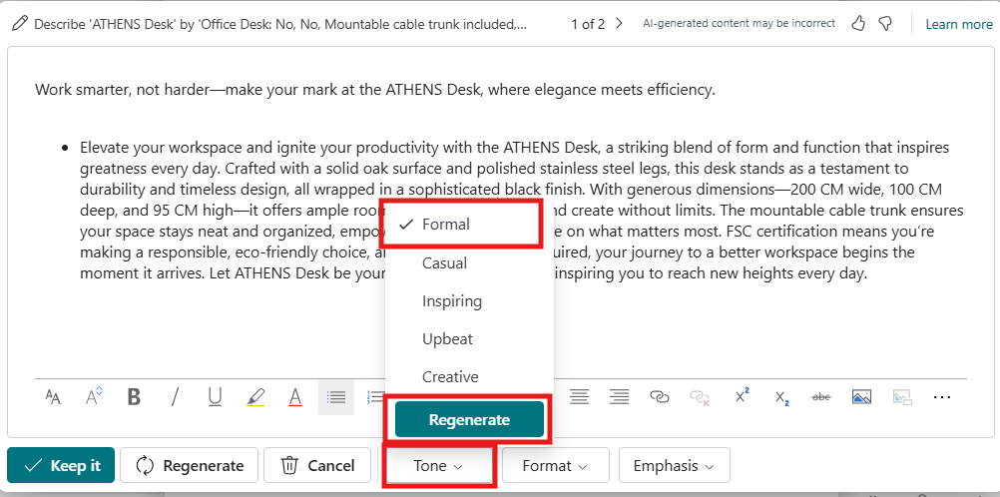

8.  Select the format of the marketing text:

- Tagline – A short, catchy phrase.

- Paragraph – A detailed descriptive block of text.

- Tagline + Paragraph – A combination of both.

- Brief – An introductory statement followed by bullet points.

> 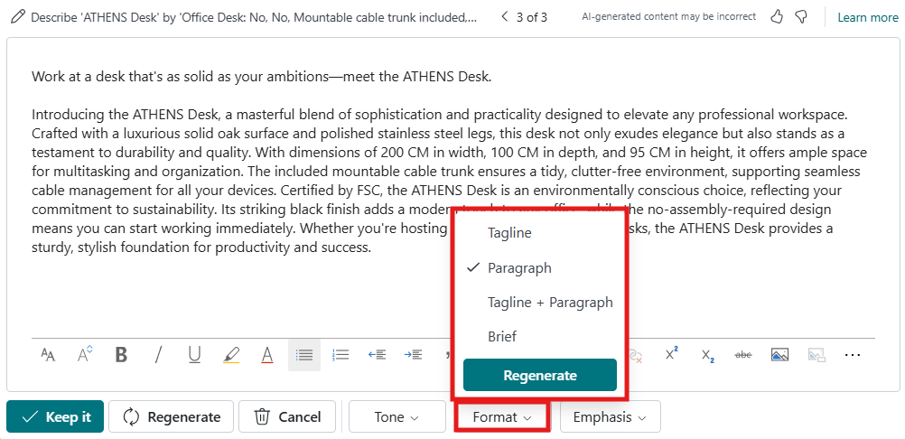

9.  Select predefined qualities to emphasize, such as:

- Quality

- Durability

- Performance

- Innovation

> 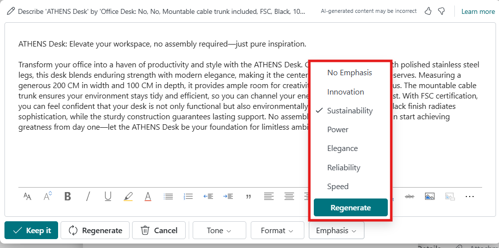

10. Choose attributes that logically align with the item type. After
    adjusting preferences, select Regenerate if needed to apply the new
    settings.

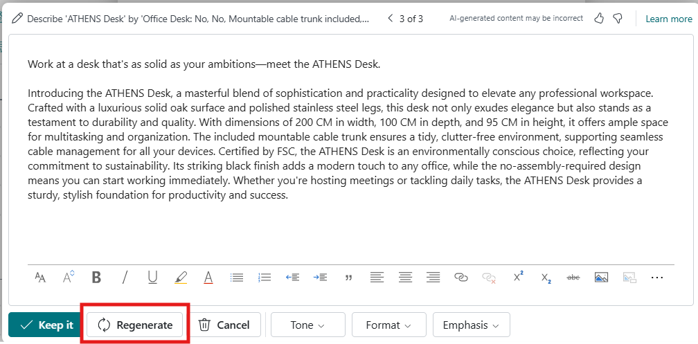

11. Conduct a thorough review of the text.

12. Confirm that:

    - Product details are accurate

    - Content complies with company standards

    - The tone aligns with brand guidelines

13. If satisfied, select Keep it to save the marketing text.

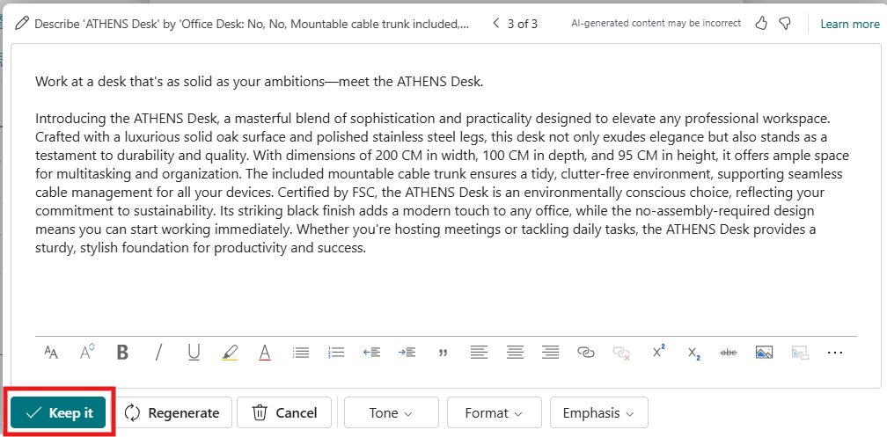

14. Click OK to confirm the update.

## Conclusion

In this lab, you explored how to use Copilot in Microsoft Dynamics 365
Business Central to efficiently create and refine marketing text for an
existing item. You learned how to generate an initial AI-powered draft,
enhance content quality by selecting relevant item attributes, and
customize tone, structure, and emphasis to align with brand guidelines.
You also reviewed multiple suggestions, edited the content for clarity
and accuracy, and finalized the text before saving it. Overall, this lab
demonstrated how AI can accelerate content creation while reinforcing
the importance of human review to ensure accuracy, consistency, and
compliance with organizational standards.
