# Lab 7: Automating Sales Order Capture for Faster Order Processing with the Sales Order Agent

## Overview

In this lab, you will learn how the Copilot-powered **Sales Order Agent** in Dynamics 365 Business Central helps automate customer inquiries and generate sales quotations directly from email requests. The lab demonstrates how to activate and configure the agent, receive customer inquiries by email, review Copilot-driven decisions, and send quotation responses automatically.

This hands-on experience shows how sales teams can respond faster to customer requests while reducing manual effort and improving accuracy.

## Objectives

- Activate the Sales Order Agent and configure its mailbox.
- Review and apply the agent's behavior settings.
- Send a customer inquiry by email.
- Review the agent's processing steps and send a quotation response.

## Prerequisites

- Access to the Business Central **production** environment configured in **Lab 1**, with admin tenant credentials.
- A personal email account (for example, Outlook.com) to act as the customer.

## Estimated Time

**30 minutes**

> [!NOTE]
> Text shown as +++sample text+++ can be typed or copied directly into the lab environment. Copilot and agent responses are AI-generated, so your results may differ slightly from the screenshots.

---

## Exercise 1: Activate and Configure the Sales Order Agent

In this exercise, you will activate the Sales Order Agent, connect a mailbox, and apply its configuration.

### Task 1: Activate the Sales Order Agent

1. Navigate to the Business Central sign-in page and sign in with the admin tenant:

    +++https://www.microsoft.com/en-us/dynamics-365/products/business-central/sign-in+++

    

> [!IMPORTANT]
> Ensure you are working in the **Production** environment before starting this exercise.

2. From the top navigation bar, select the **Plus (+)** icon, and then select **Sales Order Agent**.

    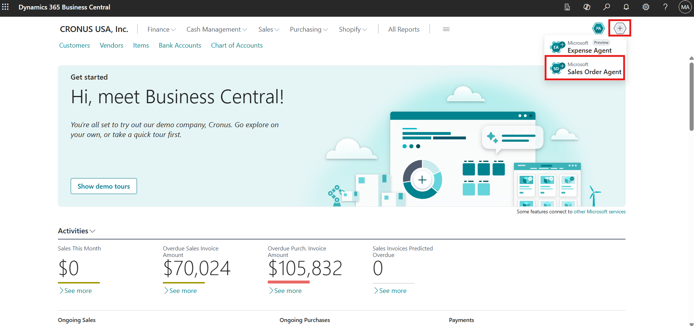

3. Turn **On** the **Activate** toggle so the agent can start handling incoming sales inquiries.

    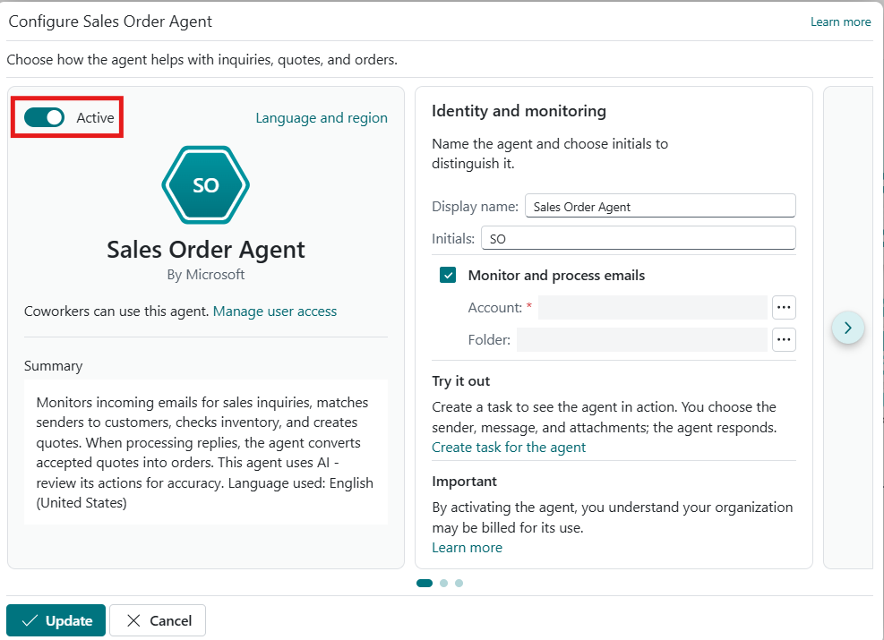

### Task 2: Configure the Mailbox for Sales Inquiries

1. In the **Monitor and process emails** section, select the account **horizontal ellipsis (⋯)** to configure how sales inquiries will be received.

    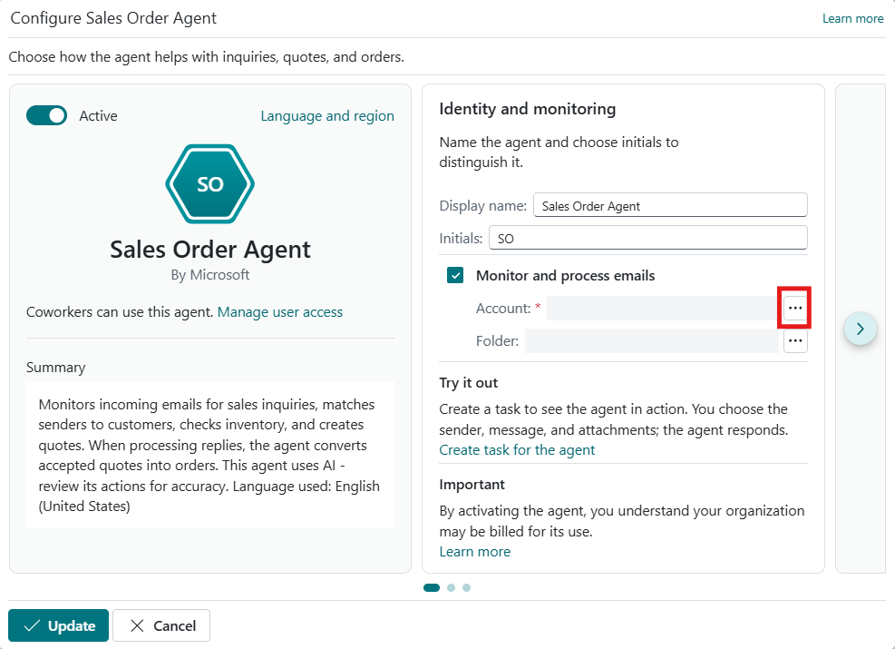

2. Select **Current user**, allowing the agent to use the signed-in user's mailbox for receiving customer emails.

3. Select **OK** to complete the mailbox configuration.

    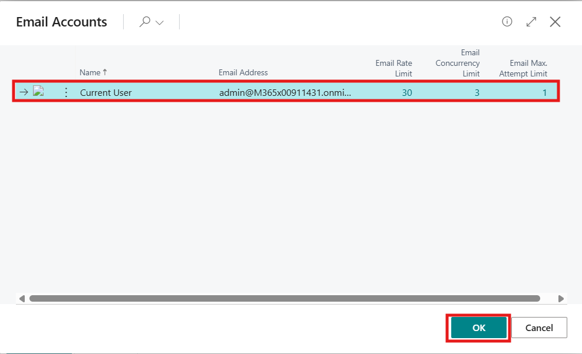

### Task 3: Configure Sales Order Agent Behavior

1. Select the **right-arrow (>)** icon to access additional configuration options.

    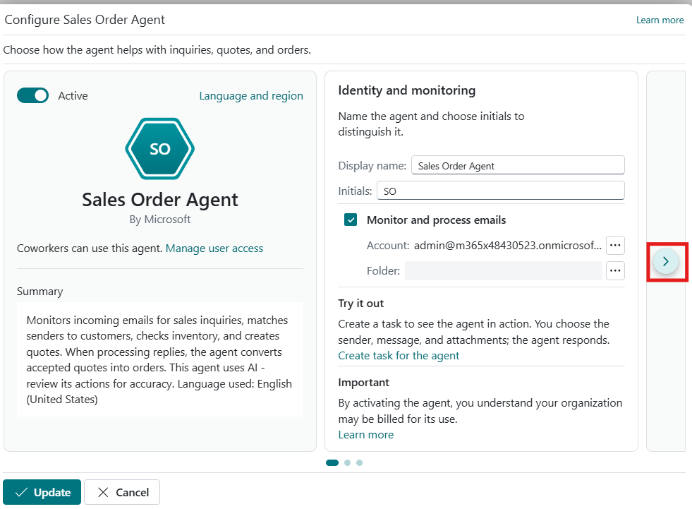

2. Review the available configuration sections:

    - **Respond to inquiries** – Controls how the agent reviews and responds to messages from registered and unregistered senders.
    - **Create sales documents** – Determines whether the agent sends quotations for confirmation and creates orders from quotes.

3. Leave the default settings unchanged for this lab.

> [!WARNING]
> Changing these settings alters how the agent handles incoming email. Keep the defaults so the rest of the lab behaves as described.

4. Select **Update** to apply the configuration.

    

5. Verify that the agent status shows it is configured successfully.

    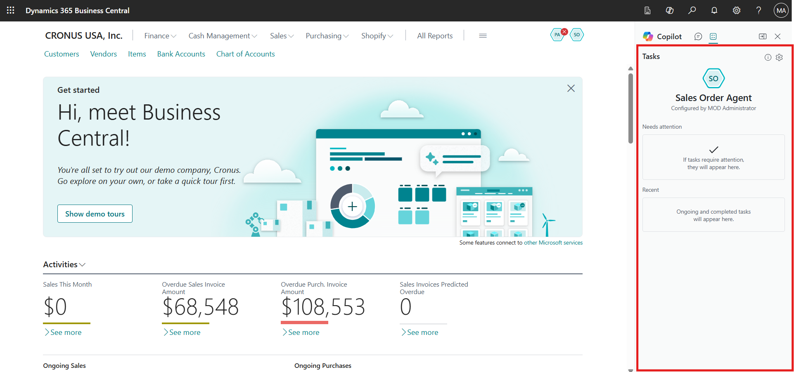

> **✅ Result:** The Sales Order Agent is active and monitoring the current user's mailbox.

---

## Exercise 2: Process a Customer Inquiry with the Sales Order Agent

In this exercise, you will send a customer inquiry email and review how the agent turns it into a quotation response.

### Task 1: Send a Customer Inquiry Email

1. Open a new browser tab and navigate to Outlook:

    +++https://outlook.live.com/mail/0/+++

2. Sign in using your personal email account.

    

> [!NOTE]
> If Outlook is not available, you can use any email provider. Outlook is used here for demonstration.

3. Create a new email addressed to the admin tenant email address configured for the Sales Order Agent.

4. Enter the following subject:

    +++Inquiry About Chairs+++

5. Enter the following email body:

    +++Hi, My name is Meagan Bond from the School of Fine Art. We are in the process of purchasing chairs and would like to know what options you have available. Please share the available models, pricing, and lead times at your earliest convenience. Thank you+++

6. Send the email to start the sales inquiry process.

    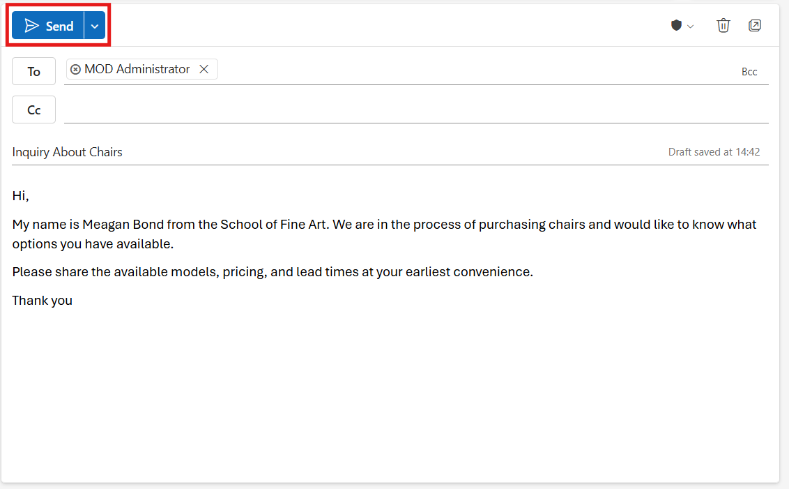

> [!TIP]
> **Meagan Bond** is the contact for the **School of Fine Art** customer in the demo data, so the agent can recognize the sender's company as an existing customer.

### Task 2: Review the Sales Inquiry in Business Central

1. Navigate back to the **Sales Order Agent** in the Business Central portal.

> [!NOTE]
> The agent checks the mailbox periodically, so it can take a few minutes for the notification to appear.

2. Notice the notification indicating a **new sales inquiry** has been received. Select the notification to open the request.

    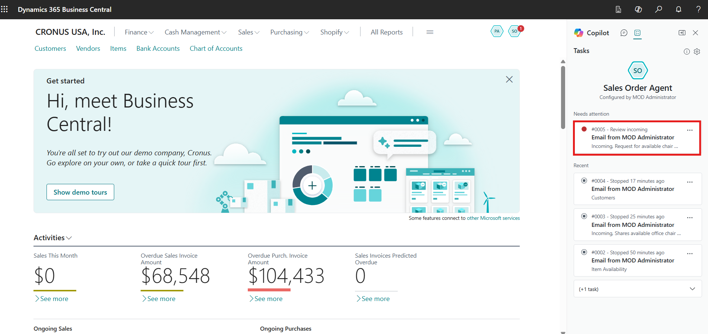

3. Select **Review** to examine the incoming email.

    

4. Review the inquiry details, and then select **Continue** to let the agent determine the next step for generating a quotation.

    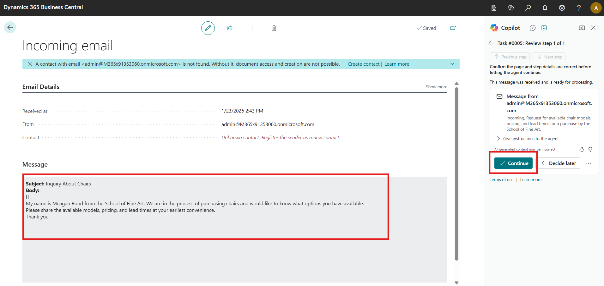

### Task 3: Review and Send the Quotation Response

1. After processing the inquiry, the agent prepares a response email. Select **Review** to see the drafted response.

    

2. Review the quotation details created from Business Central item data.

> [!IMPORTANT]
> Check the items, quantities, and prices in the draft before selecting **Continue**. Once you continue, the agent sends the email to the customer.

3. Select **Continue** to allow the agent to send the quotation email.

    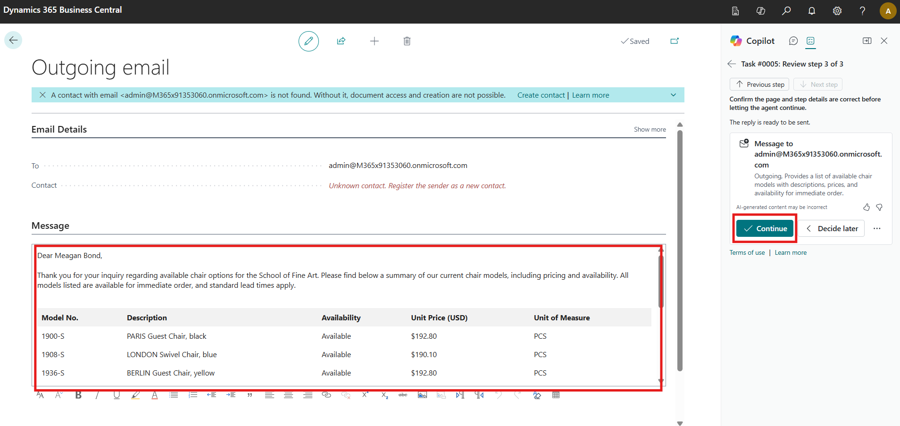

4. Return to your personal email inbox and review the quotation response, which includes the furniture details requested in the original inquiry.

    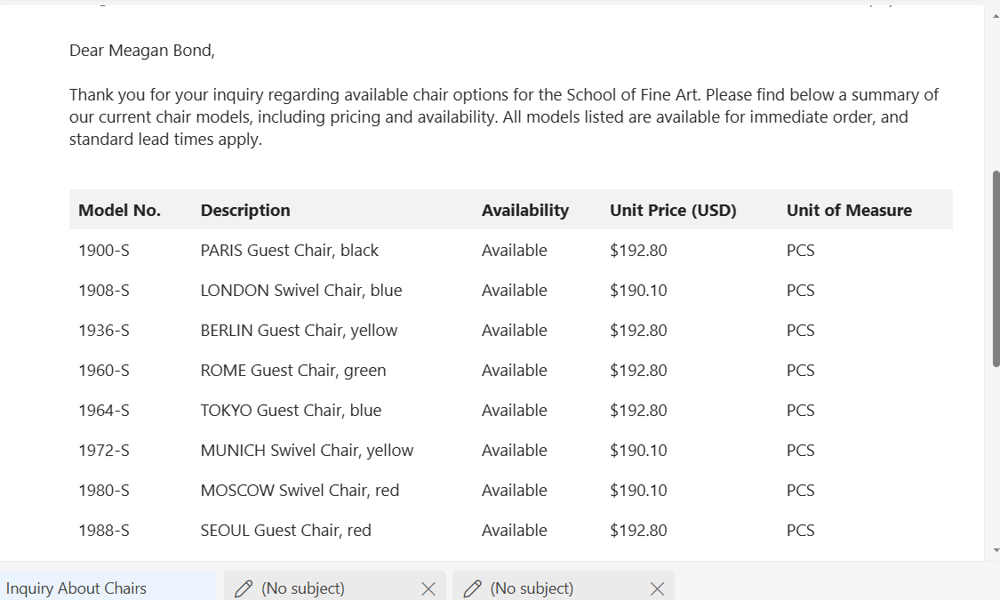

> **✅ Result:** The Sales Order Agent has turned a customer email inquiry into a quotation response.

---

## Summary

By completing this lab, you have configured the Sales Order Agent and used Copilot to automate customer inquiry handling and quotation creation. You experienced how incoming emails are reviewed, interpreted, and transformed into structured sales responses with minimal manual effort. This lab highlights how Copilot helps sales teams respond faster to customer needs, improve accuracy, and enhance customer satisfaction using Dynamics 365 Business Central.

## Key Takeaways

- The Sales Order Agent monitors a mailbox and turns customer inquiries into quotations.
- Review steps keep a person in control before the agent sends any response.
- Agent behavior settings determine how inquiries are handled and whether quotes become orders.
- Always review AI-generated content, as agent results may occasionally be incomplete or incorrect.
